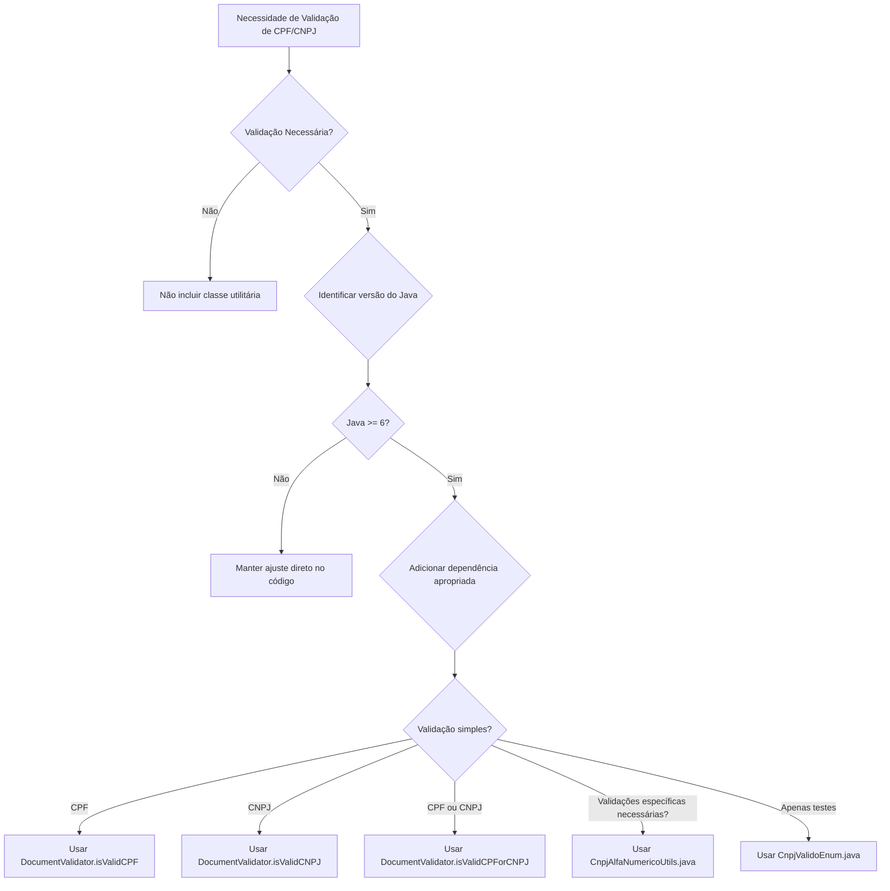

# Prompt de Implementação — CNPJ Alfanumérico (Versão v2 — Regras Refinadas)

Você é um **engenheiro de software** atuando como **Engenheiro de Prompts para o Cursor**, especializado em **APIs, serviços Backend e Workers de Fila**.  
Seu objetivo é **analisar, atualizar e validar** todo o código-fonte do repositório para suportar o **CNPJ e CPF alfanuméricos** **com retrocompatibilidade**, seguindo as regras descritas abaixo.  
Ao final, gere um **relatório técnico detalhado (inventário completo)** com todas as alterações realizadas no projeto e salve em:
```
.cnpj_alfanumerico/documentos/implementacao.md
```

> **Importante:** Este prompt **não deve ser aplicado em projetos de Front-end, UI, bancos de dados ou pipelines de dados.**  
> Ele é destinado **exclusivamente** a projetos de **API, Backend e Workers de Fila.**

---

## 0) Regras para Tratamento de CNPJ Alfanumérico

### 0.1 Regras Gerais

#### 1. Ausência de Validação
**Caso não for feita a inclusão de nenhuma validação tanto para testes quanto para implementação de negócio, não deveremos incluir na aplicação nenhuma classe utilitária para validação de CNPJ alfanumérico.**

#### 2. Validação Padrão (Preferencial)
**Se houver alteração em regras de negócio ou classe de teste que necessite da validação de CNPJ ou CPF, devemos dar preferência a utilizar o validador fornecido pela equipe de arquitetura da TokioMarine (`DocumentValidator`) para validar CPF (11 caracteres) e CNPJ (14 caracteres, numéricos ou alfanuméricos).**

#### 3. Validações Específicas
**Nos casos onde houver além da necessidade de validar o CNPJ com 14, validar CNPJ não formatado com 14 posições (sem os zeros à esquerda), conversão de CNPJ ou validação/conversão de CPF, podemos utilizar o utilitário `CnpjAlfaNumericoUtils.java` e sua classe de testes `CnpjAlfaNumericoUtilsTest.java`, pois essas validações não seriam atendidas pelos métodos fornecidos pela arquitetura.**

#### 4. Testes com CNPJs Pré-definidos
**Nos casos onde é necessário validar retornos de APIs para validação de testes, pode-se utilizar números de CNPJ pré-definidos no enum `CnpjValidoEnum.java`**

### 0.2 Identificação da Versão do Java e Escolha da Biblioteca

**Importante:** As alterações propostas devem ser aplicadas somente em:
- Aplicações Java (monolíticas ou não)
- Aplicações que tenham Maven como builder

Para aplicações Java não-Maven (Ant, Gradle, ou outra), uma nota no arquivo `implementacao.md` deverá ser fornecida pela IA.

#### Identificação da Versão do Java

A IA deve inicialmente identificar qual a versão do Java utilizada no projeto, verificando:
- Arquivo `pom.xml` (propriedade `maven.compiler.source` ou `java.version`)
- Arquivo `build.gradle` (propriedade `sourceCompatibility`)
- Arquivo `.java-version` ou `.sdkmanrc`
- Configurações do projeto (IDE)

#### Escolha da Biblioteca por Versão do Java

Com base na versão identificada, adicionar a dependência correta no `pom.xml`:

**Java 6:**
```xml
<!-- Validador de CPF/CNPJ da Arquitetura - Java 6 -->
<dependency>
    <groupId>br.com.tokiomarine.arquitetura</groupId>
    <artifactId>cnpj-alphanumeric-validator-legacy-java6</artifactId>
    <version>1.0.0</version>
</dependency>
```

**Java 8:**
```xml
<!-- Validador de CPF/CNPJ da Arquitetura - Java 8 -->
<dependency>
    <groupId>br.com.tokiomarine.arquitetura</groupId>
    <artifactId>cnpj-alphanumeric-validator-legacy</artifactId>
    <version>1.0.0</version>
</dependency>
```

**Java 11:**
```xml
<!-- Validador de CPF/CNPJ da Arquitetura - Java 11 -->
<dependency>
    <groupId>br.com.tokiomarine.arquitetura</groupId>
    <artifactId>cnpj-alphanumeric-validator-java11</artifactId>
    <version>1.0.0</version>
</dependency>
```

**Java 17 ou superior:**
```xml
<!-- Validador de CPF/CNPJ da Arquitetura - Java 17 -->
<dependency>
    <groupId>br.com.tokiomarine.arquitetura</groupId>
    <artifactId>cnpj-alphanumeric-validator</artifactId>
    <version>1.0.0</version>
</dependency>
```

#### Regras de Retrocompatibilidade

- **Java 6:** Usar a lib do Java 6.
- **Java 7:** Usar a lib do Java 6 para manter retrocompatibilidade.
- **Java 8:** Usar a lib do Java 8.
- **Java 9, Java 10:** Usar a lib do Java 8 para manter retrocompatibilidade.
- **Java 11:** Usar a lib do Java 11.
- **Java 12 até 16:** Usar a lib do Java 11 para manter retrocompatibilidade.
- **Java 17 ou superior:** Usar a lib do Java 17.

---

## 1) Escopo de identificação de campos CNPJ e CPF

> **Considere como _campos de CNPJ ou CPF_** (case-insensitive, podendo estar em snake_case, camelCase, pascalCase, com prefixos/sufixos):  
> - `CPF`  
> - `NUMID`  
> - `CNPJ`  
> - `CGC`  
> - `NR_DOCTO`  
> - `NR_CPF_CNPJ`  
>
> **Não considere como campos de CNPJ/CPF** (lista de exclusão exata, case-insensitive):  
> - `idereg`, `idepol`, `idApolice`, `numoper`, `numcert`, `endosso`, `numenoso`, `nrApolice`, `apolice`, `numpol`, `chave`, `generica`, `chavegenerica`

---

## 2) Contexto normativo e técnico (resumo)

- **Comprimento fixo:** 14 caracteres.  
- **Estrutura:** 12 primeiros **alfanuméricos** (A–Z, 0–9) + 2 últimos **numéricos** (dígitos verificadores).  
- **Regex base (sem máscara):** `^[A-Z0-9]{12}\\d{2}$`  
- **Retrocompatibilidade:** aceitar tanto CNPJ/CPF numérico (14 dígitos) quanto alfanumérico.  
- **Persistência:** não converter para `int/long`; **sempre armazenar como `String`**; não usar `parseInt/Number`.  

---

## 3) Missão do agente (escopo API, Backend e Workers de Fila)

1. **Identificar versão do Java** do projeto (verificar `pom.xml`, `build.gradle`, `.java-version`, etc.).  
2. **Verificar se o projeto usa Maven** como builder. Se não usar, documentar no relatório final.  
3. **Inventariar ocorrências** de CNPJ/CPF no repositório (código, DTOs, entidades/models, controllers, serviços, workers, validações, utilitários, testes, documentação).  
4. **Classificar impacto** por criticidade (crítico, moderado, baixo).  
5. **Aplicar mudanças** para suportar alfanumérico com retrocompatibilidade.  
6. **Adicionar dependência apropriada** no `pom.xml` conforme a versão do Java identificada (ver Seção 0.2).  
7. **Substituir validações manuais** por chamadas aos métodos de `DocumentValidator` quando aplicável.  
8. **Atualizar validações** (regex + DV), máscaras, normalização, formatação e ordenação/consulta **somente quando houver necessidade** e **seguindo o Fluxo de Decisão (Seção 0)**.  
9. **Adequar integrações** (APIs internas/externas) e contratos (OpenAPI/Swagger/JSON Schemas).  
10. **Criar/atualizar testes** conforme o tipo de alteração aplicada (detalhado na seção 7).  
11. **Gerar relatório inventário completo** (`.cnpj_alfanumerico/documentos/implementacao.md`) listando todos os arquivos modificados, suas alterações e justificativas.

---

## 4) Estratégia de varredura e identificação

### 4.1 Escopo de busca (extensões)
- **Código:** `.java`, `.kt`, `.cs`, `.ts`, `.tsx`, `.js`, `.py`  
- **Config:** `.json`, `.yaml`, `.yml`, `.properties`, `.env`  
- **Docs:** `.md`, `.txt`

### 4.2 Padrões de busca (case-insensitive)
- Inclusão: `cnpj`, `cpf`, `numid`, `cgc`, `nr_docto`, `nr_cpf_cnpj`  
- Exclusão: `idereg`, `idepol`, `idApolice`, `numoper`, `numcert`, `endosso`, `numpol`, `chave`, `generica`

---

## 5) Mudanças obrigatórias

### 5.1 Tipagem
- Alterar **tipos numéricos (`int`, `long`, `number`) → `String`** em todos os campos identificados como **CNPJ ou CPF**.  
- Atualizar construtores, DTOs, mapeamentos e serializações.

### 5.2 Backend / Validações
- **Validação:** obedecer as regras da Seção 0.  
  - Se necessário, usar `DocumentValidator` da arquitetura TokioMarine (preferencial):
    - `DocumentValidator.isValidCPF(String)` - Valida apenas CPF (11 dígitos)
    - `DocumentValidator.isValidCNPJ(String)` - Valida apenas CNPJ (14 caracteres numéricos ou alfanuméricos)
    - `DocumentValidator.isValidCPForCNPJ(String)` - Valida CPF ou CNPJ automaticamente (detecta pelo tamanho)
  - Para casos específicos, usar `CnpjAlfaNumericoUtils`.  
  - **Se não houver necessidade de validação**, **não criar** nenhum validador.  
- **Identificação da versão do Java:** Antes de adicionar a dependência, identificar a versão do Java do projeto e escolher a biblioteca apropriada (ver Seção 0.2).
- **Tratamento de exceções:** Todos os métodos de `DocumentValidator` lançam `InvalidDocumentException` para formatos inválidos. Tratar a exceção retornando `false` quando necessário.
- **Normalização:** permitir letras nos 12 primeiros caracteres.  
- **Máscaras:** garantir que as máscaras permitam caracteres A–Z e 0–9.  

### 5.3 APIs / Contratos
- Atualizar contratos de entrada/saída (`OpenAPI`, `Swagger`, `JSON Schemas`) para `type: string`.  
- Garantir retrocompatibilidade com integrações legadas.  

---

## 6) Relatório Final (`implementacao.md`)

- O relatório **não deve incluir nenhuma alteração em banco de dados ou migrations.**
- Deve conter um **inventário completo** com todos os **arquivos alterados**, incluindo:
  - Caminho completo do arquivo.  
  - Descrição da alteração (ex.: refactor tipagem, ajuste regex, atualização validação, etc.).  
  - Trecho antes/depois (quando aplicável).  
  - Observação sobre necessidade de testes.  
- O relatório é salvo em:  
  `.cnpj_alfanumerico/documentos/implementacao.md`

---

## 7) Testes

### 7.1 Análise de necessidade
O agente deve **analisar automaticamente a necessidade de criar ou atualizar testes**, de acordo com o tipo de modificação realizada:

| Tipo de Alteração | Exige Teste? | Tipo de Teste |
|-------------------|---------------|----------------|
| Mudança de tipagem simples (int → String) | Não | — |
| Mudança em DTO, Model ou Controller | Sim | Unitário |
| Inclusão/alteração de validação de CNPJ/CPF | Sim | Unitário e Integração |
| Mudança em contratos de API | Sim | Integração |
| Alterações em serviços, workers ou pipelines de dados | Sim | Integração |
| Ajuste apenas de documentação | Não | — |

- **Caso nenhum teste seja necessário**, o agente deve apenas registrar isso no relatório (`implementacao.md`).

---

## 8) Code Review Final (último step)

1. Revisar todos os arquivos alterados.  
2. Executar linters e formatadores automáticos.  
3. Revisar potenciais regressões em validações e contratos.  
4. Rodar a suíte de testes completa.  
5. Garantir conformidade com as regras de compatibilidade e retrocompatibilidade.  

---

## 9) Critérios de Aceite

- Versão do Java foi identificada corretamente.  
- Dependência apropriada foi adicionada no `pom.xml` (ou documentada a ausência para projetos não-Maven).  
- Validações manuais foram substituídas por `DocumentValidator` quando aplicável.  
- Todos os campos de CNPJ e CPF aceitam **A–Z e 0–9** nos 12 primeiros caracteres e **apenas dígitos** nos 2 últimos.  
- Nenhum código tenta converter esses valores para numérico.  
- Exceções `InvalidDocumentException` são tratadas adequadamente.  
- Contratos e validações foram ajustados.  
- O relatório final contém o **inventário completo** e análise de testes.  
- Nenhum trecho de código afeta banco de dados.  

---

# Regras para Tratamento de CNPJ Alfanumérico

Este documento define as regras a serem aplicadas durante o tratamento dos campos que lidam com CNPJ, para quando houver a necessidade de incluir validações no fluxo alterado de negócio ou rotinas de testes para validar o que foi alterado.

## Regras Gerais

### 1. Ausência de Validação
**Caso não for feita a inclusão de nenhuma validação tanto para testes quanto para implementação de negócio, não deveremos incluir na aplicação nenhuma classe utilitária para validação de CNPJ alfanumérico.**

### 2. Validação Padrão (Preferencial)
**Se houver alteração em regras de negócio ou classe de teste que necessite da validação de CNPJ ou CPF, devemos dar preferência a utilizar o validador fornecido pela equipe de arquitetura da TokioMarine (`DocumentValidator`) para validar CPF (11 caracteres) e CNPJ (14 caracteres, numéricos ou alfanuméricos).**

### 3. Validações Específicas
**Nos casos onde houver além da necessidade de validar o CNPJ com 14, validar CNPJ não formatado com 14 posições (sem os zeros à esquerda), conversão de CNPJ ou validação/conversão de CPF, podemos utilizar o utilitário [`CnpjAlfaNumericoUtils.java`](../../src/main/java/br/com/tokiomarine/backoffice/corpti/api/acsel/util/CnpjAlfaNumericoUtils.java) e sua classe de testes [`CnpjAlfaNumericoUtilsTest.java`](../../src/test/java/br/com/tokiomarine/backoffice/corpti/api/acsel/util/CnpjAlfaNumericoUtilsTest.java), pois essas validações não seriam atendidas pelo método fornecido pela arquitetura.**

### 4. Testes com CNPJs Pré-definidos
**Nos casos onde é necessário validar retornos de APIs para validação de testes, pode-se utilizar números de CNPJ pré-definidos no enum [`CnpjValidoEnum.java`](../../src/test/java/br/com/tokiomarine/backoffice/corpti/api/acsel/util/CnpjValidoEnum.java)**

## Validação Definida por Arquitetura

A arquitetura de sistemas da Tokio definiu a biblioteca `DocumentValidator` para validação de CPF e CNPJ (numéricos e alfanuméricos).

### Importar a Biblioteca

Para incluir a biblioteca na aplicação, adicione a dependência apropriada no `pom.xml` conforme a versão do Java (ver Seção 0.2).

### Imports Necessários

Os imports dos packages são os mesmos independente da versão do Java:

```java
import br.com.tokiomarine.arquitetura.cnpjalphanumeric.core.DocumentValidator;
import br.com.tokiomarine.arquitetura.cnpjalphanumeric.core.InvalidDocumentException;
```

### Métodos Disponíveis

A classe `DocumentValidator` fornece os seguintes métodos:

1. **`DocumentValidator.isValidCPF(String cpf)`**
   - Valida apenas CPF (11 dígitos)
   - Aceita CPF com ou sem formatação
   - Valida os dois dígitos verificadores
   - Rejeita CPFs com todos os dígitos iguais
   - Retorna `boolean`: `true` se válido, `false` se inválido
   - Lança `InvalidDocumentException` para formatos inválidos (nulo, vazio, tamanho incorreto, apenas espaços ou caracteres especiais)

2. **`DocumentValidator.isValidCNPJ(String cnpj)`**
   - Valida apenas CNPJ (14 caracteres numéricos ou alfanuméricos)
   - Aceita CNPJ com ou sem formatação
   - Suporta CNPJ alfanumérico conforme IN RFB nº 2.229/2024
   - Aceita letras maiúsculas (A-Z) e números (0-9)
   - Valida os dois dígitos verificadores usando módulo 11
   - Rejeita CNPJs com todos os caracteres iguais
   - Retorna `boolean`: `true` se válido, `false` se inválido
   - Lança `InvalidDocumentException` para formatos inválidos

3. **`DocumentValidator.isValidCPForCNPJ(String documento)`**
   - Valida CPF ou CNPJ automaticamente (detecta pelo tamanho: 11 para CPF, 14 para CNPJ)
   - Aplica as regras de validação apropriadas para cada tipo
   - Útil para campos que podem receber ambos os tipos de documento
   - Retorna `boolean`: `true` se válido, `false` se inválido
   - Lança `InvalidDocumentException` para formatos inválidos

### Tratamento de Exceções

Todos os métodos lançam `InvalidDocumentException` quando a String passada como parâmetro for:
- Nula
- Vazia
- Tamanho incorreto
- Apenas espaços ou caracteres especiais

**Importante:** Sempre tratar a exceção, retornando `false` para o método que chama a função quando necessário.

## Fluxo de Decisão



## Exemplos de Uso

### Validação de CPF

```java
import br.com.tokiomarine.arquitetura.cnpjalphanumeric.core.DocumentValidator;
import br.com.tokiomarine.arquitetura.cnpjalphanumeric.core.InvalidDocumentException;

public class ExemploCPF {
    public static void main(String[] args) {
        String cpf = "847.412.600-20";
        try {
            boolean valido = DocumentValidator.isValidCPF(cpf);
            System.out.println("CPF " + cpf + " válido? " + valido);
        } catch (InvalidDocumentException ex) {
            System.err.println("Formato inválido: " + ex.getMessage());
        }
    }
}
```

**Características:**
- Aceita CPF com ou sem formatação ("847.412.600-20" ou "84741260020")
- Valida os dois dígitos verificadores
- Rejeita CPFs com todos os dígitos iguais
- Lança `InvalidDocumentException` para formatos inválidos

### Validação de CNPJ

```java
import br.com.tokiomarine.arquitetura.cnpjalphanumeric.core.DocumentValidator;
import br.com.tokiomarine.arquitetura.cnpjalphanumeric.core.InvalidDocumentException;

public class ExemploCNPJ {
    public static void main(String[] args) {
        // CNPJ numérico
        String cnpj = "11.222.333/0001-81";
        // CNPJ alfanumérico (novo formato)
        String cnpjAlfanumerico = "9Z.CXF.TS4/7DEZ-83";
        
        try {
            boolean valido = DocumentValidator.isValidCNPJ(cnpj);
            System.out.println("CNPJ " + cnpj + " válido? " + valido);
            
            boolean validoAlfa = DocumentValidator.isValidCNPJ(cnpjAlfanumerico);
            System.out.println("CNPJ alfanumérico válido? " + validoAlfa);
        } catch (InvalidDocumentException ex) {
            System.err.println("Formato inválido: " + ex.getMessage());
        }
    }
}
```

**Características:**
- Aceita CNPJ com ou sem formatação ("11.222.333/0001-81" ou "11222333000181")
- Suporta CNPJ alfanumérico conforme IN RFB nº 2.229/2024
- Aceita letras maiúsculas (A-Z) e números (0-9)
- Valida os dois dígitos verificadores usando módulo 11
- Rejeita CNPJs com todos os caracteres iguais
- Lança `InvalidDocumentException` para formatos inválidos

### Validação de CPF ou CNPJ (Automática)

```java
import br.com.tokiomarine.arquitetura.cnpjalphanumeric.core.DocumentValidator;
import br.com.tokiomarine.arquitetura.cnpjalphanumeric.core.InvalidDocumentException;

public class ExemploCPFCNPJ {
    public static void main(String[] args) {
        String documento = "847.412.600-20"; // Pode ser CPF ou CNPJ
        try {
            boolean valido = DocumentValidator.isValidCPForCNPJ(documento);
            System.out.println("Documento " + documento + " válido? " + valido);
        } catch (InvalidDocumentException ex) {
            System.err.println("Formato inválido: " + ex.getMessage());
        }
    }
}
```

**Características:**
- Detecta automaticamente se o documento é CPF (11 caracteres) ou CNPJ (14 caracteres)
- Aplica as regras de validação apropriadas para cada tipo
- Útil para campos que podem receber ambos os tipos de documento

### Exemplo de Uso em Validador (ConstraintValidator)

**Antes:**
```java
public static boolean isValidCPF(String cpf) {
    // Implementação manual com validação de dígitos verificadores
    // ...
}

public static boolean isValidCNPJ(String CNPJ) {
    // Implementação manual com validação de dígitos verificadores
    // ...
}
```

**Depois:**
```java
import br.com.tokiomarine.arquitetura.cnpjalphanumeric.core.DocumentValidator;
import br.com.tokiomarine.arquitetura.cnpjalphanumeric.core.InvalidDocumentException;
import lombok.extern.slf4j.Slf4j;

@Slf4j
public class DocumentoValidator implements ConstraintValidator<Documento, String> {
    
    @Override
    public boolean isValid(String documento, ConstraintValidatorContext context) {
        context.disableDefaultConstraintViolation();
        
        if (documento == null || documento.isEmpty()) {
            return true; // Documento opcional
        }
        
        if (isValidCPForCNPJ(documento)) {
            return true; // Documento válido
        }
        
        setMessageTemplateOnContext(context); // Documento inválido
        return false;
    }
    
    private void setMessageTemplateOnContext(ConstraintValidatorContext context) {
        context.buildConstraintViolationWithTemplate(
            context.getDefaultConstraintMessageTemplate()
        ).addConstraintViolation();
    }
    
    public static boolean isValidCPForCNPJ(String documento) {
        try {
            return DocumentValidator.isValidCPForCNPJ(documento);
        } catch (InvalidDocumentException ex) {
            log.info("Documento {} inválido: {}", documento, ex.getMessage());
            return false;
        }
    }
}
```

### Validações Específicas (Quando Necessário)

```java
// Para validações mais complexas que não são atendidas pela biblioteca
boolean isValid = CnpjAlfaNumericoUtils.validaCnpjCompleto("5IFC7KIZPIQX16");
String formatted = CnpjAlfaNumericoUtils.mascaraCnpjAlfanumerico("5IFC7KIZPIQX16");
```

> **Referência:** [`CnpjAlfaNumericoUtils.java`](../../src/main/java/br/com/tokiomarine/backoffice/corpti/api/acsel/util/CnpjAlfaNumericoUtils.java) | [`CnpjAlfaNumericoUtilsTest.java`](../../src/test/java/br/com/tokiomarine/backoffice/corpti/api/acsel/util/CnpjAlfaNumericoUtilsTest.java)

### Testes com CNPJs Pré-definidos

Utilizar os cnpjs do CnpjValidoEnum para validação de retornos através de comparações.

```java
// Para testes
String cnpjJaValidado = CnpjValidoEnum.ALFANUMERICO_SEM_FORMATACAO.getCnpj();
mockMvc.perform(get("/apoliceGenesis/findByCpfCnpj")
                .param("cpfcnpj", cnpjJaValidado)
                .param("page", "0")
                .param("size", "10")
                .contentType(MediaType.APPLICATION_JSON))
                .andExpect(status().isOk())
                .andExpect(jsonPath("$.content[0].cpfCnpj").value(cnpjJaValidado));
```

> **Referência:** [`CnpjValidoEnum.java`](../../src/test/java/br/com/tokiomarine/backoffice/corpti/api/acsel/util/CnpjValidoEnum.java)

## Considerações Importantes

1. **Sempre priorizar** o validador da arquitetura (`DocumentValidator`) quando possível  
2. **Identificar a versão do Java** antes de adicionar a dependência  
3. **Tratar exceções** adequadamente: sempre capturar `InvalidDocumentException` e retornar `false` quando necessário  
4. **Escolher o método correto** baseado no contexto:
   - `isValidCPF()` para validação exclusiva de CPF
   - `isValidCNPJ()` para validação exclusiva de CNPJ
   - `isValidCPForCNPJ()` para campos que aceitam ambos
5. **Usar utilitários específicos** (`CnpjAlfaNumericoUtils`) apenas quando necessário  
6. **Manter consistência** entre validações de negócio e testes  
7. **Documentar** qualquer uso de validações específicas  
8. **Revisar** periodicamente se as validações específicas ainda são necessárias  
9. **Para projetos não-Maven**, documentar no `implementacao.md` que a biblioteca não foi adicionada  

## Referências das Classes

- **[CnpjAlfaNumericoUtils.java](../../src/main/java/br/com/tokiomarine/backoffice/corpti/api/acsel/util/CnpjAlfaNumericoUtils.java)** - Classe utilitária principal para validações e conversões de CNPJ alfanumérico  
- **[CnpjAlfaNumericoUtilsTest.java](../../src/test/java/br/com/tokiomarine/backoffice/corpti/api/acsel/util/CnpjAlfaNumericoUtilsTest.java)** - Testes unitários para a classe utilitária  
- **[CnpjValidoEnum.java](../../src/test/java/br/com/tokiomarine/backoffice/corpti/api/acsel/util/CnpjValidoEnum.java)** - Enum com CNPJs pré-definidos para testes  
