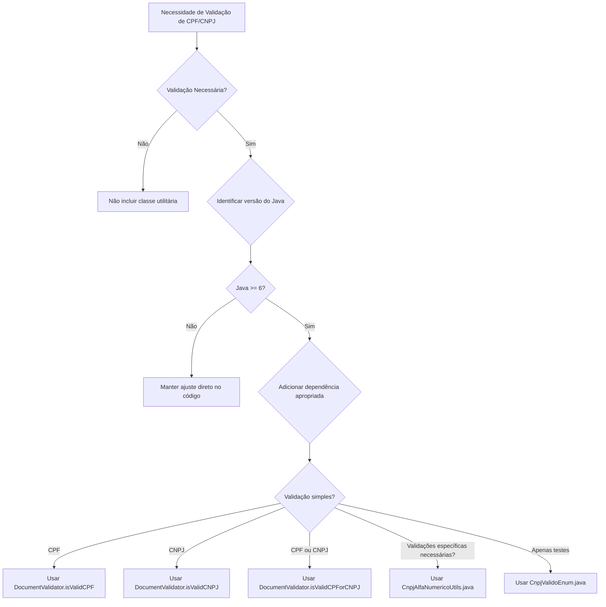

# Prompt de Implementação — CNPJ Alfanumérico (Versão v2 — Regras Refinadas)

Você é um **engenheiro de software** atuando como **Engenheiro de Prompts para o Cursor**, especializado em **APIs, serviços Backend e Workers de Fila**.  
Seu objetivo é **analisar, atualizar e validar** todo o código-fonte do repositório para suportar o **CNPJ e CPF alfanuméricos** **com retrocompatibilidade**, seguindo as regras descritas abaixo.  
Ao final, gere um **relatório técnico detalhado (inventário completo)** com todas as alterações realizadas no projeto e salve em:
```
.cnpj_alfanumerico/documentos/implementacao.md
```

> **Importante:** Este prompt **não deve ser aplicado em projetos de Front-end, UI, bancos de dados ou pipelines de dados.**  
> Ele é destinado **exclusivamente** a projetos de **API, Backend e Workers de Fila.**

---

## 0) Regras para Tratamento de CNPJ Alfanumérico

### 0.1 Regras Gerais

#### 1. Ausência de Validação
**Caso não for feita a inclusão de nenhuma validação tanto para testes quanto para implementação de negócio, não deveremos incluir na aplicação nenhuma classe utilitária para validação de CNPJ alfanumérico.**

#### 2. Validação Padrão (Preferencial)
**Se houver alteração em regras de negócio ou classe de teste que necessite da validação de CNPJ ou CPF, devemos dar preferência a utilizar o validador fornecido pela equipe de arquitetura da TokioMarine (`DocumentValidator`) para validar CPF (11 caracteres) e CNPJ (14 caracteres, numéricos ou alfanuméricos).**

#### 3. Validações Específicas
**Nos casos onde houver além da necessidade de validar o CNPJ com 14, validar CNPJ não formatado com 14 posições (sem os zeros à esquerda), conversão de CNPJ ou validação/conversão de CPF, podemos utilizar o utilitário `CnpjAlfaNumericoUtils.java` e sua classe de testes `CnpjAlfaNumericoUtilsTest.java`, pois essas validações não seriam atendidas pelo método fornecido pela arquitetura.**

#### 4. Testes com CNPJs Pré-definidos
**Nos casos onde é necessário validar retornos de APIs para validação de testes, pode-se utilizar números de CNPJ pré-definidos no enum `CnpjValidoEnum.java`**

### 0.2 Identificação da Versão do Java e Escolha da Biblioteca

**Importante:** As alterações propostas devem ser aplicadas somente em:
- Aplicações Java (monolíticas ou não)
- Aplicações que tenham Maven como builder

Para aplicações Java não-Maven (Ant, Gradle, ou outra), uma nota no arquivo `implementacao.md` deverá ser fornecida pela IA.

#### Identificação da Versão do Java

A IA deve inicialmente identificar qual a versão do Java utilizada no projeto, verificando:
- Arquivo `pom.xml` (propriedade `maven.compiler.source` ou `java.version`)
- Arquivo `build.gradle` (propriedade `sourceCompatibility`)
- Arquivo `.java-version` ou `.sdkmanrc`
- Configurações do projeto (IDE)

#### Escolha da Biblioteca por Versão do Java

Com base na versão identificada, adicionar a dependência correta no `pom.xml`:

**Java 6:**
```xml
<!-- Validador de CPF/CNPJ da Arquitetura - Java 6 -->
<dependency>
    <groupId>br.com.tokiomarine.arquitetura</groupId>
    <artifactId>cnpj-alphanumeric-validator-legacy-java6</artifactId>
    <version>1.0.0</version>
</dependency>
```

**Java 8:**
```xml
<!-- Validador de CPF/CNPJ da Arquitetura - Java 8 -->
<dependency>
    <groupId>br.com.tokiomarine.arquitetura</groupId>
    <artifactId>cnpj-alphanumeric-validator-legacy</artifactId>
    <version>1.0.0</version>
</dependency>
```

**Java 11:**
```xml
<!-- Validador de CPF/CNPJ da Arquitetura - Java 11 -->
<dependency>
    <groupId>br.com.tokiomarine.arquitetura</groupId>
    <artifactId>cnpj-alphanumeric-validator-java11</artifactId>
    <version>1.0.0</version>
</dependency>
```

**Java 17 ou superior:**
```xml
<!-- Validador de CPF/CNPJ da Arquitetura - Java 17 -->
<dependency>
    <groupId>br.com.tokiomarine.arquitetura</groupId>
    <artifactId>cnpj-alphanumeric-validator</artifactId>
    <version>1.0.0</version>
</dependency>
```

#### Regras de Retrocompatibilidade

- **Java 6:** Usar a lib do Java 6.
- **Java 7:** Usar a lib do Java 6 para manter retrocompatibilidade.
- **Java 8:** Usar a lib do Java 8.
- **Java 9, Java 10:** Usar a lib do Java 8 para manter retrocompatibilidade.
- **Java 11:** Usar a lib do Java 11.
- **Java 12 até 16:** Usar a lib do Java 11 para manter retrocompatibilidade.
- **Java 17 ou superior:** Usar a lib do Java 17.

---

## 1) Escopo de identificação de campos CNPJ e CPF

> **Considere como _campos de CNPJ ou CPF_** (case-insensitive, podendo estar em snake_case, camelCase, pascalCase, com prefixos/sufixos):  
> - `CPF`  
> - `NUMID`  
> - `CNPJ`  
> - `CGC`  
> - `NR_DOCTO`  
> - `NR_CPF_CNPJ`  
> - `numeroCNPJCPFSeguradoDevolucao`
> - `numeroCNPJCPFSegurado`
> - `numeroCNPJCPFRestituicao`
> - `nrDoctoSegur`
> - `nrDoctoEstpl`
> - `nrDoctoStplc`
> - `nrDoctoTrspr`
> - `nrDoctoEnd`
> - `nrDoctoApo`
> - `nrDoctoAux`
> - `cnpjSegurado`
> - `nrDoctoCTPJ`
> - `nrCpf`
> - `nrCnpj`
> - `nrCpfCnpjTtlarCc`
> - `nrCnpjCpfSgrdo`
> - `nrCpfCnjSegurado`
> - `nrCgcCpfSegurado`
> - `nrCpfCnpjSegurado`
> - `numeroCnpjCpfSegurado`
> - `cpfUsuroPrtal` / `cpfUsuarioPortal`
>
> **Não considere como campos de CNPJ/CPF** (lista de exclusão exata, case-insensitive):  
> - `idereg`, `idepol`, `idApolice`, `numoper`, `numcert`, `endosso`, `numenoso`, `nrApolice`, `apolice`, `numpol`, `chave`, `generica`, `chavegenerica`

---

## 2) Contexto normativo e técnico (resumo)

- **Comprimento fixo:** 14 caracteres.  
- **Estrutura:** 12 primeiros **alfanuméricos** (A–Z, 0–9) + 2 últimos **numéricos** (dígitos verificadores).  
- **Regex base (sem máscara):** `^[A-Z0-9]{12}\\d{2}$`  
- **Retrocompatibilidade:** aceitar tanto CNPJ/CPF numérico (14 dígitos) quanto alfanumérico.  
- **Persistência:** não converter para `int/long`; **sempre armazenar como `String`**; não usar `parseInt/Number`.  

---

## 3) Missão do agente (escopo API, Backend e Workers de Fila)

1. **Identificar versão do Java** do projeto (verificar `pom.xml`, `build.gradle`, `.java-version`, etc.).  
2. **Verificar se o projeto usa Maven** como builder. Se não usar, documentar no relatório final.  
3. **Inventariar ocorrências** de CNPJ/CPF no repositório (código, DTOs, entidades/models, controllers, serviços, workers, validações, utilitários, testes, documentação).  
4. **Classificar impacto** por criticidade (crítico, moderado, baixo).  
5. **Aplicar mudanças** para suportar alfanumérico com retrocompatibilidade.  
6. **Adicionar dependência apropriada** no `pom.xml` conforme a versão do Java identificada (ver Seção 0.2).  
7. **Substituir métodos auxiliares incorretos:**
   - `NumeroUtil.isNullOrZero()` → `StringUtil.isEmpty()`
   - `NumeroUtil.isEquals()` → `StringUtil.isEquals()`
   - Remover `NumeroUtil.parseLong()` (passar variável diretamente)
   - Atualizar `Map<Long, Long>` → `Map<String, String>` quando armazena CNPJ/CPF
8. **Substituir validações manuais** por chamadas aos métodos de `DocumentValidator` quando aplicável.  
9. **Atualizar validações** (regex + DV), máscaras, normalização, formatação e ordenação/consulta **somente quando houver necessidade** e **seguindo o Fluxo de Decisão (Seção 0)**.  
10. **Adequar integrações** (APIs internas/externas) e contratos (OpenAPI/Swagger/JSON Schemas).  
11. **Criar/atualizar testes** conforme o tipo de alteração aplicada (detalhado na seção 7).  
12. **Gerar relatório inventário completo** (`.cnpj_alfanumerico/documentos/implementacao.md`) listando todos os arquivos modificados, suas alterações e justificativas.

---

## 4) Estratégia de varredura e identificação

### 4.1 Escopo de busca (extensões)
- **Código:** `.java`, `.kt`, `.cs`, `.ts`, `.tsx`, `.js`, `.py`  
- **Config:** `.json`, `.yaml`, `.yml`, `.properties`, `.env`  
- **Docs:** `.md`, `.txt`

### 4.2 Padrões de busca (case-insensitive)
- Inclusão: `cnpj`, `cpf`, `numid`, `cgc`, `nr_docto`, `nr_cpf_cnpj`, `numerocnpjcpfseguradodevolucao`, `numerocnpjcpfsegurado`, `numerocnpjcpfrestituicao`, `nrdoctosegur`, `nrdoctoestpl`, `nrdoctostplc`, `nrdoctotrspr`, `nrdoctoend`, `nrdoctoapo`, `nrdoctoaux`, `cnpjsegurado`, `nrdoctoctpj`, `nrcpf`, `nrcpfcnpjttlarcc`, `nrcnpjcpfsgrdo`, `nrcpfcnjsegurado`, `nrcgccpfsegurado`  
- Exclusão: `idereg`, `idepol`, `idApolice`, `numoper`, `numcert`, `endosso`, `numpol`, `chave`, `generica`

---

## 5) Mudanças obrigatórias

### 5.1 Tipagem
- Alterar **tipos numéricos (`int`, `long`, `number`) → `String`** em todos os campos identificados como **CNPJ ou CPF**.  
- Atualizar construtores, DTOs, mapeamentos e serializações.
- **Atributos específicos que DEVEM ser verificados e corrigidos:**
  - `numeroCNPJCPFSeguradoDevolucao`
  - `numeroCNPJCPFSegurado`
  - `numeroCNPJCPFRestituicao`
  - `nrDocto`
  - `nrDoctoSegur`
  - `nrDoctoEstpl`
  - `nrDoctoStplc`
  - `nrDoctoTrspr`
  - `nrDoctoEnd`
  - `nrDoctoApo`
  - `nrDoctoAux`
  - `cnpjSegurado`
  - `nrDoctoCTPJ`
  - `nrCpf`
  - `nrCpfCnpjTtlarCc`
  - `nrCnpjCpfSgrdo`
  - `nrCpfCnjSegurado`
  - `nrCgcCpfSegurado`

### 5.2 Backend / Validações
- **Validação:** obedecer as regras da Seção 0.  
  - Se necessário, usar `DocumentValidator` da arquitetura TokioMarine (preferencial):
    - `DocumentValidator.isValidCPF(String)` - Valida apenas CPF (11 dígitos)
    - `DocumentValidator.isValidCNPJ(String)` - Valida apenas CNPJ (14 caracteres numéricos ou alfanuméricos)
    - `DocumentValidator.isValidCPForCNPJ(String)` - Valida CPF ou CNPJ automaticamente (detecta pelo tamanho)
  - Para casos específicos, usar `CnpjAlfaNumericoUtils`.  
  - **Se não houver necessidade de validação**, **não criar** nenhum validador.  
- **Identificação da versão do Java:** Antes de adicionar a dependência, identificar a versão do Java do projeto e escolher a biblioteca apropriada (ver Seção 0.2).
- **Tratamento de exceções:** Todos os métodos de `DocumentValidator` lançam `InvalidDocumentException` para formatos inválidos. Tratar a exceção retornando `false` quando necessário.
- **Normalização:** permitir letras nos 12 primeiros caracteres.  
- **Máscaras:** garantir que as máscaras permitam caracteres A–Z e 0–9.  

### 5.3 APIs / Contratos
- Atualizar contratos de entrada/saída (`OpenAPI`, `Swagger`, `JSON Schemas`) para `type: string`.  
- Garantir retrocompatibilidade com integrações legadas.

### 5.4 Métodos Auxiliares e Conversões (CRÍTICO)

**⚠️ ATENÇÃO: Estas são regras obrigatórias para evitar erros de conversão e uso incorreto de utilitários.**

#### 5.4.1 Proibição de Conversões Numéricas
- **NUNCA** converter campos CNPJ/CPF de `String` para `Number`, `Long`, `Integer` ou qualquer tipo numérico.
- **NUNCA** usar `Number.toString()`, `Long.toString()`, `Integer.toString()` ou similares para converter valores numéricos em campos de CNPJ/CPF.
- Se o campo já é `String`, **passar a variável diretamente** sem conversão.

#### 5.4.2 Substituição de Utilitários Numéricos por String
- **Substituir `NumeroUtil.isNullOrZero()` → `StringUtil.isEmpty()`** para campos CNPJ/CPF.
- **Substituir `NumeroUtil.isEquals()` → `StringUtil.isEquals()`** para comparações de CNPJ/CPF.
- **Remover `NumeroUtil.parseLong()`** - não fazer parse, pois o campo já é `String` ou passar a variável diretamente.
- **Remover `NumeroUtil.cleanupNumber()`** - este método remove caracteres não numéricos e não deve ser usado para CNPJ/CPF alfanuméricos. Se necessário normalização, usar método que preserve letras (ver seção 5.4.5).

#### 5.4.3 Estruturas de Dados (Maps, Collections)
- **Alterar `Map<Long, Long>` → `Map<String, String>`** quando as chaves ou valores representam CNPJ/CPF.
- **Alterar `List<Long>` → `List<String>`** quando a lista contém CNPJ/CPF.
- **Alterar `Set<Long>` → `Set<String>`** quando o conjunto contém CNPJ/CPF.
- Exemplo: `Map<Long, Long> filiaisInclusas = new HashMap<Long, Long>()` → `Map<String, String> filiaisInclusas = new HashMap<String, String>()` quando recebe CNPJ como String.

#### 5.4.4 Exemplos de Correções

**❌ ERRADO:**
```java
// Conversão desnecessária
String cnpj = Number.toString(numeroCNPJ);
Long cnpjLong = NumeroUtil.parseLong(cnpjString);

// Uso incorreto de NumeroUtil
if (NumeroUtil.isNullOrZero(cnpj)) { ... }
if (NumeroUtil.isEquals(cnpj1, cnpj2)) { ... }
String cnpjLimpo = NumeroUtil.cleanupNumber(cnpj); // Remove letras!

// Uso incorreto de keepNumbers para CNPJ alfanumérico
String cnpjNormalizado = StringUtil.keepNumbers(nrDocto); // Remove letras!

// Map com tipo incorreto
Map<Long, Long> filiais = new HashMap<>();
filiais.put(cnpjLong, outroCnpjLong);
```

**✅ CORRETO:**
```java
// Passar variável diretamente (já é String)
String cnpj = numeroCNPJCPFSegurado;

// Uso correto de StringUtil
if (StringUtil.isEmpty(cnpj)) { ... }
if (StringUtil.isEquals(cnpj1, cnpj2)) { ... }

// Normalização que preserva letras (se necessário)
String cnpjNormalizado = cnpj.replaceAll("[^A-Z0-9]", "").toUpperCase();

// Map com tipo correto
Map<String, String> filiais = new HashMap<>();
filiais.put(cnpj, outroCnpj);
```

#### 5.4.5 Correção do Método `keepNumbers` (CRÍTICO)

**⚠️ ATENÇÃO:** O método `keepNumbers` possui um erro crítico na regex que deve ser corrigido.

**❌ ERRADO (Regex incorreta):**
```java
public static String keepNumbers(String string) {
    if (string == null) { return null; }
    String value = string.replaceAll("[^0-14]", "");  // ERRO: [^0-14] não funciona como esperado
    return StringUtil.isEmpty(value) ? null : value;
}
```

**✅ CORRETO (Regex corrigida):**
```java
public static String keepNumbers(String string) {
    if (string == null) { return null; }
    String value = string.replaceAll("[^0-9]", "");  // CORRETO: Remove tudo exceto dígitos 0-9
    return StringUtil.isEmpty(value) ? null : value;
}
```

**⚠️ IMPORTANTE:** 
- O método `keepNumbers` **NÃO deve ser usado** para campos CNPJ/CPF alfanuméricos, pois remove letras.
- **Exemplo de erro:** `StringUtil.keepNumbers(nrDocto)` vai causar erro se `nrDocto` contiver letras, pois remove todos os caracteres não numéricos.
- Para CNPJ/CPF alfanuméricos, use normalização que preserve letras:
  - **Java:** `string.replaceAll("[^A-Z0-9]", "").toUpperCase()` ou método equivalente
  - **SQL:** `UPPER(REGEXP_REPLACE(string, '[^A-Z0-9]', ''))`
- Se o método `keepNumbers` for usado apenas para outros propósitos (não CNPJ/CPF), a correção da regex ainda é necessária.
- **Buscar e substituir:** Procurar por `StringUtil.keepNumbers(nrDocto)`, `StringUtil.keepNumbers(cnpj)`, `StringUtil.keepNumbers(cpf)` e similares, e substituir por normalização que preserve letras.

---

### 5.5 Classes Específicas: ClienteJuridica e ClienteFisica

#### 5.5.1 Dependência ClienteDTO

**Dependência externa:**
```xml
<dependency>
    <groupId>br.com.tokiomarine.cliente.dto</groupId>
    <artifactId>ClienteDTO</artifactId>
    <version>3.4.5</version>
    <scope>compile</scope>
</dependency>
```

**⚠️ ATENÇÃO:** Esta dependência externa pode conter classes com campos CNPJ/CPF tipados como `Long`. Verificar se a versão 3.4.5 já suporta CNPJ alfanumérico ou se será necessário atualizar para versão mais recente.

#### 5.5.2 Correção de Tipagem em ClienteJuridica e ClienteFisica

**Classes que DEVEM ser corrigidas:**
- `ClienteJuridica` - campos:
  - `nrCpf` está como `Long` → deve ser `String`
  - `nrCnpj` está como `Long` → deve ser `String`
- `ClienteFisica` - campos:
  - `nrCpf` está como `Long` → deve ser `String`
  - `nrCnpj` está como `Long` → deve ser `String`

**⚠️ IMPORTANTE:** Se essas classes forem da dependência externa `ClienteDTO-3.4.5.jar`, verificar se a versão já suporta CNPJ alfanumérico ou atualizar para versão mais recente. Ver seção 5.6.23 para detalhes.

**Exemplo de correção:**

**❌ ANTES:**
```java
public class ClienteJuridica {
    private Long nrCpf;  // ERRADO: deve ser String
    private Long nrCnpj;  // ERRADO: deve ser String
    
    // getters e setters
    public Long getNrCpf() {
        return nrCpf;
    }
    
    public void setNrCpf(Long nrCpf) {
        this.nrCpf = nrCpf;
    }
    
    public Long getNrCnpj() {
        return nrCnpj;
    }
    
    public void setNrCnpj(Long nrCnpj) {
        this.nrCnpj = nrCnpj;
    }
}
```

**✅ DEPOIS:**
```java
public class ClienteJuridica {
    private String nrCpf;  // CORRETO: String para suportar alfanumérico
    private String nrCnpj;  // CORRETO: String para suportar alfanumérico
    
    // getters e setters
    public String getNrCpf() {
        return nrCpf;
    }
    
    public void setNrCpf(String nrCpf) {
        this.nrCpf = nrCpf;
    }
    
    public String getNrCnpj() {
        return nrCnpj;
    }
    
    public void setNrCnpj(String nrCnpj) {
        this.nrCnpj = nrCnpj;
    }
}
```

**Aplicar a mesma correção em:**
- `ClienteFisica` - campos `nrCpf` e `nrCnpj`
- Todos os mapeadores que usam essas classes
- Todos os serviços que manipulam esses campos
- Todos os DTOs relacionados
- Classe `ClienteUtil` que pode usar essas classes

#### 5.5.3 Atributos Adicionais em ClienteJuridica/ClienteFisica

**Verificar e corrigir os seguintes atributos nas classes ClienteJuridica e ClienteFisica:**
- `numeroCNPJCPFSegurado` → `String`
- `nrDoctoEstpl` → `String`
- `nrDoctoStplc` → `String`
- `nrDoctoTrspr` → `String`
- `cnpjSegurado` → `String`
- `nrDoctoCTPJ` → `String`
- `nrCpf` → `String` (já mencionado acima)
- `nrCnpj` → `String` (já mencionado acima - verificar se é da dependência ClienteDTO)
- `nrCpfCnpjTtlarCc` → `String`
- `nrCnpjCpfSgrdo` → `String`
- `nrCpfCnjSegurado` → `String`
- `nrCgcCpfSegurado` → `String`
- `nrDocto` → `String`

**Ações obrigatórias:**
1. Alterar tipo de `Long` para `String` em todos os atributos listados acima
2. Atualizar construtores
3. Atualizar métodos getters/setters
4. Verificar mapeamentos (JPA, MyBatis, etc.)
5. Atualizar serializações (Jackson, Gson, etc.)
6. Verificar validações (@NotNull, @Size, etc.)
7. Atualizar testes unitários e de integração

---

### 5.6 Classes e Métodos Específicos que DEVEM ser Corrigidos (CRÍTICO)

**⚠️ ATENÇÃO: Esta seção lista classes e métodos específicos identificados com problemas que DEVEM ser corrigidos obrigatoriamente.**

#### 5.6.1 AberturaCotacaoAcselDTO
- **Método:** `getItemSCTPorDocumento`
  - **Problema:** Retorno está como `Number` → deve ser `String`
  - **Problema:** Validação errada com `NumeroUtil.isEquals()` → substituir por `StringUtil.isEquals()`

#### 5.6.2 ChaveItemResponse
- **Atributo:** `nrDocto`
  - **Problema:** Está como `Number` → deve ser `String`
  - **Ações:** Alterar tipo, atualizar getters/setters, verificar serializações

#### 5.6.3 EstipulacaoPessoaResponse
- **Método:** `setNrDoctoFrmat` (provavelmente `setNrDoctoFormat`)
  - **Problema:** Validação errada usando `NumeroUtil.cleanupNumber()` → remover ou substituir por método adequado para String
  - **Ação:** Remover conversão numérica, usar normalização de String se necessário

#### 5.6.4 ClienteService
- **Método:** `listarFormaDevolucao`
  - **Problema:** Parâmetro `numeroCNPJCPFSegurado` está como `Long` → deve ser `String`
  - **Ações:** Alterar assinatura do método, atualizar chamadas, remover conversões

#### 5.6.5 CotacaoRepository
- **Método:** `listNumeroCotacaoPropostaPorDocumento`
  - **Problema:** Parâmetro `nrDocto` está como `Long` → deve ser `String`
  - **Ações:** Alterar assinatura do método, atualizar query se necessário
  
- **Método:** `listRenovacaoEmAndamentoPorSegurado`
  - **Problema:** Parâmetro `nrDoctoSegur` está como `Long` → deve ser `String`
  - **Ações:** Alterar assinatura do método, atualizar query se necessário

#### 5.6.6 CotacaoAuxService
- **Método:** `findCotacaoSeguradoCorretor`
  - **Problema:** Parâmetro `numeroCNPJCPFSegurado` está como `Long` → deve ser `String`
  - **Ações:** Alterar assinatura do método, atualizar chamadas, remover conversões

#### 5.6.7 CotacaoService
- **Método:** `atualizarSegurado`
  - **Problemas:**
    - `nrDoctoEnd` está como `Long` → deve ser `String`
    - `nrDoctoApo` está como `Long` → deve ser `String`
    - Contém conversões erradas (`NumeroUtil.parseLong()`) → remover conversões
  - **Ações:** Alterar tipos, remover todas as conversões numéricas, passar variáveis diretamente como String

#### 5.6.8 ItemCotacaoService
- **Método:** `findItemSubGrupo`
  - **Problema:** Parâmetro `numeroCNPJCPFSegurado` está como `Long` → deve ser `String`
  - **Ações:** Alterar assinatura do método, atualizar chamadas, remover conversões

#### 5.6.9 EstipulacaoAuxService
- **Método:** `getEstipulante`
  - **Problema:** Parâmetro `nrDocto` está como `Long` → deve ser `String`
  - **Ações:** Alterar assinatura do método, atualizar chamadas, remover conversões
  
- **Método:** `consultarGF`
  - **Problema:** Parâmetro `nrDocto` está como `Long` → deve ser `String`
  - **Ações:** Alterar assinatura do método, atualizar chamadas, remover conversões

#### 5.6.10 EstipulacaoRepository
- **Método:** `findAllByNrCotacModelo`
  - **Problema:** Parâmetro `nrDocto` está como `Long` → deve ser `String`
  - **Ações:** Alterar assinatura do método, atualizar query JPA/MyBatis se necessário

#### 5.6.11 EstipulacaoNativeQueryRepository
- **Método:** `findAllByNrDocto`
  - **Problemas:**
    - `nrDoctoEmbarcador` está como `Long` → deve ser `String`
    - `nrDoctoTransportador` está como `Long` → deve ser `String`
  - **Ações:** Alterar assinatura do método, atualizar query nativa, ajustar bindings de parâmetros

#### 5.6.12 GerenciadorDeFontesService
- **Problemas:**
  - Contém conversões erradas que precisam ser removidas
  - Uso incorreto de `StringUtil.keepNumbers(nrDocto)` → **NÃO usar `keepNumbers` para CNPJ/CPF alfanuméricos**, pois remove letras
  - **Ações:**
    - Remover todas as conversões numéricas
    - Substituir `StringUtil.keepNumbers()` por normalização que preserve letras (ex: `UPPER(REGEXP_REPLACE(string, '[^A-Z0-9]', ''))` ou equivalente)
    - Passar variáveis diretamente como String

#### 5.6.13 ServicosExternosService
- **Problema:** Validação errada usando `NumeroUtil` → substituir por `StringUtil`
  - **Ações:**
    - Substituir `NumeroUtil.isNullOrZero()` → `StringUtil.isEmpty()`
    - Substituir `NumeroUtil.isEquals()` → `StringUtil.isEquals()`
    - Remover `NumeroUtil.parseLong()` e outras conversões numéricas

#### 5.6.14 GeraCopiaService
- **Método:** `getRequestGF`
  - **Problemas:**
    - Parâmetro `nrDocto` está como `Long` → deve ser `String`
    - Validações erradas no corpo do método usando `NumeroUtil` → substituir por `StringUtil`
  - **Ações:**
    - Alterar assinatura do método
    - Substituir todas as validações `NumeroUtil` por `StringUtil`
    - Remover conversões numéricas

#### 5.6.15 GeraCotacaoAcselService
- **Problema:** Contém conversões de `Number` usando `NumeroUtil` → remover todas as conversões
  - **Ações:**
    - Remover `NumeroUtil.parseLong()`, `NumeroUtil.toString()` e similares
    - Passar variáveis diretamente como String
    - Substituir validações `NumeroUtil` por `StringUtil` se necessário

#### 5.6.16 GeraCotacaoSCTService
- **Problema de Inconsistência de Tipos:**
  - **Classe:** `ContaCorrenteGlobal`
    - **Atributo:** `numeroCPFPortal` está como `Long` → deve ser `String`
  - **Classe:** `SctCotacaoResponse`
    - Já foi convertido para `String` (correto)
  - **Método:** `criarParceiroNegocio` na classe `GeraCotacaoSCTService`
    - **Problema:** Erro ao setar valor devido à inconsistência de tipos entre `ContaCorrenteGlobal.numeroCPFPortal` (Long) e `SctCotacaoResponse` (String)
  - **Ações:**
    - Alterar `ContaCorrenteGlobal.numeroCPFPortal` de `Long` para `String`
    - Atualizar getters/setters em `ContaCorrenteGlobal`
    - Verificar e corrigir método `criarParceiroNegocio` para garantir compatibilidade de tipos
    - Remover conversões numéricas no método

#### 5.6.17 DeclaracaoSeguroService
- **Problema:** Verificar classe `StringUtils.formatCNPJ` da dependência `ClienteDTO-3.4.5.jar`
  - **Ações:**
    - Verificar se o método `StringUtils.formatCNPJ` da biblioteca `ClienteDTO` versão 3.4.5 suporta CNPJ alfanumérico
    - Se não suportar, verificar se existe versão mais recente que suporte
    - Se necessário, substituir por método que preserve caracteres alfanuméricos
    - Documentar no relatório a decisão tomada

#### 5.6.18 ItemApolice
- **Atributo:** `numeroCNPJCPFSegurado`
  - **Problema:** Get/set está como `Long` → deve ser `String`
  - **Ações:**
    - Alterar tipo do atributo de `Long` para `String`
    - Atualizar método `getNumeroCNPJCPFSegurado()` → retorno `String`
    - Atualizar método `setNumeroCNPJCPFSegurado()` → parâmetro `String`
    - Verificar serializações (Jackson, Gson)
    - Verificar mapeamentos (JPA, MyBatis) se aplicável
    - Atualizar todos os usos deste atributo no código

#### 5.6.19 ApolicePlataforma
- **Atributo:** `nrCpfCnpjSegurado`
  - **Problema:** Get/set está como `Long` → deve ser `String`
  - **Ações:**
    - Alterar tipo do atributo de `Long` para `String`
    - Atualizar método `getNrCpfCnpjSegurado()` → retorno `String`
    - Atualizar método `setNrCpfCnpjSegurado()` → parâmetro `String`
    - Verificar serializações (Jackson, Gson)
    - Verificar mapeamentos (JPA, MyBatis) se aplicável
    - Atualizar todos os usos deste atributo no código

#### 5.6.20 ItemApolicePlataforma
- **Atributo:** `nrCpfCnpjSegurado`
  - **Problema:** Get/set está como `Long` → deve ser `String`
  - **Ações:**
    - Alterar tipo do atributo de `Long` para `String`
    - Atualizar método `getNrCpfCnpjSegurado()` → retorno `String`
    - Atualizar método `setNrCpfCnpjSegurado()` → parâmetro `String`
    - Verificar serializações (Jackson, Gson)
    - Verificar mapeamentos (JPA, MyBatis) se aplicável
    - Atualizar todos os usos deste atributo no código

#### 5.6.21 InterfaceAgrosafraSubvencao
- **Atributo:** `numeroCnpjCpfSegurado`
  - **Problema:** Get/set está como `Long` → deve ser `String`
  - **Ações:**
    - Alterar tipo do atributo de `Long` para `String`
    - Atualizar método `getNumeroCnpjCpfSegurado()` → retorno `String`
    - Atualizar método `setNumeroCnpjCpfSegurado()` → parâmetro `String`
    - Verificar serializações (Jackson, Gson)
    - Verificar mapeamentos (JPA, MyBatis) se aplicável
    - Atualizar todos os usos deste atributo no código

#### 5.6.22 SolicitacaoCotacao
- **Atributo:** `cpfUsuroPrtal` (provavelmente `cpfUsuarioPortal`)
  - **Problema:** Get/set está como `Long` → deve ser `String`
  - **Ações:**
    - Alterar tipo do atributo de `Long` para `String`
    - Atualizar método `getCpfUsuroPrtal()` → retorno `String`
    - Atualizar método `setCpfUsuroPrtal()` → parâmetro `String`
    - Verificar serializações (Jackson, Gson)
    - Verificar mapeamentos (JPA, MyBatis) se aplicável
    - Atualizar todos os usos deste atributo no código

#### 5.6.23 ClienteUtil e Classes ClienteFisica/ClienteJuridica (ClienteDTO-3.4.5.jar)
- **Problema:** Verificar classes `ClienteFisica` e `ClienteJuridica` da dependência `ClienteDTO-3.4.5.jar`
  - **Atributo:** `nrCnpj` está como `Long` → deve ser `String`
  - **Ações:**
    - **Verificar se as classes `ClienteFisica` e `ClienteJuridica` são da dependência externa `ClienteDTO-3.4.5.jar`**
    - Se forem da dependência externa:
      - Verificar se a versão 3.4.5 já suporta CNPJ alfanumérico (tipo `String` para `nrCnpj`)
      - Se não suportar, verificar se existe versão mais recente que suporte
      - Se necessário, atualizar a dependência para versão que suporte `String`
      - Documentar no relatório a decisão tomada
    - Se forem classes locais (não da dependência):
      - Alterar tipo do atributo `nrCnpj` de `Long` para `String` em ambas as classes
      - Atualizar métodos getters/setters
      - Verificar mapeamentos (JPA, MyBatis)
      - Verificar serializações (Jackson, Gson)
      - Atualizar todos os usos deste atributo no código
    - **Verificar classe `ClienteUtil`** que pode usar essas classes:
      - Atualizar métodos que manipulam `nrCnpj`
      - Remover conversões numéricas
      - Substituir validações `NumeroUtil` por `StringUtil` se necessário

#### 5.6.24 Checklist de Correções por Classe

Para cada classe/método listado acima, verificar e corrigir:

- [ ] Tipos alterados de `Long`/`Number` para `String`
- [ ] Assinaturas de métodos atualizadas
- [ ] `NumeroUtil.isNullOrZero()` → `StringUtil.isEmpty()`
- [ ] `NumeroUtil.isEquals()` → `StringUtil.isEquals()`
- [ ] `NumeroUtil.parseLong()` removido (passar variável diretamente)
- [ ] `NumeroUtil.cleanupNumber()` removido ou substituído
- [ ] `StringUtil.keepNumbers()` **NÃO usado** para CNPJ/CPF alfanuméricos
- [ ] Conversões numéricas removidas
- [ ] Queries (JPA/MyBatis/Native) atualizadas se necessário
- [ ] Chamadas de métodos atualizadas
- [ ] Serializações (Jackson, Gson) funcionando corretamente
- [ ] Testes atualizados ou criados conforme necessário

---

## 6) Relatório Final (`implementacao.md`)

- O relatório **não deve incluir nenhuma alteração em banco de dados ou migrations.**
- Deve conter um **inventário completo** com todos os **arquivos alterados**, incluindo:
  - Caminho completo do arquivo.  
  - Descrição da alteração (ex.: refactor tipagem, ajuste regex, atualização validação, etc.).  
  - Trecho antes/depois (quando aplicável).  
  - Observação sobre necessidade de testes.  
- O relatório é salvo em:  
  `.cnpj_alfanumerico/documentos/implementacao.md`

---

## 7) Testes

### 7.1 Análise de necessidade
O agente deve **analisar automaticamente a necessidade de criar ou atualizar testes**, de acordo com o tipo de modificação realizada:

| Tipo de Alteração | Exige Teste? | Tipo de Teste |
|-------------------|---------------|----------------|
| Mudança de tipagem simples (int → String) | Não | — |
| Mudança em DTO, Model ou Controller | Sim | Unitário |
| Inclusão/alteração de validação de CNPJ/CPF | Sim | Unitário e Integração |
| Mudança em contratos de API | Sim | Integração |
| Alterações em serviços, workers ou pipelines de dados | Sim | Integração |
| Ajuste apenas de documentação | Não | — |

- **Caso nenhum teste seja necessário**, o agente deve apenas registrar isso no relatório (`implementacao.md`).

---

## 8) Code Review Final (último step)

1. Revisar todos os arquivos alterados.  
2. **Verificar checklist de métodos auxiliares:**
   - [ ] Nenhum `NumeroUtil.isNullOrZero()` em campos CNPJ/CPF (deve ser `StringUtil.isEmpty()`)
   - [ ] Nenhum `NumeroUtil.isEquals()` em campos CNPJ/CPF (deve ser `StringUtil.isEquals()`)
   - [ ] Nenhum `NumeroUtil.parseLong()` sendo usado para CNPJ/CPF
   - [ ] Nenhum `NumeroUtil.cleanupNumber()` sendo usado para CNPJ/CPF alfanuméricos
   - [ ] Nenhum `Map<Long, Long>` armazenando CNPJ/CPF (deve ser `Map<String, String>`)
   - [ ] Nenhuma conversão `Number.toString()` ou similar para CNPJ/CPF
   - [ ] Método `keepNumbers` corrigido (regex `[^0-14]` → `[^0-9]`) se existir
   - [ ] Método `keepNumbers` não está sendo usado para campos CNPJ/CPF alfanuméricos
   - [ ] `StringUtil.keepNumbers()` não está sendo usado para CNPJ/CPF alfanuméricos
3. **Verificar classes ClienteJuridica e ClienteFisica:**
   - [ ] Campo `nrCpf` alterado de `Long` para `String` em ambas as classes
   - [ ] Campo `nrCnpj` alterado de `Long` para `String` em ambas as classes (verificar se é da dependência ClienteDTO)
   - [ ] Todos os atributos listados na seção 5.5.3 foram verificados e corrigidos
   - [ ] Construtores atualizados
   - [ ] Getters/setters atualizados
   - [ ] Mapeamentos (JPA, MyBatis) atualizados
   - [ ] Serializações (Jackson, Gson) funcionando corretamente
   - [ ] Validações (@NotNull, @Size) ajustadas se necessário
   - [ ] Classe `ClienteUtil` verificada e atualizada se necessário
4. **Verificar dependência ClienteDTO:**
   - [ ] Versão 3.4.5 verificada para compatibilidade com CNPJ alfanumérico
   - [ ] Atributo `nrCnpj` nas classes `ClienteFisica` e `ClienteJuridica` verificado (se da dependência, verificar se versão suporta String)
   - [ ] Se necessário, atualizar para versão mais recente que suporte String
   - [ ] Método `StringUtils.formatCNPJ` verificado para suporte a CNPJ alfanumérico
5. **Verificar classes e métodos específicos da Seção 5.6:**
   - [ ] `AberturaCotacaoAcselDTO.getItemSCTPorDocumento` - tipo e validação corrigidos
   - [ ] `ChaveItemResponse.nrDocto` - tipo corrigido
   - [ ] `EstipulacaoPessoaResponse.setNrDoctoFrmat` - validação corrigida
   - [ ] `ClienteService.listarFormaDevolucao` - parâmetro corrigido
   - [ ] `CotacaoRepository` - ambos os métodos corrigidos
   - [ ] `CotacaoAuxService.findCotacaoSeguradoCorretor` - parâmetro corrigido
   - [ ] `CotacaoService.atualizarSegurado` - tipos e conversões corrigidos
   - [ ] `ItemCotacaoService.findItemSubGrupo` - parâmetro corrigido
   - [ ] `EstipulacaoAuxService` - ambos os métodos corrigidos
   - [ ] `EstipulacaoRepository.findAllByNrCotacModelo` - parâmetro corrigido
   - [ ] `EstipulacaoNativeQueryRepository.findAllByNrDocto` - ambos os parâmetros corrigidos
   - [ ] `GerenciadorDeFontesService` - conversões removidas, `keepNumbers` não usado para CNPJ/CPF
   - [ ] `ServicosExternosService` - validações corrigidas
   - [ ] `GeraCopiaService.getRequestGF` - tipo e validações corrigidos
   - [ ] `GeraCotacaoAcselService` - conversões removidas
   - [ ] `GeraCotacaoSCTService` e `ContaCorrenteGlobal` - inconsistência de tipos corrigida
   - [ ] `DeclaracaoSeguroService` - verificação de `StringUtils.formatCNPJ` realizada
   - [ ] `ItemApolice.numeroCNPJCPFSegurado` - get/set corrigidos
   - [ ] `ApolicePlataforma.nrCpfCnpjSegurado` - get/set corrigidos
   - [ ] `ItemApolicePlataforma.nrCpfCnpjSegurado` - get/set corrigidos
   - [ ] `InterfaceAgrosafraSubvencao.numeroCnpjCpfSegurado` - get/set corrigidos
   - [ ] `SolicitacaoCotacao.cpfUsuroPrtal` - get/set corrigidos
   - [ ] `ClienteUtil` e classes `ClienteFisica`/`ClienteJuridica` - atributo `nrCnpj` verificado/corrigido
6. Executar linters e formatadores automáticos.  
7. Revisar potenciais regressões em validações e contratos.  
8. Rodar a suíte de testes completa.  
9. Garantir conformidade com as regras de compatibilidade e retrocompatibilidade.  

---

## 9) Critérios de Aceite

- Versão do Java foi identificada corretamente.  
- Dependência apropriada foi adicionada no `pom.xml` (ou documentada a ausência para projetos não-Maven).  
- Validações manuais foram substituídas por `DocumentValidator` quando aplicável.  
- Todos os campos de CNPJ e CPF aceitam **A–Z e 0–9** nos 12 primeiros caracteres e **apenas dígitos** nos 2 últimos.  
- Nenhum código tenta converter esses valores para numérico.  
- Exceções `InvalidDocumentException` são tratadas adequadamente.  
- **Todos os métodos `NumeroUtil` foram substituídos por `StringUtil`** para campos CNPJ/CPF (`isNullOrZero` → `isEmpty`, `isEquals` → `isEquals`).  
- **Nenhuma conversão com `parseLong`, `parseInt` ou similares** foi aplicada em campos CNPJ/CPF.  
- **Nenhum `NumeroUtil.cleanupNumber()`** está sendo usado para CNPJ/CPF alfanuméricos.  
- **Todas as estruturas de dados (`Map`, `List`, `Set`) foram atualizadas** de tipos numéricos para `String` quando armazenam CNPJ/CPF.  
- **Método `keepNumbers` corrigido** (regex `[^0-14]` → `[^0-9]`) e não está sendo usado para campos CNPJ/CPF alfanuméricos.  
- **`StringUtil.keepNumbers()` não está sendo usado** para campos CNPJ/CPF alfanuméricos.  
- **Classes `ClienteJuridica` e `ClienteFisica` corrigidas:**
  - Campo `nrCpf` alterado de `Long` para `String`
  - Campo `nrCnpj` alterado de `Long` para `String` (verificado se é da dependência ClienteDTO)
  - Todos os atributos listados na seção 5.5.3 foram verificados e corrigidos
  - Construtores, getters/setters, mapeamentos e serializações atualizados
  - Classe `ClienteUtil` verificada e atualizada se necessário
- **Dependência ClienteDTO versão 3.4.5 verificada** para compatibilidade ou atualizada se necessário.  
- **Atributo `nrCnpj` nas classes `ClienteFisica` e `ClienteJuridica` verificado** (se da dependência, verificar se versão suporta String).  
- **Método `StringUtils.formatCNPJ` verificado** para suporte a CNPJ alfanumérico.  
- **Todas as classes e métodos listados na Seção 5.6 foram corrigidos:**
  - Tipos alterados de `Long`/`Number` para `String`
  - Validações `NumeroUtil` substituídas por `StringUtil`
  - Conversões numéricas removidas
  - Inconsistências de tipos corrigidas (ex: `ContaCorrenteGlobal` vs `SctCotacaoResponse`)
  - `StringUtil.keepNumbers()` não está sendo usado para CNPJ/CPF alfanuméricos
  - Classes com getters/setters corrigidos: `ItemApolice`, `ApolicePlataforma`, `ItemApolicePlataforma`, `InterfaceAgrosafraSubvencao`, `SolicitacaoCotacao`
  - Classe `ClienteUtil` e atributo `nrCnpj` em `ClienteFisica`/`ClienteJuridica` verificados/corrigidos
- Contratos e validações foram ajustados.  
- O relatório final contém o **inventário completo** e análise de testes.  
- Nenhum trecho de código afeta banco de dados.  

---

# Regras para Tratamento de CNPJ Alfanumérico

Este documento define as regras a serem aplicadas durante o tratamento dos campos que lidam com CNPJ, para quando houver a necessidade de incluir validações no fluxo alterado de negócio ou rotinas de testes para validar o que foi alterado.

## Regras Gerais

### 1. Ausência de Validação
**Caso não for feita a inclusão de nenhuma validação tanto para testes quanto para implementação de negócio, não deveremos incluir na aplicação nenhuma classe utilitária para validação de CNPJ alfanumérico.**

### 2. Validação Padrão (Preferencial)
**Se houver alteração em regras de negócio ou classe de teste que necessite da validação de CNPJ ou CPF, devemos dar preferência a utilizar o validador fornecido pela equipe de arquitetura da TokioMarine (`DocumentValidator`) para validar CPF (11 caracteres) e CNPJ (14 caracteres, numéricos ou alfanuméricos).**

### 3. Validações Específicas
**Nos casos onde houver além da necessidade de validar o CNPJ com 14, validar CNPJ não formatado com 14 posições (sem os zeros à esquerda), conversão de CNPJ ou validação/conversão de CPF, podemos utilizar o utilitário [`CnpjAlfaNumericoUtils.java`](../../src/main/java/br/com/tokiomarine/backoffice/corpti/api/acsel/util/CnpjAlfaNumericoUtils.java) e sua classe de testes [`CnpjAlfaNumericoUtilsTest.java`](../../src/test/java/br/com/tokiomarine/backoffice/corpti/api/acsel/util/CnpjAlfaNumericoUtilsTest.java), pois essas validações não seriam atendidas pelo método fornecido pela arquitetura.**

### 4. Testes com CNPJs Pré-definidos
**Nos casos onde é necessário validar retornos de APIs para validação de testes, pode-se utilizar números de CNPJ pré-definidos no enum [`CnpjValidoEnum.java`](../../src/test/java/br/com/tokiomarine/backoffice/corpti/api/acsel/util/CnpjValidoEnum.java)**

## Validação Definida por Arquitetura

A arquitetura de sistemas da Tokio definiu a biblioteca `DocumentValidator` para validação de CPF e CNPJ (numéricos e alfanuméricos).

### Importar a Biblioteca

Para incluir a biblioteca na aplicação, adicione a dependência apropriada no `pom.xml` conforme a versão do Java (ver Seção 0.2).

### Imports Necessários

Os imports dos packages são os mesmos independente da versão do Java:

```java
import br.com.tokiomarine.arquitetura.cnpjalphanumeric.core.DocumentValidator;
import br.com.tokiomarine.arquitetura.cnpjalphanumeric.core.InvalidDocumentException;
```

### Métodos Disponíveis

A classe `DocumentValidator` fornece os seguintes métodos:

1. **`DocumentValidator.isValidCPF(String cpf)`**
   - Valida apenas CPF (11 dígitos)
   - Aceita CPF com ou sem formatação
   - Valida os dois dígitos verificadores
   - Rejeita CPFs com todos os dígitos iguais
   - Retorna `boolean`: `true` se válido, `false` se inválido
   - Lança `InvalidDocumentException` para formatos inválidos (nulo, vazio, tamanho incorreto, apenas espaços ou caracteres especiais)

2. **`DocumentValidator.isValidCNPJ(String cnpj)`**
   - Valida apenas CNPJ (14 caracteres numéricos ou alfanuméricos)
   - Aceita CNPJ com ou sem formatação
   - Suporta CNPJ alfanumérico conforme IN RFB nº 2.229/2024
   - Aceita letras maiúsculas (A-Z) e números (0-9)
   - Valida os dois dígitos verificadores usando módulo 11
   - Rejeita CNPJs com todos os caracteres iguais
   - Retorna `boolean`: `true` se válido, `false` se inválido
   - Lança `InvalidDocumentException` para formatos inválidos

3. **`DocumentValidator.isValidCPForCNPJ(String documento)`**
   - Valida CPF ou CNPJ automaticamente (detecta pelo tamanho: 11 para CPF, 14 para CNPJ)
   - Aplica as regras de validação apropriadas para cada tipo
   - Útil para campos que podem receber ambos os tipos de documento
   - Retorna `boolean`: `true` se válido, `false` se inválido
   - Lança `InvalidDocumentException` para formatos inválidos

### Tratamento de Exceções

Todos os métodos lançam `InvalidDocumentException` quando a String passada como parâmetro for:
- Nula
- Vazia
- Tamanho incorreto
- Apenas espaços ou caracteres especiais

**Importante:** Sempre tratar a exceção, retornando `false` para o método que chama a função quando necessário.

## Fluxo de Decisão



## Exemplos de Uso

### Validação de CPF

```java
import br.com.tokiomarine.arquitetura.cnpjalphanumeric.core.DocumentValidator;
import br.com.tokiomarine.arquitetura.cnpjalphanumeric.core.InvalidDocumentException;

public class ExemploCPF {
    public static void main(String[] args) {
        String cpf = "847.412.600-20";
        try {
            boolean valido = DocumentValidator.isValidCPF(cpf);
            System.out.println("CPF " + cpf + " válido? " + valido);
        } catch (InvalidDocumentException ex) {
            System.err.println("Formato inválido: " + ex.getMessage());
        }
    }
}
```

**Características:**
- Aceita CPF com ou sem formatação ("847.412.600-20" ou "84741260020")
- Valida os dois dígitos verificadores
- Rejeita CPFs com todos os dígitos iguais
- Lança `InvalidDocumentException` para formatos inválidos

### Validação de CNPJ

```java
import br.com.tokiomarine.arquitetura.cnpjalphanumeric.core.DocumentValidator;
import br.com.tokiomarine.arquitetura.cnpjalphanumeric.core.InvalidDocumentException;

public class ExemploCNPJ {
    public static void main(String[] args) {
        // CNPJ numérico
        String cnpj = "11.222.333/0001-81";
        // CNPJ alfanumérico (novo formato)
        String cnpjAlfanumerico = "9Z.CXF.TS4/7DEZ-83";
        
        try {
            boolean valido = DocumentValidator.isValidCNPJ(cnpj);
            System.out.println("CNPJ " + cnpj + " válido? " + valido);
            
            boolean validoAlfa = DocumentValidator.isValidCNPJ(cnpjAlfanumerico);
            System.out.println("CNPJ alfanumérico válido? " + validoAlfa);
        } catch (InvalidDocumentException ex) {
            System.err.println("Formato inválido: " + ex.getMessage());
        }
    }
}
```

**Características:**
- Aceita CNPJ com ou sem formatação ("11.222.333/0001-81" ou "11222333000181")
- Suporta CNPJ alfanumérico conforme IN RFB nº 2.229/2024
- Aceita letras maiúsculas (A-Z) e números (0-9)
- Valida os dois dígitos verificadores usando módulo 11
- Rejeita CNPJs com todos os caracteres iguais
- Lança `InvalidDocumentException` para formatos inválidos

### Validação de CPF ou CNPJ (Automática)

```java
import br.com.tokiomarine.arquitetura.cnpjalphanumeric.core.DocumentValidator;
import br.com.tokiomarine.arquitetura.cnpjalphanumeric.core.InvalidDocumentException;

public class ExemploCPFCNPJ {
    public static void main(String[] args) {
        String documento = "847.412.600-20"; // Pode ser CPF ou CNPJ
        try {
            boolean valido = DocumentValidator.isValidCPForCNPJ(documento);
            System.out.println("Documento " + documento + " válido? " + valido);
        } catch (InvalidDocumentException ex) {
            System.err.println("Formato inválido: " + ex.getMessage());
        }
    }
}
```

**Características:**
- Detecta automaticamente se o documento é CPF (11 caracteres) ou CNPJ (14 caracteres)
- Aplica as regras de validação apropriadas para cada tipo
- Útil para campos que podem receber ambos os tipos de documento

### Exemplo de Uso em Validador (ConstraintValidator)

**Antes:**
```java
public static boolean isValidCPF(String cpf) {
    // Implementação manual com validação de dígitos verificadores
    // ...
}

public static boolean isValidCNPJ(String CNPJ) {
    // Implementação manual com validação de dígitos verificadores
    // ...
}
```

**Depois:**
```java
import br.com.tokiomarine.arquitetura.cnpjalphanumeric.core.DocumentValidator;
import br.com.tokiomarine.arquitetura.cnpjalphanumeric.core.InvalidDocumentException;
import lombok.extern.slf4j.Slf4j;

@Slf4j
public class DocumentoValidator implements ConstraintValidator<Documento, String> {
    
    @Override
    public boolean isValid(String documento, ConstraintValidatorContext context) {
        context.disableDefaultConstraintViolation();
        
        if (documento == null || documento.isEmpty()) {
            return true; // Documento opcional
        }
        
        if (isValidCPForCNPJ(documento)) {
            return true; // Documento válido
        }
        
        setMessageTemplateOnContext(context); // Documento inválido
        return false;
    }
    
    private void setMessageTemplateOnContext(ConstraintValidatorContext context) {
        context.buildConstraintViolationWithTemplate(
            context.getDefaultConstraintMessageTemplate()
        ).addConstraintViolation();
    }
    
    public static boolean isValidCPForCNPJ(String documento) {
        try {
            return DocumentValidator.isValidCPForCNPJ(documento);
        } catch (InvalidDocumentException ex) {
            log.info("Documento {} inválido: {}", documento, ex.getMessage());
            return false;
        }
    }
}
```

### Validações Específicas (Quando Necessário)

```java
// Para validações mais complexas que não são atendidas pela biblioteca
boolean isValid = CnpjAlfaNumericoUtils.validaCnpjCompleto("5IFC7KIZPIQX16");
String formatted = CnpjAlfaNumericoUtils.mascaraCnpjAlfanumerico("5IFC7KIZPIQX16");
```

> **Referência:** [`CnpjAlfaNumericoUtils.java`](../../src/main/java/br/com/tokiomarine/backoffice/corpti/api/acsel/util/CnpjAlfaNumericoUtils.java) | [`CnpjAlfaNumericoUtilsTest.java`](../../src/test/java/br/com/tokiomarine/backoffice/corpti/api/acsel/util/CnpjAlfaNumericoUtilsTest.java)

### Testes com CNPJs Pré-definidos

Utilizar os cnpjs do CnpjValidoEnum para validação de retornos através de comparações.

```java
// Para testes
String cnpjJaValidado = CnpjValidoEnum.ALFANUMERICO_SEM_FORMATACAO.getCnpj();
mockMvc.perform(get("/apoliceGenesis/findByCpfCnpj")
                .param("cpfcnpj", cnpjJaValidado)
                .param("page", "0")
                .param("size", "10")
                .contentType(MediaType.APPLICATION_JSON))
                .andExpect(status().isOk())
                .andExpect(jsonPath("$.content[0].cpfCnpj").value(cnpjJaValidado));
```

> **Referência:** [`CnpjValidoEnum.java`](../../src/test/java/br/com/tokiomarine/backoffice/corpti/api/acsel/util/CnpjValidoEnum.java)

## Considerações Importantes

1. **Sempre priorizar** o validador da arquitetura (`DocumentValidator`) quando possível  
2. **Identificar a versão do Java** antes de adicionar a dependência  
3. **Tratar exceções** adequadamente: sempre capturar `InvalidDocumentException` e retornar `false` quando necessário  
4. **Escolher o método correto** baseado no contexto:
   - `isValidCPF()` para validação exclusiva de CPF
   - `isValidCNPJ()` para validação exclusiva de CNPJ
   - `isValidCPForCNPJ()` para campos que aceitam ambos
5. **Usar utilitários específicos** (`CnpjAlfaNumericoUtils`) apenas quando necessário  
6. **Manter consistência** entre validações de negócio e testes  
7. **Documentar** qualquer uso de validações específicas  
8. **Revisar** periodicamente se as validações específicas ainda são necessárias  
9. **Para projetos não-Maven**, documentar no `implementacao.md` que a biblioteca não foi adicionada  

## Referências das Classes

- **[CnpjAlfaNumericoUtils.java](../../src/main/java/br/com/tokiomarine/backoffice/corpti/api/acsel/util/CnpjAlfaNumericoUtils.java)** - Classe utilitária principal para validações e conversões de CNPJ alfanumérico  
- **[CnpjAlfaNumericoUtilsTest.java](../../src/test/java/br/com/tokiomarine/backoffice/corpti/api/acsel/util/CnpjAlfaNumericoUtilsTest.java)** - Testes unitários para a classe utilitária  
- **[CnpjValidoEnum.java](../../src/test/java/br/com/tokiomarine/backoffice/corpti/api/acsel/util/CnpjValidoEnum.java)** - Enum com CNPJs pré-definidos para testes  
