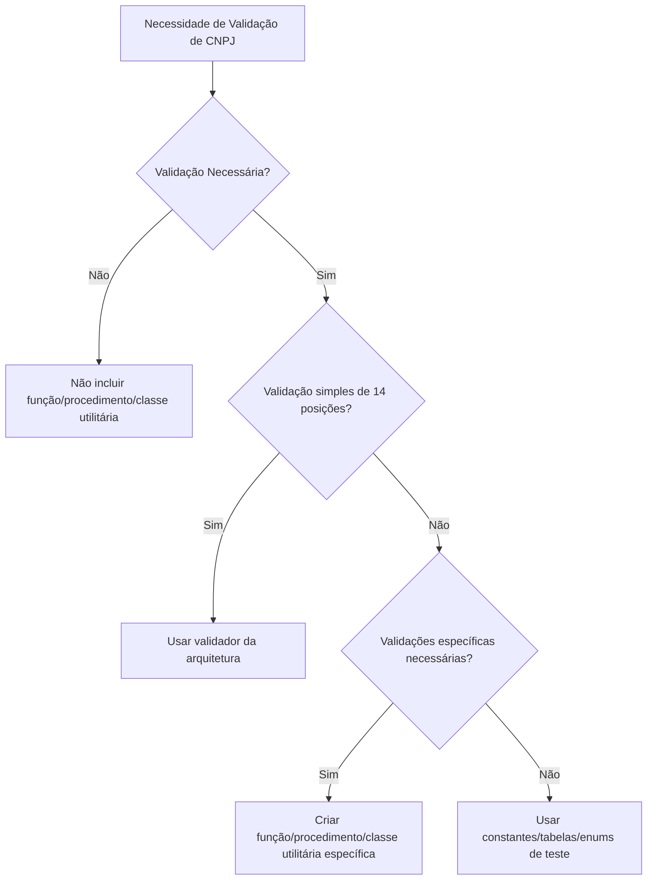

# Prompt de Implementação — CNPJ Alfanumérico (Versão Monolito)

Você é um **especialista em análise de código-fonte de sistemas fiscais no Brasil com arquitetura monolítica**, atuando como **Engenheiro de Prompts para o Cursor**.  
Seu objetivo é **analisar, atualizar e validar** todo o código do projeto fornecido (tanto do front-end quanto do back-end) e identificar todas as ocorrências de CNPJ em todas as camadas do sistema (componentes de interface, formulários, validações, exibição de dados, máscaras de entrada, interceptores, serviços de API, DTOs, lógica de negócios, controle de acesso, armazenamento local, testes de integração, entre outras interações de front-end e back-end) para suportar o **CNPJ e CPF alfanuméricos** **com retrocompatibilidade**, seguindo as regras descritas abaixo.  
Ao final, gere um **relatório técnico detalhado (inventário completo)** com todas as alterações realizadas no projeto e salve em:
```
.cnpj_alfanumerico/documentos/implementacao.md
```

> **Importante:** Este prompt é destinado **exclusivamente** a projetos de **arquitetura monolítica** que contenham **frontend e backend** no mesmo repositório ou sistema.

---

## 0) Regras para Tratamento de CNPJ Alfanumérico

### 0.1 Regras Gerais

#### 1. Ausência de Validação
**Caso não for feita a inclusão de nenhuma validação tanto para testes quanto para implementação de negócio, não deveremos incluir na aplicação nenhuma função, procedimento ou classe utilitária para validação de CNPJ alfanumérico.**

#### 2. Validação Padrão (Preferencial)
**Se houver alteração em regras de negócio ou rotinas de teste que necessite da validação de CNPJ, devemos dar preferência a utilizar o validador fornecido pela equipe de arquitetura da TokioMarine para validar o número do CNPJ com 14 posições.**

**Para validação de CPF, devemos utilizar `DocumentValidator.isValidCPF()` fornecido pela arquitetura. Métodos que validam CPF usando algoritmos manuais de validação de dígitos verificadores DEVEM ser substituídos para usar o validador da arquitetura (seguir rigorosamente a Seção 0.9).**

#### 3. Validações Específicas
**Nos casos onde houver além da necessidade de validar o CNPJ com 14, validar CNPJ não formatado com 14 posições (sem os zeros à esquerda), conversão de CNPJ ou validação/conversão de CPF, podemos utilizar funções utilitárias específicas (conforme a camada: `CnpjAlfaNumericoUtils.java` para backend, utilitários JavaScript/TypeScript para frontend), pois essas validações não seriam atendidas pelo método fornecido pela arquitetura.**

**IMPORTANTE:** Para validação de CPF, sempre usar `DocumentValidator.isValidCPF()`. Não criar validações manuais de CPF.

#### 4. Testes com CNPJs Pré-definidos
**Nos casos onde é necessário validar retornos de APIs ou componentes para validação de testes, pode-se utilizar números de CNPJ pré-definidos em enums, constantes ou tabelas de teste.**

---

## 0.5) Regra Obrigatória: Remoção de Marcadores de Conflito de Merge

> **⚠️ REGRA CRÍTICA E OBRIGATÓRIA:** Esta regra deve ser aplicada **ANTES de qualquer outra análise ou alteração** e **em TODOS os componentes analisados** (frontend e backend), independentemente de estarem relacionados a CNPJ/CPF ou não.

### 0.5.1 Escopo da Limpeza

O agente **DEVE** buscar e remover **automaticamente** todos os marcadores de conflito de merge do Git encontrados em **TODOS os arquivos do projeto**, incluindo:

- **Frontend:** Todos os arquivos de código, configuração e documentação (`.ts`, `.tsx`, `.js`, `.jsx`, `.vue`, `.html`, `.css`, `.scss`, `.json`, `.md`, etc.)
- **Backend:** Todos os arquivos de código, configuração e documentação (`.java`, `.kt`, `.cs`, `.ts`, `.js`, `.py`, `.properties`, `.yaml`, `.yml`, `.xml`, `.md`, etc.)

### 0.5.2 Padrões de Marcadores a Remover

O agente **DEVE** identificar e remover os seguintes padrões de marcadores de conflito (case-sensitive, exatos):

1. **Marcador de início de conflito:**
   - `<<<<<<< HEAD`
   - `<<<<<<< ` (seguido de qualquer texto, como branch name ou commit hash)
   - `<<<<<<<` (sem texto adicional)

2. **Marcador de separação:**
   - `=======`

3. **Marcador de fim de conflito:**
   - `>>>>>>> ` (seguido de hash de commit, ex: `>>>>>>> 408d6bf01cc4a1ca0ad2be9e6a0b499a8cfbf0f1`)
   - `>>>>>>>` (sem texto adicional)

### 0.5.3 Processo de Remoção

1. **Busca exaustiva:**
   - Realizar busca por grep/ripgrep em **TODOS os arquivos do projeto** (frontend e backend) pelos padrões: `<<<<<<<`, `=======`, `>>>>>>>`
   - Não limitar a busca apenas a arquivos relacionados a CNPJ/CPF.

2. **Resolução de conflitos:**
   - Se encontrar marcadores de conflito, o agente **DEVE**:
     - Analisar o contexto do conflito
     - Manter apenas o código válido e funcional
     - Remover todos os marcadores (`<<<<<<<`, `=======`, `>>>>>>>`)
     - Garantir que o código resultante seja sintaticamente correto
     - Se houver dúvida sobre qual versão manter, priorizar a versão mais recente ou a que está alinhada com o padrão do projeto

3. **Registro obrigatório:**
   - Registrar no inventário final (`implementacao.md`) **TODOS os arquivos** que continham marcadores de conflito e foram limpos, incluindo:
     - Caminho completo do arquivo
     - Tipo de conflito encontrado
     - Ação realizada (remoção de marcadores, resolução de conflito, etc.)

### 0.5.4 Validação Pós-Limpeza

Após a remoção dos marcadores, o agente **DEVE**:

1. Verificar que **nenhum marcador de conflito** (`<<<<<<<`, `=======`, `>>>>>>>`) permanece em nenhum arquivo do projeto
2. Validar que o código resultante está sintaticamente correto (executar linters quando disponível)
3. Garantir que não houve perda de funcionalidade durante a resolução dos conflitos

### 0.5.5 Critério de Aceite

- ✅ **Nenhum arquivo do projeto** contém marcadores de conflito de merge (`<<<<<<<`, `=======`, `>>>>>>>`)
- ✅ Todos os arquivos que continham marcadores foram limpos e registrados no relatório
- ✅ O código resultante está funcional e sintaticamente correto

---

## 0.6) Regra Obrigatória: Alteração de Tipos de Retorno de Métodos

> **⚠️ REGRA CRÍTICA E OBRIGATÓRIA:** Esta regra deve ser aplicada **em TODOS os métodos que retornam tipos numéricos relacionados a CNPJ/CPF**. **NÃO é aceitável** retornar `null` apenas para evitar exceções quando o CNPJ/CPF é alfanumérico. O tipo de retorno do método **DEVE ser alterado** para suportar valores alfanuméricos.

### 0.6.1 Escopo da Alteração

O agente **DEVE** identificar e alterar **TODOS os métodos** que retornam tipos numéricos relacionados a CNPJ/CPF, incluindo:

- **Métodos que retornam arrays numéricos:** `Integer[]`, `int[]`, `Long[]`, `long[]`, `Number[]`
- **Métodos que retornam tipos primitivos ou wrappers numéricos:** `Integer`, `int`, `Long`, `long`, `Number`, `BigInteger`
- **Métodos que processam, desformatam ou extraem partes de CNPJ/CPF** e retornam valores numéricos

### 0.6.2 Padrões de Métodos a Identificar

O agente **DEVE** buscar por métodos que:

1. **Retornam arrays numéricos relacionados a CNPJ/CPF:**
   - Exemplos: `desformataCpfCnpj()`, `parseCpfCnpj()`, `splitCpfCnpj()`, métodos que retornam `Integer[]`, `int[]`, `Long[]`
   - **CRÍTICO:** Métodos que retornam arrays com valores `null` quando recebem CNPJ alfanumérico (ex: `return new Integer[]{null, null, null}`) **DEVEM ser alterados** para retornar `String[]` com os valores alfanuméricos reais
   - **Ação obrigatória:** Alterar tipo de retorno para `String[]` e atualizar **TODAS as referências** ao método
   - **Garantir que o método retorna as partes reais do CNPJ/CPF**, não arrays com valores null

2. **Retornam valores numéricos extraídos de CNPJ/CPF:**
   - Exemplos: `getNumeroCpfCnpj()`, `getNumeroCpfCnpjSinistrado()`, `getIdEstabCpfCnpj()`, `getDigitoCpfCnpj()`, `getBaseCpfCnpj()`, métodos que retornam `Long`, `Integer`, `BigInteger`
   - **CRÍTICO:** Métodos que usam `Long.parseLong()`, `Integer.parseInt()`, `parseInt()`, `parseLong()` dentro do corpo do método **DEVEM ser identificados e alterados**, pois causarão `NumberFormatException` quando receberem caracteres não numéricos
   - **CRÍTICO:** Métodos com sufixos variados (ex: `getNumeroCpfCnpjSinistrado`, `getNumeroCpfCnpjFormatado`) também devem ser identificados e alterados
   - **Ação obrigatória:** Alterar tipo de retorno para `String` e atualizar **TODAS as referências** ao método
   - **Remover todas as chamadas a `Long.parseLong()`, `Integer.parseInt()` e similares** que tentam converter CNPJ/CPF para números

3. **Métodos utilitários que processam CNPJ/CPF:**
   - Métodos em classes utilitárias (ex: `FormaterUtil`, `CpfCnpjUtil`, `DocumentUtil`, `FiltroApoliceAMLP`) que retornam tipos numéricos
   - **Ação obrigatória:** Alterar tipo de retorno conforme necessário e atualizar **TODAS as referências**

### 0.6.3 Processo de Alteração

1. **Identificação exaustiva:**
   - Buscar por métodos que contenham nos nomes: `cnpj`, `cpf`, `numid`, `cgc`, `nr_docto`, `nr_cpf_cnpj` e que retornem tipos numéricos
   - **CRÍTICO:** Buscar especificamente por métodos que usam `Long.parseLong()` ou `Integer.parseInt()` dentro do corpo do método relacionado a CNPJ/CPF:
     - Padrões: `Long.parseLong.*cnpj`, `Long.parseLong.*cpf`, `Integer.parseInt.*cnpj`, `Integer.parseInt.*cpf`
     - Buscar por métodos que contenham `parseLong` ou `parseInt` e que processem CNPJ/CPF
   - Buscar por padrões de retorno: `return.*Integer`, `return.*Long`, `return.*int`, `return.*long`, `return.*Number`
   - Buscar por conversões que podem falhar: `Integer.parseInt`, `Long.parseLong`, `NumberFormatException`, `parseInt`, `parseLong`
   - **CRÍTICO:** Buscar por métodos que retornam arrays com valores null: `return new Integer[]{null`, `return new Long[]{null`, `return.*null.*null.*null`
   - **CRÍTICO:** Buscar por métodos com sufixos variados que podem processar CNPJ/CPF: `getNumeroCpfCnpj*`, `get*CpfCnpj*`, `desformata*`, `parse*`

2. **Análise de impacto:**
   - Para cada método identificado, buscar **TODAS as referências** (chamadas) ao método no projeto
   - Identificar todos os locais onde o retorno do método é usado
   - Classificar o impacto da alteração (crítico, moderado, baixo)

3. **Alteração obrigatória:**
   - **Alterar o tipo de retorno** do método de numérico para `String` ou `String[]`
   - **Atualizar TODAS as referências** ao método para trabalhar com o novo tipo
   - **Remover conversões numéricas** que não são mais necessárias ou que falhariam com valores alfanuméricos:
     - **CRÍTICO:** Remover todas as chamadas a `Long.parseLong()`, `Integer.parseInt()`, `parseInt()`, `parseLong()` que tentam converter CNPJ/CPF para números
     - **CRÍTICO:** Remover blocos `try-catch` que capturam `NumberFormatException` e retornam `null` ou arrays com valores null
   - **Garantir que o método retorne o valor alfanumérico completo**, não `null`
   - **CRÍTICO - Métodos que retornam arrays:** Garantir que métodos que retornam `String[]` retornem as partes reais do CNPJ/CPF (ex: `[numero, base, digito]`), **NÃO arrays com valores null** (ex: `[null, null, null]`)

4. **Validação:**
   - Verificar que nenhum método relacionado a CNPJ/CPF retorna `null` apenas para evitar exceções
   - Verificar que todas as referências foram atualizadas
   - Garantir que o código resultante funciona tanto com CNPJs numéricos quanto alfanuméricos

### 0.6.4 Exemplos de Alteração Obrigatória

#### Exemplo 1: Método que retorna array numérico (CRÍTICO - Nota 3 do feedback)

```java
// ❌ ERRADO - Retornar array com valores null quando recebe CNPJ alfanumérico
public Integer[] desformataCpfCnpj(String cpfCnpj) {
    try {
        String limpo = cpfCnpj.replaceAll("[^0-9]", "");
        Integer numero = Integer.parseInt(limpo.substring(0, 8));
        Integer base = Integer.parseInt(limpo.substring(8, 12));
        Integer digito = Integer.parseInt(limpo.substring(12, 14));
        return new Integer[]{numero, base, digito};
    } catch (NumberFormatException e) {
        return new Integer[]{null, null, null}; // ❌ ERRADO - Retorna null ao invés das partes do CNPJ
    }
}

// ✅ CORRETO - Alterar tipo de retorno para String[] e retornar as partes reais
public String[] desformataCpfCnpj(String cpfCnpj) {
    String limpo = cpfCnpj.replaceAll("[^A-Z0-9]", "").toUpperCase();
    String numero = limpo.substring(0, 8);  // ✅ Retorna parte alfanumérica real
    String base = limpo.substring(8, 12);  // ✅ Retorna parte alfanumérica real
    String digito = limpo.substring(12, 14); // ✅ Retorna parte numérica real
    return new String[]{numero, base, digito}; // ✅ Retorna valores alfanuméricos reais, não null
}
```

#### Exemplo 2: Método que retorna valor numérico (CRÍTICO - Nota 2 do feedback)

```java
// ❌ ERRADO - Long.parseLong causará Exception com caracteres não numéricos
public class FiltroApoliceAMLP {
    public Long getNumeroCpfCnpj(String cpfCnpj) {
        try {
            String limpo = cpfCnpj.replaceAll("[^0-9]", "");
            return Long.parseLong(limpo.substring(0, 8)); // ❌ ERRADO - Causa NumberFormatException com alfanumérico
        } catch (NumberFormatException e) {
            return null; // ❌ ERRADO
        }
    }
    
    public Long getNumeroCpfCnpjSinistrado(String cpfCnpj) {
        try {
            String limpo = cpfCnpj.replaceAll("[^0-9]", "");
            return Long.parseLong(limpo.substring(0, 8)); // ❌ ERRADO - Causa NumberFormatException com alfanumérico
        } catch (NumberFormatException e) {
            return null; // ❌ ERRADO
        }
    }
}

// ✅ CORRETO - Alterar tipo de retorno para String e remover Long.parseLong
public class FiltroApoliceAMLP {
    public String getNumeroCpfCnpj(String cpfCnpj) {
        String limpo = cpfCnpj.replaceAll("[^A-Z0-9]", "").toUpperCase();
        return limpo.substring(0, 8); // ✅ Retorna valor alfanumérico sem conversão
    }
    
    public String getNumeroCpfCnpjSinistrado(String cpfCnpj) {
        String limpo = cpfCnpj.replaceAll("[^A-Z0-9]", "").toUpperCase();
        return limpo.substring(0, 8); // ✅ Retorna valor alfanumérico sem conversão
    }
}
```

#### Exemplo 3: Atualização de referências

```java
// Antes - Usando retorno numérico
Integer[] partes = formaterUtil.desformataCpfCnpj(cnpj);
Long numero = filtro.getNumeroCpfCnpj(cnpj);

// Depois - Usando retorno String
String[] partes = formaterUtil.desformataCpfCnpj(cnpj);
String numero = filtro.getNumeroCpfCnpj(cnpj);
```

### 0.6.5 Critério de Aceite

- ✅ **Nenhum método relacionado a CNPJ/CPF retorna tipos numéricos** (`Integer`, `Long`, `int`, `long`, `Integer[]`, `Long[]`, etc.)
- ✅ **Nenhum método retorna `null` apenas para evitar exceções** quando o CNPJ/CPF é alfanumérico
- ✅ **Nenhum método usa `Long.parseLong()` ou `Integer.parseInt()`** para converter CNPJ/CPF para números (causaria `NumberFormatException` com caracteres não numéricos)
- ✅ **Métodos que retornam arrays retornam as partes reais do CNPJ/CPF**, não arrays com valores null (ex: `[null, null, null]`)
- ✅ **Métodos com sufixos variados foram identificados e alterados** (ex: `getNumeroCpfCnpjSinistrado`, `getNumeroCpfCnpjFormatado`)
- ✅ **Todos os métodos identificados tiveram seus tipos de retorno alterados** para `String` ou `String[]`
- ✅ **Todas as referências aos métodos foram atualizadas** para trabalhar com os novos tipos
- ✅ **O código funciona corretamente** tanto com CNPJs numéricos quanto alfanuméricos

---

## 0.7) Regra Obrigatória: Verificação e Configuração do Validador da Arquitetura

> **⚠️ REGRA CRÍTICA E OBRIGATÓRIA:** Esta regra deve ser aplicada **sempre que o código utilizar ou referenciar a classe `ValidatorCNPJalphanumeric`**. O agente **DEVE** verificar se a classe existe no projeto e, caso não exista, garantir que a dependência seja adicionada e os imports corretos sejam configurados.

### 0.7.1 Escopo da Verificação

O agente **DEVE** verificar e configurar adequadamente a classe `ValidatorCNPJalphanumeric` sempre que:

- O código referenciar ou utilizar `ValidatorCNPJalphanumeric.isValid()` ou métodos similares
- A validação de CNPJ alfanumérico for necessária conforme as regras da Seção 0
- Classes do backend precisarem validar CNPJs alfanuméricos

### 0.7.2 Processo de Verificação e Configuração

1. **Identificação de uso:**
   - Buscar por todas as referências a `ValidatorCNPJalphanumeric` no código (case-insensitive)
   - Identificar arquivos que importam ou utilizam essa classe
   - Verificar se há erros de compilação ou avisos do IDE indicando classe não encontrada

2. **Verificação da existência da classe:**
   - Buscar a classe `ValidatorCNPJalphanumeric` no projeto (arquivos `.java`, `.kt`, etc.)
   - Verificar se a classe existe no classpath do projeto
   - Identificar o package completo da classe (ex: `br.com.tokiomarine.validator.ValidatorCNPJalphanumeric`)

3. **Verificação de dependências:**
   - Se a classe **não existir** no projeto, verificar se é uma dependência externa:
     - Ler arquivos de build (`pom.xml`, `build.gradle`, `package.json`) para identificar repositórios e dependências
     - Buscar por referências à biblioteca ou artefato que contém `ValidatorCNPJalphanumeric`
     - Verificar documentação ou outros projetos similares para identificar o artefato Maven/Gradle necessário

4. **Adição de dependência (se necessário):**
   - Se a classe for uma dependência externa e não estiver no `pom.xml` (ou equivalente):
     - Adicionar a dependência no arquivo de build apropriado (`pom.xml`, `build.gradle`, etc.)
     - Incluir `groupId`, `artifactId` e `version` corretos
     - Verificar se é necessário adicionar repositório Maven/Gradle específico
     - Garantir compatibilidade com outras dependências do projeto

5. **Configuração de imports:**
   - Para cada arquivo que utiliza `ValidatorCNPJalphanumeric`:
     - Verificar se o import está presente e correto
     - Adicionar o import completo (ex: `import br.com.tokiomarine.validator.ValidatorCNPJalphanumeric;`)
     - Garantir que o import está no topo do arquivo, junto com os outros imports
     - Verificar que não há conflitos de import ou classes duplicadas

6. **Validação pós-configuração:**
   - Verificar que não há mais erros de compilação relacionados à classe
   - Confirmar que o IDE não mostra mais avisos sobre classe não encontrada
   - Garantir que a classe está disponível no classpath durante a compilação

### 0.7.3 Exemplos de Configuração

#### Exemplo 1: Adição de dependência no pom.xml

```xml
<!-- Se ValidatorCNPJalphanumeric for uma dependência externa -->
<dependency>
    <groupId>br.com.tokiomarine</groupId>
    <artifactId>validator-cnpj-alphanumeric</artifactId>
    <version>1.0.0</version> <!-- Ajustar versão conforme necessário -->
</dependency>
```

#### Exemplo 2: Import correto em classe Java

```java
// ✅ CORRETO - Import completo da classe
import br.com.tokiomarine.validator.ValidatorCNPJalphanumeric;

public class ValidationUtil {
    public static boolean validateCnpj(String str_cnpj) {
        // ... código de validação ...
        return ValidatorCNPJalphanumeric.isValid(cnpjLimpo);
    }
}
```

#### Exemplo 3: Verificação de existência antes de usar

```java
// Se a classe pode não estar disponível, verificar antes de usar
try {
    return ValidatorCNPJalphanumeric.isValid(cnpjLimpo);
} catch (NoClassDefFoundError e) {
    // Fallback para validação alternativa se a classe não estiver disponível
    // Registrar no relatório que a dependência precisa ser adicionada
    return validateCnpjFallback(cnpjLimpo);
}
```

### 0.7.4 Registro no Relatório

O agente **DEVE** registrar no relatório final (`implementacao.md`):

- **Arquivos que utilizam `ValidatorCNPJalphanumeric`:**
  - Caminho completo do arquivo
  - Tipo de uso (import, chamada de método, etc.)
  - Status da configuração (classe encontrada, dependência adicionada, import configurado)

- **Dependências adicionadas:**
  - Arquivo de build modificado (`pom.xml`, `build.gradle`, etc.)
  - Dependência adicionada (groupId, artifactId, version)
  - Repositório adicionado (se necessário)

- **Imports adicionados/corrigidos:**
  - Lista de arquivos que tiveram imports adicionados ou corrigidos
  - Package completo utilizado no import

- **Problemas encontrados:**
  - Se a classe não foi encontrada e não foi possível identificar a dependência
  - Se houve conflitos de dependência
  - Se foi necessário usar validação alternativa

### 0.7.5 Critério de Aceite

- ✅ **Todas as referências a `ValidatorCNPJalphanumeric` foram identificadas**
- ✅ **A classe existe no projeto OU a dependência foi adicionada ao arquivo de build**
- ✅ **Todos os imports estão corretos e completos em todos os arquivos que utilizam a classe**
- ✅ **Não há erros de compilação ou avisos do IDE relacionados à classe**
- ✅ **Todas as configurações foram registradas no relatório final**

---

## 0.9) Regra Obrigatória: Substituição de Métodos de Validação de CPF

> **⚠️ REGRA CRÍTICA E OBRIGATÓRIA:** Esta regra deve ser aplicada **em TODOS os métodos que validam CPF usando algoritmos manuais de validação de dígitos verificadores**. O agente **DEVE** identificar e substituir esses métodos para usar `DocumentValidator.isValidCPF()` fornecido pela arquitetura.

### 0.9.1 Escopo da Substituição

O agente **DEVE** identificar e substituir **TODOS os métodos** que validam CPF usando algoritmos manuais, incluindo:

- **Métodos com nomes relacionados a CPF:** `validarCPF`, `validateCPF`, `isValidCPF`, `validaCPF`, `verificarCPF`, `checkCPF`
- **Métodos que implementam validação de dígitos verificadores manualmente:**
  - Métodos que calculam dígitos verificadores usando loops, multiplicações e módulos
  - Métodos que validam CPF usando algoritmos numéricos (ex: algoritmo de validação de CPF com 11 dígitos)
  - Métodos que fazem validação de CPF sem usar o validador da arquitetura

### 0.9.2 Padrões de Métodos a Identificar

O agente **DEVE** buscar por métodos que:

1. **Têm nomes relacionados a validação de CPF:**
   - Padrões: `validarCPF`, `validateCPF`, `isValidCPF`, `validaCPF`, `verificarCPF`, `checkCPF`, `validarCpf`, `validateCpf`
   - Buscar case-insensitive em todo o código backend

2. **Implementam algoritmo de validação manual:**
   - Padrões de código que indicam validação manual:
     - Loops que calculam dígitos verificadores (ex: `for (int i = 0; i < 9; i++)`)
     - Cálculos com módulo 11 (ex: `% 11`, `mod 11`)s
     - Multiplicações sequenciais para validação de CPF
     - Extração e comparação de dígitos verificadores manualmente
     - Validação de CPF com 11 dígitos usando algoritmo numérico

3. **Não utilizam o validador da arquitetura:**
   - Métodos que não chamam `DocumentValidator.isValidCPF()`
   - Métodos que não importam ou referenciam `DocumentValidator`

### 0.9.3 Processo de Substituição

1. **Identificação exaustiva:**
   - Buscar por métodos que contenham nos nomes: `validarCPF`, `validateCPF`, `isValidCPF`, `validaCPF`, `verificarCPF`, `checkCPF`
   - Buscar por padrões de código que indicam validação manual de CPF:
     - Loops com cálculos de dígitos verificadores
     - Operações com módulo 11
     - Extração manual de dígitos verificadores
   - Buscar por métodos que validam CPF sem usar `DocumentValidator.isValidCPF()`

2. **Análise de impacto:**
   - Para cada método identificado, buscar **TODAS as referências** (chamadas) ao método no projeto
   - Identificar todos os locais onde o método é usado
   - Classificar o impacto da substituição (crítico, moderado, baixo)

3. **Substituição obrigatória:**
   - **Substituir a implementação manual** do método para usar `DocumentValidator.isValidCPF()`
   - **Adicionar o import correto** de `DocumentValidator` (verificar package completo)
   - **Manter a assinatura do método** (nome, parâmetros, tipo de retorno) para não quebrar referências existentes
   - **Remover código de validação manual** (loops, cálculos de dígitos verificadores, etc.)
   - **Garantir que o método funciona** tanto com CPFs numéricos quanto alfanuméricos

4. **Verificação e configuração do DocumentValidator:**
   - Verificar se a classe `DocumentValidator` existe no projeto ou se é uma dependência externa
   - Se não existir, adicionar dependência no `pom.xml` (ou equivalente) se necessário
   - Garantir que o import correto está presente (ex: `import br.com.tokiomarine.validator.DocumentValidator;`)
   - Seguir processo similar à **Seção 0.7** para configuração completa

5. **Validação:**
   - Verificar que todos os métodos de validação de CPF usam `DocumentValidator.isValidCPF()`
   - Verificar que não há mais validações manuais de CPF no código
   - Garantir que o código resultante funciona tanto com CPFs numéricos quanto alfanuméricos
   - Confirmar que todas as referências aos métodos continuam funcionando

### 0.9.4 Exemplos de Substituição Obrigatória

#### Exemplo 1: Método com validação manual de dígitos verificadores

```java
// ❌ ERRADO - Validação manual com algoritmo de dígitos verificadores
public class ValidationUtil {
    public static boolean validarCPF(String cpf) {
        if (cpf == null || cpf.length() != 11) {
            return false;
        }
        
        // Remove caracteres não numéricos
        String cpfLimpo = cpf.replaceAll("[^0-9]", "");
        
        // Validação de dígitos verificadores (algoritmo manual)
        int soma = 0;
        for (int i = 0; i < 9; i++) {
            int digito = Character.getNumericValue(cpfLimpo.charAt(i));
            soma += digito * (10 - i);
        }
        int primeiroDigito = 11 - (soma % 11);
        if (primeiroDigito >= 10) primeiroDigito = 0;
        
        soma = 0;
        for (int i = 0; i < 10; i++) {
            int digito = Character.getNumericValue(cpfLimpo.charAt(i));
            soma += digito * (11 - i);
        }
        int segundoDigito = 11 - (soma % 11);
        if (segundoDigito >= 10) segundoDigito = 0;
        
        return primeiroDigito == Character.getNumericValue(cpfLimpo.charAt(9)) &&
               segundoDigito == Character.getNumericValue(cpfLimpo.charAt(10));
    }
}

// ✅ CORRETO - Usar DocumentValidator.isValidCPF()
import br.com.tokiomarine.validator.DocumentValidator;

public class ValidationUtil {
    public static boolean validarCPF(String cpf) {
        if (cpf == null || cpf.isEmpty()) {
            return false;
        }
        
        // Remove caracteres não alfanuméricos e converte para maiúsculas
        String cpfLimpo = cpf.replaceAll("[^A-Z0-9]", "").toUpperCase();
        
        // Usa o validador da arquitetura
        return DocumentValidator.isValidCPF(cpfLimpo);
    }
}
```

#### Exemplo 2: Método que valida CPF sem usar validador

```java
// ❌ ERRADO - Validação sem usar DocumentValidator
public class CpfValidator {
    public boolean isValidCPF(String cpf) {
        // Validação básica sem algoritmo de dígitos verificadores
        return cpf != null && cpf.matches("\\d{11}");
    }
}

// ✅ CORRETO - Usar DocumentValidator.isValidCPF()
import br.com.tokiomarine.validator.DocumentValidator;

public class CpfValidator {
    public boolean isValidCPF(String cpf) {
        if (cpf == null || cpf.isEmpty()) {
            return false;
        }
        
        String cpfLimpo = cpf.replaceAll("[^A-Z0-9]", "").toUpperCase();
        return DocumentValidator.isValidCPF(cpfLimpo);
    }
}
```

### 0.9.5 Registro no Relatório

O agente **DEVE** registrar no relatório final (`implementacao.md`):

- **Métodos de validação de CPF identificados e substituídos:**
  - Caminho completo do arquivo
  - Nome do método e assinatura antes/depois
  - Tipo de validação manual que foi substituída (algoritmo de dígitos verificadores, validação básica, etc.)
  - Status da substituição (método substituído, import adicionado, dependência configurada)

- **Configuração do DocumentValidator:**
  - Arquivos que utilizam `DocumentValidator.isValidCPF()`
  - Dependências adicionadas (se necessário)
  - Imports adicionados/corrigidos
  - Package completo utilizado no import

- **Referências atualizadas:**
  - Lista de arquivos que chamam os métodos substituídos
  - Confirmação de que as referências continuam funcionando

- **Problemas encontrados:**
  - Se a classe `DocumentValidator` não foi encontrada e não foi possível identificar a dependência
  - Se houve conflitos de dependência
  - Se foi necessário manter validação alternativa (com justificativa)

### 0.9.6 Critério de Aceite

- ✅ **Todos os métodos de validação de CPF foram identificados**
- ✅ **Todos os métodos que validam CPF manualmente foram substituídos** para usar `DocumentValidator.isValidCPF()`
- ✅ **A classe `DocumentValidator` existe no projeto OU a dependência foi adicionada ao arquivo de build**
- ✅ **Todos os imports de `DocumentValidator` estão corretos e completos**
- ✅ **Não há mais validações manuais de CPF** (algoritmos de dígitos verificadores, loops de validação, etc.)
- ✅ **Todas as referências aos métodos substituídos continuam funcionando**
- ✅ **O código funciona corretamente** tanto com CPFs numéricos quanto alfanuméricos
- ✅ **Todas as substituições foram registradas no relatório final**

---

## 0.8) Regra Obrigatória: Preservação de Encoding/Charset

> **⚠️ REGRA CRÍTICA E OBRIGATÓRIA:** Esta regra deve ser aplicada **em TODOS os arquivos do projeto** durante qualquer alteração ou criação de arquivos.

### 0.8.1 Escopo da Regra

O agente **DEVE** garantir que o encoding/charset dos arquivos seja preservado ou configurado corretamente:

- **Encoding padrão:** UTF-8 para **TODOS os arquivos do projeto** (código, configuração, documentação)
- **Encoding específico:** ISO-8859-1 ou Windows-1252 **APENAS** na branch que contém arquivos SQL
- **Preservação:** Se possível, identificar o charset/encoding do arquivo original e mantê-lo

### 0.8.2 Processo de Aplicação

1. **Identificação do encoding atual:**
   - Tentar identificar o encoding/charset do arquivo antes de fazer alterações
   - Verificar se há declarações de encoding no arquivo (ex: `<?xml encoding="UTF-8"?>`, `charset="UTF-8"` em HTML)
   - Verificar configurações do projeto (ex: `.editorconfig`, `tsconfig.json`, `pom.xml`)

2. **Aplicação do encoding:**
   - **Arquivos de código, configuração e documentação:** Usar UTF-8
   - **Arquivos SQL (apenas na branch específica):** Usar ISO-8859-1 ou Windows-1252 conforme necessário
   - **Novos arquivos:** Sempre criar com UTF-8, exceto se explicitamente especificado para SQL

3. **Validação:**
   - Garantir que caracteres especiais (acentos, cedilhas, etc.) são preservados corretamente
   - Verificar que não há problemas de codificação após as alterações
   - Confirmar que arquivos SQL na branch específica mantêm o encoding correto

### 0.8.3 Critério de Aceite

- ✅ **Todos os arquivos de código, configuração e documentação estão em UTF-8**
- ✅ **Arquivos SQL na branch específica mantêm encoding ISO-8859-1 ou Windows-1252**
- ✅ **Caracteres especiais são preservados corretamente após alterações**
- ✅ **Não há problemas de codificação introduzidos pelas alterações**

---

## 1) Escopo de identificação de campos CNPJ e CPF

> **Considere como _campos de CNPJ ou CPF_** (case-insensitive, podendo estar em snake_case, camelCase, pascalCase, com prefixos/sufixos):  
> - `CPF`  
> - `NUMID`  
> - `CNPJ`  
> - `CGC`  
> - `NR_DOCTO`  
> - `NR_CPF_CNPJ`  
>
> **Não considere como campos de CNPJ/CPF** (lista de exclusão exata, case-insensitive):  
> - `idereg`, `idepol`, `idApolice`, `numoper`, `numcert`, `endosso`, `numenoso`, `nrApolice`, `apolice`, `numpol`, `chave`, `generica`, `chavegenerica`

---

## 2) Contexto normativo e técnico (resumo)

- **Comprimento fixo:** 14 caracteres.  
- **Estrutura:** 12 primeiros **alfanuméricos** (A–Z, 0–9) + 2 últimos **numéricos** (dígitos verificadores).  
- **Regex base (sem máscara):** `^[A-Z0-9]{12}\d{2}$`  
- **Regex com máscara:** `^[A-Z0-9]{2}\.[A-Z0-9]{3}\.[A-Z0-9]{3}/[A-Z0-9]{4}-\d{2}$`  
- **Máscara visual (frontend):** 
  - **Geral:** `SS.SSS.SSS/SSSS-NN` (onde `S` → alfanumérico A–Z, 0–9 e `N` → numérico 0–9)
  - **jquery.meio.mask.js:** `************99` ou `############99` (onde `*` ou `#` → alfanumérico A–Z, 0–9 e `99` → 2 dígitos numéricos)  
- **Retrocompatibilidade:** aceitar tanto CNPJ/CPF numérico (14 dígitos) quanto alfanumérico.  
- **Persistência (backend):** não converter para `int/long`; **sempre armazenar como `String`**; não usar `parseInt/Number`.  
- **Campos impactados:** formulários, componentes, máscaras, validações, pipes, form controls, DTOs, entidades, controllers, serviços, workers, testes e2e/unitários/integração.

---

## 3) Missão do agente (escopo Monolito — todas as camadas)

> **⚠️ ATENÇÃO CRÍTICA:** O agente **DEVE** realizar a varredura e análise em **TODAS as duas camadas simultaneamente** (Frontend e Backend). **NÃO** se limite a apenas uma camada. Se o agente identificar apenas arquivos de uma camada (ex: apenas Java do backend), ele **DEVE** expandir a busca para incluir frontend.

1. **Limpar marcadores de conflito de merge (OBRIGATÓRIO - PRIMEIRO PASSO):**
   - Buscar e remover **TODOS os marcadores de conflito de merge do Git** (`<<<<<<<`, `=======`, `>>>>>>>`) em **TODOS os arquivos do projeto** (frontend e backend), **independentemente de estarem relacionados a CNPJ/CPF ou não**.
   - Aplicar a regra descrita na **Seção 0.5** para garantir limpeza completa e sistemática.
   - Resolver conflitos não resolvidos, mantendo apenas o código válido e funcional.
   - Registrar no inventário todos os arquivos que continham marcadores de conflito e foram limpos.
2. **Inventariar ocorrências** de CNPJ/CPF em **todas as camadas** do sistema (Frontend e Backend):
   - **Frontend:** componentes, formulários, diretivas, validações, máscaras, regex, serviços, pipes, form controls, interceptores, armazenamento local, **funções de limpeza de dados**, testes e2e/unitários.
   - **Backend:** código, DTOs, entidades/models, controllers, serviços, workers, validações, utilitários, testes, documentação, contratos de API.
3. **Classificar impacto** por criticidade (crítico, moderado, baixo) e por camada.  
4. **Aplicar mudanças** para suportar alfanumérico com retrocompatibilidade em todas as camadas.  
5. **Atualizar validações** (regex + DV), máscaras, normalização, formatação e ordenação/consulta **somente quando houver necessidade** e **seguindo o Fluxo de Decisão (Seção 0)**.  
6. **Adequar tipos de dados** em todas as camadas:
   - Frontend: garantir que inputs aceitem alfanuméricos.
   - Backend: alterar `int/long` → `String` em DTOs, entidades, parâmetros.
   - **Backend (CRÍTICO):** Identificar e alterar **tipos de retorno de métodos** que retornam valores numéricos relacionados a CNPJ/CPF (`Integer[]`, `Long`, `Integer`, etc.) para `String` ou `String[]`, seguindo rigorosamente a **Seção 0.6**. **NÃO é aceitável** retornar `null` apenas para evitar exceções.
7. **Verificar e configurar o Validador da Arquitetura:**
   - **Backend (CRÍTICO):** Verificar se a classe `ValidatorCNPJalphanumeric` existe no projeto ou se é uma dependência externa, seguindo rigorosamente a **Seção 0.7**.
   - Adicionar dependência no `pom.xml` (ou equivalente) se necessário.
   - Garantir que todos os imports estão corretos e completos em todas as classes que utilizam o validador.
8. **Substituir métodos de validação de CPF:**
   - **Backend (CRÍTICO):** Identificar e substituir **TODOS os métodos** que validam CPF usando algoritmos manuais de validação de dígitos verificadores, seguindo rigorosamente a **Seção 0.9**.
   - Substituir implementações manuais por `DocumentValidator.isValidCPF()`.
   - Verificar e configurar a classe `DocumentValidator` (verificar se existe no projeto ou adicionar dependência se necessário).
   - Garantir que todos os imports estão corretos e completos.
9. **Adequar integrações** (APIs internas/externas) e contratos (OpenAPI/Swagger/JSON Schemas).  
9. **Criar/atualizar testes** conforme o tipo de alteração aplicada em cada camada (detalhado na seção 7).  
10. **Gerar relatório inventário completo** (`.cnpj_alfanumerico/documentos/implementacao.md`) listando todos os arquivos/objetos modificados por camada, suas alterações e justificativas, incluindo arquivos que continham marcadores de conflito e foram limpos.

---

## 4) Estratégia de varredura e identificação

> **⚠️ IMPORTANTE:** A varredura deve ser realizada **SIMULTANEAMENTE e de forma EXAUSTIVA** em **TODAS as duas camadas** (Frontend e Backend). **NÃO** se limite a apenas uma camada ou tecnologia específica. O agente deve usar múltiplas estratégias de busca para garantir cobertura completa.

### 4.0 Processo de varredura inicial (OBRIGATÓRIO)

Antes de iniciar qualquer alteração, o agente **DEVE** executar os seguintes passos em ordem:

1. **Identificar a estrutura do projeto:**
   - Listar diretórios raiz para identificar pastas de frontend (ex: `src/app`, `frontend`, `web`, `client`, `ui`), backend (ex: `src/main`, `backend`, `server`, `api`).
   - Verificar arquivos de configuração raiz (`package.json`, `pom.xml`, `build.gradle`, `angular.json`, `tsconfig.json`, etc.) para identificar tecnologias usadas.

2. **Busca sistemática por padrões de texto (case-insensitive):**
   - **Frontend:** Buscar por `cnpj`, `cpf`, `numid`, `cgc`, `nr_docto`, `nr_cpf_cnpj` em arquivos `.ts`, `.tsx`, `.js`, `.jsx`, `.vue`, `.html`, `.css`, `.scss`, `.json`.
   - **Backend:** Buscar pelos mesmos padrões em arquivos `.java`, `.kt`, `.cs`, `.ts`, `.js`, `.py`, `.properties`, `.yaml`, `.yml`.
   - **Backend (CRÍTICO):** Buscar por padrões de tipos de retorno numéricos relacionados a CNPJ/CPF:
     - Padrões de retorno: `Integer[]`, `Long`, `Integer`, `int[]`, `long[]`, `return.*Integer`, `return.*Long`
     - Padrões de métodos: `desformataCpfCnpj`, `getNumeroCpfCnpj`, `getNumeroCpfCnpj*` (incluindo sufixos variados), `getIdEstabCpfCnpj`, `getDigitoCpfCnpj`, `parseCpfCnpj`, `splitCpfCnpj`
     - **Padrões de conversão que podem falhar (CRÍTICO):** 
       - `Long.parseLong.*cnpj`, `Long.parseLong.*cpf`, `Integer.parseInt.*cnpj`, `Integer.parseInt.*cpf`
       - `Integer.parseInt`, `Long.parseLong`, `NumberFormatException`, `parseInt`, `parseLong`
       - Métodos que usam `parseLong` ou `parseInt` dentro de métodos relacionados a CNPJ/CPF
     - **Padrões de retorno null problemático (CRÍTICO):** 
       - `return null`, `return new Integer[]{null`, `return new Long[]{null`
       - `return new Integer[]{null, null, null}` (array com valores null ao invés das partes do CNPJ)
       - `catch.*NumberFormatException.*return null`

3. **Busca semântica por contexto:**
   - Usar busca semântica para encontrar ocorrências relacionadas a CNPJ/CPF em cada camada:
     - Frontend: "Where are CNPJ input masks configured?", "Where are CNPJ validations in forms?", "Where are CNPJ services called?"
     - Backend: "Where are CNPJ DTOs defined?", "Where are CNPJ validations in controllers?", "Where are CNPJ entities stored?"
     - **Backend (CRÍTICO):** 
       - "Where are methods that return numeric types (Integer, Long, Integer[]) related to CNPJ/CPF?"
       - "Where are methods that parse or format CNPJ/CPF and return numbers?"
       - "Where are methods that use Long.parseLong or Integer.parseInt to convert CNPJ/CPF to numbers?"
       - "Where are methods like getNumeroCpfCnpj or getNumeroCpfCnpjSinistrado that return Long?"
       - "Where are methods like desformataCpfCnpj that return Integer[] and may return null values?"

4. **Identificar bibliotecas e dependências:**
   - **Frontend:** Ler `package.json` para identificar bibliotecas de máscara, validação e frameworks.
   - **Frontend (CRÍTICO):** Identificar se o projeto utiliza `jquery.meio.mask.js`:
     - Buscar por referências a `jquery.meio.mask`, `setMask`, `meio.mask` no código
     - Identificar todas as ocorrências de uso de máscaras CNPJ/CPF
     - Identificar funções de limpeza de dados (ex: `salvarEntidade()`, funções que removem caracteres especiais)
   - **Backend:** Ler arquivos de build (`pom.xml`, `build.gradle`, `package.json`) para identificar frameworks e bibliotecas.
   - **Backend (CRÍTICO):** Verificar se a classe `ValidatorCNPJalphanumeric` existe no projeto ou se é uma dependência externa:
     - Buscar por referências a `ValidatorCNPJalphanumeric` no código
     - Verificar se a classe está presente no classpath
     - Se não existir, identificar se precisa ser adicionada como dependência no `pom.xml` (ou equivalente)
     - Seguir rigorosamente a **Seção 0.7** para configuração completa
   - **Backend (CRÍTICO):** Identificar métodos de validação de CPF que usam algoritmos manuais:
     - Buscar por métodos com nomes: `validarCPF`, `validateCPF`, `isValidCPF`, `validaCPF`, `verificarCPF`, `checkCPF`
     - Buscar por padrões de código que indicam validação manual (loops, cálculos de dígitos verificadores, módulo 11)
     - Verificar se os métodos usam `DocumentValidator.isValidCPF()` ou implementam validação manual
     - Seguir rigorosamente a **Seção 0.9** para substituição completa

5. **Buscar e remover marcadores de conflito de merge (OBRIGATÓRIO - APLICAR EM TODOS OS ARQUIVOS):**
   - Buscar em **TODOS os arquivos do projeto** (frontend e backend), **independentemente de estarem relacionados a CNPJ/CPF ou não**, por marcadores de conflito de merge do Git:
     - `<<<<<<< HEAD` (ou variações como `<<<<<<<`, `<<<<<<< ` seguido de qualquer texto)
     - `=======`
     - `>>>>>>> ` seguido de hash de commit (ex: `>>>>>>> 408d6bf01cc4a1ca0ad2be9e6a0b499a8cfbf0f1`)
   - **Seguir rigorosamente a regra descrita na Seção 0.5** para garantir limpeza completa e sistemática.
   - **Remover automaticamente** todos os marcadores de conflito encontrados, mantendo apenas o código válido e funcional.
   - Se houver conflitos não resolvidos, o agente deve resolver escolhendo a versão correta do código ou mesclando adequadamente.
   - Registrar no inventário **TODOS os arquivos** que continham marcadores de conflito e foram limpos, incluindo caminho completo e tipo de conflito encontrado.

6. **Verificar e configurar encoding/charset:**
   - Identificar o encoding atual dos arquivos (quando possível).
   - Garantir que todos os arquivos de código, configuração e documentação estejam em UTF-8.
   - Verificar se há arquivos SQL em branch específica que precisam manter encoding ISO-8859-1 ou Windows-1252.
   - Seguir rigorosamente a **Seção 0.8** para preservação de encoding.

7. **Criar inventário inicial:**
   - Listar TODOS os arquivos encontrados, organizados por camada (Frontend, Backend).
   - Classificar cada ocorrência por tipo (input mask, validação, DTO, entidade, controller, serviço, função de limpeza, etc.).
   - Incluir lista de arquivos que continham marcadores de conflito e foram limpos.
   - Incluir informações sobre encoding/charset dos arquivos.

### 4.1 Escopo de busca (extensões e objetos)

#### Frontend
- **Código:** `.ts`, `.tsx`, `.js`, `.jsx`, `.vue`, `.html`, `.css`, `.scss`  
- **Config:** `package.json`, `.json`, `.yaml`, `.yml`, `.properties`, `.env`  
- **Docs:** `.md`, `.txt`

#### Backend
- **Código:** `.java`, `.kt`, `.cs`, `.ts`, `.js`, `.py`  
- **Config:** `.json`, `.yaml`, `.yml`, `.properties`, `.env`, `pom.xml`, `build.gradle`, `package.json`  
- **Docs:** `.md`, `.txt`


### 4.2 Padrões de busca (case-insensitive)

**Padrões de INCLUSÃO** (buscar em TODAS as camadas):
- `cnpj`, `cpf`, `numid`, `cgc`, `nr_docto`, `nr_cpf_cnpj`
- Variações: `CNPJ`, `CPF`, `NumId`, `numId`, `NUM_ID`, `nrDocto`, `nr_docto`, `nrCpfCnpj`, `nr_cpf_cnpj`
- **Bibliotecas de máscara:** `jquery.meio.mask`, `setMask`, `ngx-mask`, `react-input-mask`, `imask`, `cleave`, `vanilla-masker`
- **Funções de limpeza:** `salvarEntidade`, `limpar`, `clean`, `remove`, `replace`, funções que removem caracteres especiais antes de salvar

**Padrões de EXCLUSÃO** (ignorar, case-insensitive):
- `idereg`, `idepol`, `idApolice`, `numoper`, `numcert`, `endosso`, `numenoso`, `nrApolice`, `apolice`, `numpol`, `chave`, `generica`, `chavegenerica`

**Padrões de BUSCA CRÍTICA - Tipos de Retorno de Métodos** (buscar em Backend):
- **Tipos de retorno numéricos:** `Integer[]`, `Long`, `Integer`, `int[]`, `long[]`, `Number[]`, `BigInteger`
- **Padrões de métodos:** `desformataCpfCnpj`, `getNumeroCpfCnpj`, `getNumeroCpfCnpj*` (incluindo sufixos variados como `getNumeroCpfCnpjSinistrado`), `getIdEstabCpfCnpj`, `getDigitoCpfCnpj`, `parseCpfCnpj`, `splitCpfCnpj`, `getBaseCpfCnpj`
- **Padrões de conversão problemática (CRÍTICO):** 
  - `Long.parseLong.*cnpj`, `Long.parseLong.*cpf`, `Integer.parseInt.*cnpj`, `Integer.parseInt.*cpf`
  - `Integer.parseInt`, `Long.parseLong`, `NumberFormatException`, `parseInt`, `parseLong`, `valueOf`
  - Métodos que usam `parseLong` ou `parseInt` dentro de métodos relacionados a CNPJ/CPF
- **Padrões de retorno null problemático:** 
  - `return null`, `return new Integer[]{null`, `return new Long[]{null`
  - `catch.*NumberFormatException.*return null`
  - `return new Integer[]{null, null, null}` (array com valores null ao invés das partes do CNPJ)

**Padrões de BUSCA CRÍTICA - Métodos de Validação de CPF** (buscar em Backend):
- **Nomes de métodos de validação de CPF:** `validarCPF`, `validateCPF`, `isValidCPF`, `validaCPF`, `verificarCPF`, `checkCPF`, `validarCpf`, `validateCpf`
- **Padrões de código que indicam validação manual:**
  - Loops com cálculos de dígitos verificadores: `for.*i.*<.*9`, `for.*i.*<.*10`, `for.*i.*<.*11`
  - Cálculos com módulo 11: `% 11`, `mod 11`, `soma % 11`
  - Extração manual de dígitos: `charAt(9)`, `charAt(10)`, `substring(9, 11)`
  - Validação sem `DocumentValidator.isValidCPF()`

**Padrões de LIMPEZA OBRIGATÓRIA** (remover imediatamente ao encontrar em **TODOS os arquivos do projeto**, independentemente de estarem relacionados a CNPJ/CPF):
- Marcadores de conflito de merge do Git:
  - `<<<<<<< HEAD` ou `<<<<<<< ` (seguido de qualquer texto)
  - `=======`
  - `>>>>>>> ` (seguido de hash de commit, ex: `>>>>>>> 408d6bf01cc4a1ca0ad2be9e6a0b499a8cfbf0f1`)
- **Ação:** Remover automaticamente todos esses marcadores de **TODOS os arquivos encontrados**, mantendo apenas o código válido e funcional. Se houver conflitos não resolvidos, resolver adequadamente seguindo a **Seção 0.5**.
- **Escopo:** Esta limpeza deve ser aplicada a **TODOS os componentes analisados** (frontend e backend), não apenas aos relacionados a CNPJ/CPF.

**Estratégia de busca recomendada:**
1. **Busca por grep/ripgrep:** Usar busca exata por padrões de texto em todas as extensões relevantes de cada camada.
2. **Busca semântica:** Usar busca semântica para encontrar contextos relacionados que podem não conter os termos exatos.
3. **Busca por tipo de arquivo:** Buscar em grupos de extensões específicas de cada camada (ver 4.1).
4. **Validação cruzada:** Comparar resultados de diferentes métodos de busca para garantir cobertura completa.

### 4.3 Estratégia de busca por camada (EXECUÇÃO OBRIGATÓRIA)

O agente **DEVE** executar buscas específicas em cada camada usando as ferramentas disponíveis:

#### Frontend - Busca Obrigatória

1. **Busca por extensões de arquivo:**
   - Buscar padrões `cnpj|cpf|numid|cgc|nr_docto|nr_cpf_cnpj` em arquivos: `*.ts`, `*.tsx`, `*.js`, `*.jsx`, `*.vue`, `*.html`, `*.css`, `*.scss`, `*.json`
   - Exemplo: Buscar em todos os arquivos TypeScript/JavaScript do frontend.

2. **Busca semântica específica:**
   - "Where are CNPJ input masks configured in the frontend?"
   - "Where is jquery.meio.mask.js used for CNPJ masks?"
   - "Where are functions that clean or sanitize CNPJ data before saving?"
   - "Where are CNPJ form validations in the frontend?"
   - "Where are CNPJ services or API calls in the frontend?"
   - "Where are CNPJ pipes or formatters in the frontend?"

3. **Verificar arquivos de configuração:**
   - Ler `package.json` (raiz e pastas de frontend) para identificar bibliotecas de máscara.
   - Verificar arquivos de configuração de frameworks (ex: `angular.json`, `vite.config.ts`, `next.config.js`).

4. **Buscar em diretórios típicos de frontend:**
   - `src/app`, `src/components`, `src/services`, `src/utils`, `src/validators`, `src/pipes`, `src/directives`
   - `components`, `pages`, `services`, `utils`, `validators`, `hooks`, `helpers`

#### Backend - Busca Obrigatória

1. **Busca por extensões de arquivo:**
   - Buscar padrões `cnpj|cpf|numid|cgc|nr_docto|nr_cpf_cnpj` em arquivos: `*.java`, `*.kt`, `*.cs`, `*.ts`, `*.js`, `*.py`, `*.properties`, `*.yaml`, `*.yml`
   - Exemplo: Buscar em todos os arquivos Java/TypeScript/Python do backend.

2. **Busca semântica específica:**
   - "Where are CNPJ DTOs defined in the backend?"
   - "Where are CNPJ entities or models in the backend?"
   - "Where are CNPJ validations in controllers or services?"
   - "Where are CNPJ API endpoints defined?"
   - **CRÍTICO:** "Where are methods that return Integer, Long, or Integer[] related to CNPJ or CPF?"
   - **CRÍTICO:** "Where are utility methods that parse, format, or extract parts of CNPJ/CPF and return numeric types?"
   - **CRÍTICO:** "Where are methods that use Long.parseLong or Integer.parseInt to convert CNPJ/CPF to numbers?"
   - **CRÍTICO:** "Where are methods like getNumeroCpfCnpj or getNumeroCpfCnpjSinistrado in FiltroApoliceAMLP that return Long?"
   - **CRÍTICO:** "Where are methods like desformataCpfCnpj that return Integer[] and may return arrays with null values?"
   - **CRÍTICO:** "Where are methods that return null when CNPJ/CPF cannot be converted to numbers?"
   - **CRÍTICO:** "Where are methods that validate CPF using manual algorithms or digit verification?"
   - **CRÍTICO:** "Where are CPF validation methods that don't use DocumentValidator.isValidCPF()?"

3. **Verificar arquivos de configuração:**
   - Ler `pom.xml`, `build.gradle`, `package.json` (backend) para identificar frameworks.
   - Verificar arquivos de configuração de API (ex: `application.properties`, `application.yml`, `swagger.yaml`).

4. **Buscar em diretórios típicos de backend:**
   - `src/main/java`, `src/main/kotlin`, `src/main/resources`
   - `controllers`, `services`, `dto`, `entities`, `models`, `validators`, `utils`
   - `api`, `domain`, `infrastructure`, `application`

### 4.4 Objetos a verificar por camada

#### Frontend
- **Componentes:** inputs, formulários, diretivas, pipes, formatadores
- **Serviços:** serviços de API, interceptores, utilitários
- **Validações:** validators, regex, form controls
- **Máscaras:** bibliotecas de máscara (ngx-mask, react-input-mask, imask.js, cleave.js, vanilla-masker, jquery.meio.mask.js, etc.)
- **Funções de limpeza de dados:** funções que limpam dados antes de salvar (ex: `salvarEntidade()`, funções que removem pontos, barras, hífens, etc.)
- **Armazenamento:** localStorage, sessionStorage, cookies
- **Testes:** testes unitários, testes e2e

#### Backend
- **DTOs:** classes de transferência de dados
- **Entidades/Models:** modelos de domínio
- **Controllers:** endpoints de API
- **Serviços:** lógica de negócio
- **Workers:** processamento assíncrono
- **Validações:** validators, regex, annotations
- **Contratos:** OpenAPI, Swagger, JSON Schemas
- **Métodos utilitários (CRÍTICO):** métodos que retornam tipos numéricos relacionados a CNPJ/CPF (ex: `FormaterUtil`, `CpfCnpjUtil`, `DocumentUtil`, classes de filtro)
- **Testes:** testes unitários, testes de integração

### 4.5 Validação de cobertura (OBRIGATÓRIO antes de prosseguir)

Antes de iniciar as alterações, o agente **DEVE** validar que encontrou arquivos em **TODAS as duas camadas**:

1. **Checklist de validação:**
   - [ ] **Frontend:** Encontrei pelo menos um arquivo relacionado a CNPJ/CPF? (componente, serviço, validação, máscara, etc.)
   - [ ] **Backend:** Encontrei pelo menos um arquivo relacionado a CNPJ/CPF? (DTO, entidade, controller, serviço, etc.)

2. **Se alguma camada estiver vazia:**
   - Expandir a busca usando diferentes estratégias (busca semântica, busca por diretórios, busca por extensões).
   - Verificar se a camada realmente existe no projeto (pode ser um projeto sem frontend ou sem backend separado).
   - Documentar no relatório se alguma camada não foi encontrada e o motivo.

3. **Se encontrar apenas uma camada:**
   - **PARAR** e expandir a busca antes de prosseguir.
   - Usar `list_dir` para explorar a estrutura do projeto.
   - Verificar se há subdiretórios que não foram explorados.
   - Usar busca semântica mais ampla para encontrar outras camadas.

4. **Registrar no inventário inicial:**
   - Listar TODOS os arquivos encontrados, organizados por camada.
   - Incluir caminho completo, tipo de arquivo e descrição do que foi encontrado.

---

## 5) Mudanças obrigatórias por camada

### 5.1 Frontend

#### 5.1.1 Identificação de biblioteca de máscara
- Detectar automaticamente qual biblioteca de máscara está sendo usada no projeto, verificando dependências no `package.json` ou referências no código.
- Exemplos: `ngx-mask`, `react-input-mask`, `imask.js`, `cleave.js`, `vanilla-masker`, `jquery.meio.mask.js`.
- **CRÍTICO - jquery.meio.mask.js:** Se o projeto utilizar `jquery.meio.mask.js`, identificar todas as ocorrências de uso e aplicar o padrão correto de máscara alfanumérica.
- Consultar a documentação oficial da biblioteca para entender como configurar máscaras personalizadas.

#### 5.1.2 Ajuste da máscara
- Converter o padrão numérico `##.###.###/####-##` para alfanumérico respeitando o formato aceito pela biblioteca detectada.
- **CRÍTICO - jquery.meio.mask.js:** Para o plugin `jquery.meio.mask.js`, usar o padrão correto:
  - **Antes (apenas numérico):** `$("#cnpj").setMask("99999999999999");` ou `$("#cnpj").setMask("99.999.999/9999-99");`
  - **Depois (alfanumérico):** `$("#cnpj").setMask("************99");` ou `$("#cnpj").setMask("############99");`
  - Onde `*` ou `#` representa caracteres alfanuméricos (A-Z, 0-9) e `99` representa os 2 últimos dígitos numéricos
- **Funções de limpeza de dados:** Identificar funções que limpam dados antes de salvar (ex: `salvarEntidade()`, funções que removem pontos, barras, hífens, etc.) e garantir que:
  - A máscara seja aplicada corretamente antes da limpeza
  - A limpeza preserve caracteres alfanuméricos (não remover letras)
  - O valor limpo mantenha os 14 caracteres (12 alfanuméricos + 2 numéricos)
- Para outras bibliotecas, converter para o padrão equivalente:
  - `ngx-mask`: `SS.SSS.SSS/SSSS-NN`
  - `react-input-mask`: `AA.AAA.AAA/AAAA-NN`
- Caso a biblioteca não aceite caracteres alfabéticos nativamente:
  - Adicionar expressão regular customizada (se disponível).
  - Ou criar diretiva/componente customizado baseado no padrão existente.

#### 5.1.3 Ajuste de validação
- Atualizar **validações de formulário** (`Validators.pattern`, `Yup`, `Zod`, etc.) para aceitar letras nos 12 primeiros caracteres:
  ```typescript
  Validators.pattern(/^[A-Z0-9]{12}\d{2}$/i)
  ```
- Para inputs mascarados, garantir que o valor submetido seja limpo (`unmask`/`rawValue`) sem perder as letras.
- Atualizar também **pipes, formatadores e máscaras visuais**.

#### 5.1.4 Atualização dos testes
- Atualizar testes unitários e e2e:
  - Inserir exemplos de CNPJs numéricos e alfanuméricos.
  - Validar máscaras, digitação, formatação e submissão de dados.
  - Garantir que as letras A–Z sejam aceitas nos 12 primeiros caracteres.

### 5.2 Backend

#### 5.2.1 Tipagem
- Alterar **tipos numéricos (`int`, `long`, `number`) → `String`** em todos os campos identificados como **CNPJ ou CPF**.  
- Atualizar construtores, DTOs, mapeamentos e serializações.
- **CRÍTICO - Tipos de retorno de métodos:** Identificar e alterar **TODOS os métodos** que retornam tipos numéricos relacionados a CNPJ/CPF:
  - Métodos que retornam `Integer[]`, `int[]`, `Long[]`, `long[]` → alterar para `String[]`
  - Métodos que retornam `Integer`, `Long`, `int`, `long`, `BigInteger` → alterar para `String`
  - **NÃO é aceitável** retornar `null` apenas para evitar exceções - o tipo de retorno **DEVE ser alterado**
  - Atualizar **TODAS as referências** (chamadas) aos métodos alterados
  - Seguir rigorosamente a **Seção 0.6** para o processo completo de alteração

#### 5.2.2 Validações
- **Validação:** obedecer as regras da Seção 0.  
  - Se necessário, usar `ValidatorCNPJalphanumeric.isValid(cnpj)` (preferencial).  
  - **CRÍTICO:** Antes de usar `ValidatorCNPJalphanumeric`, seguir rigorosamente a **Seção 0.7** para:
    - Verificar se a classe existe no projeto
    - Adicionar dependência no `pom.xml` (ou equivalente) se necessário
    - Garantir que o import correto está presente na classe que utiliza o validador
  - **CRÍTICO - Validação de CPF:** Identificar e substituir **TODOS os métodos** que validam CPF usando algoritmos manuais, seguindo rigorosamente a **Seção 0.9**:
    - Substituir implementações manuais por `DocumentValidator.isValidCPF()`
    - Verificar se a classe `DocumentValidator` existe no projeto ou adicionar dependência se necessário
    - Garantir que o import correto está presente (ex: `import br.com.tokiomarine.validator.DocumentValidator;`)
    - Remover código de validação manual (loops, cálculos de dígitos verificadores, etc.)
  - Para casos específicos, usar `CnpjAlfaNumericoUtils` (Java) ou utilitários equivalentes em outras linguagens.  
  - **Se não houver necessidade de validação**, **não criar** nenhum validador.  
- **Normalização:** permitir letras nos 12 primeiros caracteres.  
- **Máscaras:** garantir que as máscaras permitam caracteres A–Z e 0–9.

#### 5.2.3 APIs / Contratos
- Atualizar contratos de entrada/saída (`OpenAPI`, `Swagger`, `JSON Schemas`) para `type: string`.  
- Garantir retrocompatibilidade com integrações legadas.

---

## 6) Relatório Final (`implementacao.md`)

O relatório deve conter um **inventário completo** organizado por **camada** (Frontend, Backend), incluindo:

### 6.1 Resumo técnico do projeto
- Framework frontend (Angular, React, Vue, etc.), versão e bibliotecas detectadas.
- Stack backend (Java, .NET, Node.js, Python, etc.), versão e frameworks.
- Biblioteca de máscara identificada (nome + versão) — se aplicável.
- **Encoding/Charset configurado:** 
  - Encoding padrão utilizado (UTF-8 para código, configuração e documentação)
  - Encoding específico para arquivos SQL (se aplicável)
  - Arquivos que tiveram encoding alterado ou preservado
- **Arquivos limpos de marcadores de conflito de merge:** Lista de arquivos que continham marcadores de conflito (`<<<<<<<`, `=======`, `>>>>>>>`) e foram limpos durante a implementação.

### 6.2 Frontend
- Biblioteca de máscara identificada (nome + versão).
- Trecho da configuração original e ajustada da máscara.
- Regex e máscaras aplicadas (antes/depois).
- **Funções de limpeza de dados identificadas e ajustadas:**
  - Lista de funções que limpam dados antes de salvar (ex: `salvarEntidade()`)
  - Alterações realizadas para preservar caracteres alfanuméricos
  - Garantia de que a máscara é aplicada corretamente antes da limpeza
- Arquivos alterados (lista detalhada).
- Referências da documentação oficial da biblioteca.
- Casos de teste criados/ajustados.

### 6.3 Backend
- Arquivos alterados (lista detalhada):
  - Caminho completo do arquivo.
  - Descrição da alteração (ex.: refactor tipagem, ajuste regex, atualização validação, etc.).
  - Trecho antes/depois (quando aplicável).
  - Observação sobre necessidade de testes.
- **Métodos com tipos de retorno alterados (CRÍTICO):**
  - Lista completa de métodos que tiveram tipos de retorno alterados (ex: `Integer[]` → `String[]`, `Long` → `String`).
  - Caminho completo do arquivo onde o método está definido.
  - Nome do método e assinatura antes/depois.
  - **Métodos específicos que usavam `Long.parseLong()` ou `Integer.parseInt()`** (ex: `getNumeroCpfCnpj`, `getNumeroCpfCnpjSinistrado`, `desformataCpfCnpj`).
  - **Métodos que retornavam arrays com valores null** e foram corrigidos para retornar as partes reais do CNPJ/CPF.
  - Lista de TODAS as referências (chamadas) ao método que foram atualizadas.
  - Justificativa da alteração (não retornar `null` para evitar exceções, não usar `Long.parseLong()` que causaria `NumberFormatException`).
- **Configuração do Validador da Arquitetura (CRÍTICO):**
  - **Arquivos que utilizam `ValidatorCNPJalphanumeric`:**
    - Caminho completo do arquivo.
    - Tipo de uso (import, chamada de método, etc.).
    - Status da configuração (classe encontrada, dependência adicionada, import configurado).
  - **Dependências adicionadas:**
    - Arquivo de build modificado (`pom.xml`, `build.gradle`, etc.).
    - Dependência adicionada (groupId, artifactId, version).
    - Repositório adicionado (se necessário).
  - **Imports adicionados/corrigidos:**
    - Lista de arquivos que tiveram imports adicionados ou corrigidos.
    - Package completo utilizado no import.
  - **Problemas encontrados:**
    - Se a classe não foi encontrada e não foi possível identificar a dependência.
    - Se houve conflitos de dependência.
    - Se foi necessário usar validação alternativa.
- **Métodos de validação de CPF substituídos (CRÍTICO):**
  - Lista completa de métodos que validavam CPF manualmente e foram substituídos para usar `DocumentValidator.isValidCPF()`.
  - Caminho completo do arquivo onde o método está definido.
  - Nome do método e assinatura antes/depois.
  - Tipo de validação manual que foi substituída (algoritmo de dígitos verificadores, validação básica, etc.).
  - Lista de TODAS as referências (chamadas) ao método que foram verificadas.
  - Status da configuração do `DocumentValidator` (classe encontrada, dependência adicionada, import configurado).
- Contratos de API atualizados (OpenAPI, Swagger, etc.).

### 6.4 Localização do relatório
O relatório é salvo em:  
`.cnpj_alfanumerico/documentos/implementacao.md`

---

## 7) Testes

### 7.1 Análise de necessidade por camada
O agente deve **analisar automaticamente a necessidade de criar ou atualizar testes**, de acordo com o tipo de modificação realizada em cada camada:

#### Frontend
| Tipo de Alteração | Exige Teste? | Tipo de Teste |
|-------------------|---------------|----------------|
| Mudança em máscara de input | Sim | Unitário e e2e |
| Mudança em validação de formulário | Sim | Unitário |
| Mudança em pipe/formatador | Sim | Unitário |
| Mudança em serviço de API | Sim | Unitário e Integração |
| Ajuste apenas de documentação | Não | — |

#### Backend
| Tipo de Alteração | Exige Teste? | Tipo de Teste |
|-------------------|---------------|----------------|
| Mudança de tipagem simples (int → String) | Não | — |
| Mudança em DTO, Model ou Controller | Sim | Unitário |
| Inclusão/alteração de validação de CNPJ/CPF | Sim | Unitário e Integração |
| **Substituição de método de validação de CPF (algoritmo manual → DocumentValidator.isValidCPF())** | **Sim** | **Unitário e Integração** |
| Mudança em contratos de API | Sim | Integração |
| Alterações em serviços, workers ou pipelines de dados | Sim | Integração |
| **Alteração de tipo de retorno de método (Integer[] → String[], Long → String)** | **Sim** | **Unitário e Integração** |
| Ajuste apenas de documentação | Não | — |

- **Caso nenhum teste seja necessário**, o agente deve apenas registrar isso no relatório (`implementacao.md`).

### 7.2 Scripts de teste

#### Frontend
- Criar/atualizar testes unitários e e2e para validar:
  - Máscaras aceitam letras nos 12 primeiros caracteres.
  - Validações funcionam com CNPJs numéricos e alfanuméricos.
  - Formatação e exibição de dados.
  - Submissão de formulários.

#### Backend
- Criar/atualizar testes unitários e de integração para validar:
  - DTOs e entidades aceitam CNPJs alfanuméricos.
  - Validações funcionam corretamente.
  - Contratos de API estão corretos.
  - Integrações mantêm retrocompatibilidade.
  - **CRÍTICO:** Métodos que tiveram tipos de retorno alterados funcionam corretamente com CNPJs numéricos e alfanuméricos.
  - **CRÍTICO:** Métodos não retornam `null` quando recebem CNPJs alfanuméricos.
  - **CRÍTICO:** Métodos não usam `Long.parseLong()` ou `Integer.parseInt()` para converter CNPJ/CPF para números (não causam `NumberFormatException`).
  - **CRÍTICO:** Métodos que retornam arrays retornam as partes reais do CNPJ/CPF, não arrays com valores null.
  - **CRÍTICO:** Métodos com sufixos variados (ex: `getNumeroCpfCnpjSinistrado`) foram identificados, alterados e testados.
  - **CRÍTICO:** Todas as referências aos métodos alterados foram atualizadas e funcionam corretamente.
  - **CRÍTICO:** Métodos de validação de CPF usam `DocumentValidator.isValidCPF()` e funcionam corretamente com CPFs numéricos e alfanuméricos.
  - **CRÍTICO:** Não há mais validações manuais de CPF no código.

---

## 8) Code Review Final (último step)

1. **Limpeza de código (OBRIGATÓRIO - PRIMEIRO PASSO):**
   - **Verificar e remover TODOS os marcadores de conflito de merge do Git** em **TODOS os arquivos do projeto**, **independentemente de estarem relacionados a CNPJ/CPF ou não**:
     - Buscar por `<<<<<<<`, `=======`, `>>>>>>>` em **TODOS os arquivos** (frontend e backend).
     - Seguir rigorosamente a **regra descrita na Seção 0.5**.
     - Remover automaticamente todos os marcadores encontrados.
     - Resolver conflitos não resolvidos, mantendo apenas o código válido e funcional.
     - Registrar no relatório **TODOS os arquivos** que foram limpos, incluindo caminho completo e tipo de conflito encontrado.

2. **Frontend:**
   - Revisar todas as alterações de input masks e validações.
   - **CRÍTICO:** Verificar que máscaras do `jquery.meio.mask.js` estão configuradas corretamente (`************99` ou `############99`).
   - **CRÍTICO:** Verificar que funções de limpeza de dados (ex: `salvarEntidade()`) preservam caracteres alfanuméricos e aplicam a máscara corretamente.
   - Comparar comportamento anterior e novo (numérico x alfanumérico).
   - Verificar encoding/charset dos arquivos (UTF-8).
   - Executar os testes unitários e e2e completos.
   - Verificar a documentação e comentários de código.
   - Confirmar que a máscara visual está conforme o padrão oficial.

3. **Backend:**
   - Revisar todos os arquivos alterados.
   - Executar linters e formatadores automáticos.
   - Verificar encoding/charset dos arquivos (UTF-8, exceto SQL na branch específica).
   - Revisar potenciais regressões em validações e contratos.
   - **CRÍTICO:** Verificar que nenhum método relacionado a CNPJ/CPF retorna tipos numéricos ou `null` para evitar exceções.
   - **CRÍTICO:** Verificar que nenhum método usa `Long.parseLong()` ou `Integer.parseInt()` para converter CNPJ/CPF para números (causaria `NumberFormatException` com caracteres não numéricos).
   - **CRÍTICO:** Verificar que métodos que retornam arrays retornam as partes reais do CNPJ/CPF, não arrays com valores null (ex: `[null, null, null]`).
   - **CRÍTICO:** Verificar que métodos com sufixos variados foram identificados e alterados (ex: `getNumeroCpfCnpjSinistrado`, `getNumeroCpfCnpjFormatado`).
   - **CRÍTICO:** Verificar que todos os métodos com tipos de retorno alterados têm todas as suas referências atualizadas.
   - **CRÍTICO:** Verificar configuração do `ValidatorCNPJalphanumeric`:
     - Confirmar que a classe existe no projeto ou que a dependência foi adicionada ao `pom.xml` (ou equivalente).
     - Verificar que todos os imports estão corretos e completos.
     - Confirmar que não há erros de compilação ou avisos do IDE relacionados à classe.
     - Seguir rigorosamente a **Seção 0.7** para validação completa.
   - **CRÍTICO:** Verificar métodos de validação de CPF:
     - Confirmar que todos os métodos que validam CPF usam `DocumentValidator.isValidCPF()`.
     - Verificar que não há mais validações manuais de CPF (algoritmos de dígitos verificadores, loops de validação, etc.).
     - Confirmar que a classe `DocumentValidator` existe no projeto ou que a dependência foi adicionada.
     - Verificar que todos os imports de `DocumentValidator` estão corretos e completos.
     - Seguir rigorosamente a **Seção 0.9** para validação completa.
   - Rodar a suíte de testes completa.
   - Garantir conformidade com as regras de compatibilidade e retrocompatibilidade.

4. **Integração:**
   - Validar fluxo completo frontend → backend.
   - Testar retrocompatibilidade end-to-end.
   - Verificar que dados existentes continuam funcionando.

5. **Anexar evidências no relatório (`implementacao.md`).**

---

## 9) Critérios de Aceite

### Frontend
- A máscara do CNPJ aceita letras (A–Z) nos 12 primeiros caracteres e números nos 2 últimos.
- A biblioteca de máscara foi configurada conforme sua documentação oficial.
- **CRÍTICO - jquery.meio.mask.js:** Se o projeto utilizar `jquery.meio.mask.js`, a máscara CNPJ está configurada como `************99` ou `############99`.
- **Funções de limpeza de dados:** Funções que limpam dados antes de salvar (ex: `salvarEntidade()`) preservam caracteres alfanuméricos e aplicam a máscara corretamente.
- Validações regex foram atualizadas.
- Todos os testes passam com CNPJs numéricos e alfanuméricos.

### Backend
- Todos os campos de CNPJ e CPF aceitam **A–Z e 0–9** nos 12 primeiros caracteres e **apenas dígitos** nos 2 últimos.
- Nenhum código tenta converter esses valores para numérico.
- **CRÍTICO:** Todos os métodos que retornam tipos numéricos relacionados a CNPJ/CPF (`Integer[]`, `Long`, `Integer`, etc.) tiveram seus tipos de retorno alterados para `String` ou `String[]`.
- **CRÍTICO:** Nenhum método retorna `null` apenas para evitar exceções quando o CNPJ/CPF é alfanumérico.
- **CRÍTICO:** Nenhum método usa `Long.parseLong()` ou `Integer.parseInt()` para converter CNPJ/CPF para números (causaria `NumberFormatException` com caracteres não numéricos).
- **CRÍTICO:** Métodos que retornam arrays retornam as partes reais do CNPJ/CPF, não arrays com valores null (ex: `[null, null, null]`).
- **CRÍTICO:** Métodos com sufixos variados foram identificados e alterados (ex: `getNumeroCpfCnpjSinistrado`, `getNumeroCpfCnpjFormatado`).
- **CRÍTICO:** Todas as referências aos métodos alterados foram atualizadas para trabalhar com os novos tipos.
- **CRÍTICO:** A classe `ValidatorCNPJalphanumeric` está configurada corretamente:
  - A classe existe no projeto OU a dependência foi adicionada ao `pom.xml` (ou equivalente).
  - Todos os imports estão corretos e completos em todos os arquivos que utilizam a classe.
  - Não há erros de compilação ou avisos do IDE relacionados à classe.
- **CRÍTICO:** Todos os métodos de validação de CPF usam `DocumentValidator.isValidCPF()`:
  - Todos os métodos que validavam CPF manualmente foram substituídos para usar o validador da arquitetura.
  - A classe `DocumentValidator` existe no projeto OU a dependência foi adicionada ao `pom.xml` (ou equivalente).
  - Todos os imports de `DocumentValidator` estão corretos e completos.
  - Não há mais validações manuais de CPF (algoritmos de dígitos verificadores, loops de validação, etc.).
- Contratos e validações foram ajustados.

### Geral
- **Nenhum marcador de conflito de merge do Git** (`<<<<<<<`, `=======`, `>>>>>>>`) está presente em **nenhum arquivo do projeto**, **independentemente de estarem relacionados a CNPJ/CPF ou não**.
- Todos os arquivos que continham marcadores de conflito foram limpos e registrados no relatório final.
- **Encoding/Charset:** Todos os arquivos de código, configuração e documentação estão em UTF-8. Arquivos SQL na branch específica mantêm encoding ISO-8859-1 ou Windows-1252 conforme necessário.
- O relatório final contém o **inventário completo** por camada e análise de testes, incluindo lista de arquivos limpos de marcadores de conflito e informações sobre encoding/charset.
- Retrocompatibilidade foi mantida em todas as camadas.
- Fluxo end-to-end funciona corretamente.

---

## 10) Exemplos práticos

### 10.1 Frontend (Angular + ngx-mask)

```typescript
// Antes
<input mask="00.000.000/0000-00" formControlName="cnpj" />

// Depois
<input mask="SS.SSS.SSS/SSSS-NN" formControlName="cnpj" />

// Validação
Validators.pattern(/^[A-Z0-9]{12}\d{2}$/i)
```

**Referência:** [ngx-mask Documentation](https://www.npmjs.com/package/ngx-mask)

### 10.2 Frontend (React + react-input-mask)

```jsx
// Antes
<InputMask mask="99.999.999/9999-99" value={cnpj} onChange={handleChange} />

// Depois
<InputMask mask="AA.AAA.AAA/AAAA-NN" value={cnpj} onChange={handleChange} />

// Validação (Yup)
Yup.string().matches(/^[A-Z0-9]{12}\d{2}$/i, 'CNPJ inválido')
```

**Referência:** [react-input-mask GitHub](https://github.com/sanniassin/react-input-mask)

### 10.2.1 Frontend (jQuery + jquery.meio.mask.js)

```javascript
// Antes - Apenas numérico
function salvarEntidade(){
    $("#cnpj").setMask("99999999999999");
    $("#cep").setMask("99999999");
    $(".telefone").setMask("?999999999");
    $("#entidadeForm").submit();
}

// Depois - Alfanumérico (12 primeiros caracteres alfanuméricos + 2 numéricos)
function salvarEntidade(){
    $("#cnpj").setMask("************99");  // ou "############99"
    $("#cep").setMask("99999999");
    $(".telefone").setMask("?999999999");
    $("#entidadeForm").submit();
}
```

**Observações importantes:**
- A função `salvarEntidade()` tem o propósito de salvar uma entidade, limpando os dados antes (removendo caracteres como pontos, barras, hífens, etc.)
- Para o CNPJ, usar `*` ou `#` para aceitar tanto numérico quanto alfanumérico nos 12 primeiros caracteres
- Os 2 últimos caracteres (`99`) devem ser apenas numéricos (dígitos verificadores)
- A máscara deve ser aplicada antes da limpeza de dados, garantindo que caracteres alfanuméricos sejam preservados

**Referência:** Plugin `jquery.meio.mask.js`

### 10.3 Backend (Java)

```java
// Antes
public class EmpresaDTO {
    private Long cnpj;
    // ...
}

// Depois
public class EmpresaDTO {
    private String cnpj;
    // ...
}

// Validação (se necessário)
// ✅ CORRETO - Import completo da classe (ajustar package conforme necessário)
import br.com.tokiomarine.validator.ValidatorCNPJalphanumeric;

public class ValidationUtil {
    public static boolean validateCnpj(String cnpj) {
        // ... código de validação ...
        boolean isValid = ValidatorCNPJalphanumeric.isValid(cnpj);
        return isValid;
    }
}
```

**Importante:** Antes de usar `ValidatorCNPJalphanumeric`, seguir a **Seção 0.7** para:
- Verificar se a classe existe no projeto
- Adicionar dependência no `pom.xml` se necessário
- Garantir que o import correto está presente

### 10.4 Backend (TypeScript/Node.js)

```typescript
// Antes
interface EmpresaDTO {
    cnpj: number;
}

// Depois
interface EmpresaDTO {
    cnpj: string;
}

// Validação
const isValid = /^[A-Z0-9]{12}\d{2}$/i.test(cnpj);
```

### 10.5 Backend (Java) - Alteração de Tipos de Retorno de Métodos (CRÍTICO)

#### Exemplo 1: Método que retorna array numérico (CRÍTICO - Nota 3 do feedback)

```java
// ❌ ERRADO - Retorna array com valores null quando recebe CNPJ alfanumérico
public class FormaterUtil {
    public Integer[] desformataCpfCnpj(String cpfCnpj) {
        try {
            String limpo = cpfCnpj.replaceAll("[^0-9]", "");
            Integer numero = Integer.parseInt(limpo.substring(0, 8));
            Integer base = Integer.parseInt(limpo.substring(8, 12));
            Integer digito = Integer.parseInt(limpo.substring(12, 14));
            return new Integer[]{numero, base, digito};
        } catch (NumberFormatException e) {
            return new Integer[]{null, null, null}; // ❌ ERRADO - Retorna null ao invés das partes do CNPJ
        }
    }
}

// ✅ CORRETO - Alterar tipo de retorno para String[] e retornar as partes reais
public class FormaterUtil {
    public String[] desformataCpfCnpj(String cpfCnpj) {
        String limpo = cpfCnpj.replaceAll("[^A-Z0-9]", "").toUpperCase();
        String numero = limpo.substring(0, 8);  // ✅ Retorna parte alfanumérica real
        String base = limpo.substring(8, 12);  // ✅ Retorna parte alfanumérica real
        String digito = limpo.substring(12, 14); // ✅ Retorna parte numérica real
        return new String[]{numero, base, digito}; // ✅ Retorna valores alfanuméricos reais, não null
    }
}

// Atualização de referências
// Antes:
Integer[] partes = formaterUtil.desformataCpfCnpj(cnpj);
Integer numero = partes[0];

// Depois:
String[] partes = formaterUtil.desformataCpfCnpj(cnpj);
String numero = partes[0];
```

#### Exemplo 2: Método que retorna valor numérico (CRÍTICO - Nota 2 do feedback)

```java
// ❌ ERRADO - Long.parseLong causará Exception com caracteres não numéricos
public class FiltroApoliceAMLP {
    public Long getNumeroCpfCnpj(String cpfCnpj) {
        try {
            String limpo = cpfCnpj.replaceAll("[^0-9]", "");
            return Long.parseLong(limpo.substring(0, 8)); // ❌ ERRADO - Causa NumberFormatException com alfanumérico
        } catch (NumberFormatException e) {
            return null; // ❌ ERRADO
        }
    }
    
    public Long getNumeroCpfCnpjSinistrado(String cpfCnpj) {
        try {
            String limpo = cpfCnpj.replaceAll("[^0-9]", "");
            return Long.parseLong(limpo.substring(0, 8)); // ❌ ERRADO - Causa NumberFormatException com alfanumérico
        } catch (NumberFormatException e) {
            return null; // ❌ ERRADO
        }
    }
    
    public Long getIdEstabCpfCnpj(String cpfCnpj) {
        try {
            String limpo = cpfCnpj.replaceAll("[^0-9]", "");
            return Long.parseLong(limpo.substring(8, 12));
        } catch (NumberFormatException e) {
            return null; // ❌ ERRADO
        }
    }
    
    public Long getDigitoCpfCnpj(String cpfCnpj) {
        try {
            String limpo = cpfCnpj.replaceAll("[^0-9]", "");
            return Long.parseLong(limpo.substring(12, 14));
        } catch (NumberFormatException e) {
            return null; // ❌ ERRADO
        }
    }
}

// ✅ CORRETO - Alterar tipo de retorno para String e remover Long.parseLong
public class FiltroApoliceAMLP {
    public String getNumeroCpfCnpj(String cpfCnpj) {
        String limpo = cpfCnpj.replaceAll("[^A-Z0-9]", "").toUpperCase();
        return limpo.substring(0, 8); // ✅ Retorna valor alfanumérico sem conversão
    }
    
    public String getNumeroCpfCnpjSinistrado(String cpfCnpj) {
        String limpo = cpfCnpj.replaceAll("[^A-Z0-9]", "").toUpperCase();
        return limpo.substring(0, 8); // ✅ Retorna valor alfanumérico sem conversão
    }
    
    public String getIdEstabCpfCnpj(String cpfCnpj) {
        String limpo = cpfCnpj.replaceAll("[^A-Z0-9]", "").toUpperCase();
        return limpo.substring(8, 12); // ✅ Retorna valor alfanumérico
    }
    
    public String getDigitoCpfCnpj(String cpfCnpj) {
        String limpo = cpfCnpj.replaceAll("[^A-Z0-9]", "").toUpperCase();
        return limpo.substring(12, 14); // ✅ Retorna valor alfanumérico
    }
}

// Atualização de referências
// Antes:
Long numero = filtro.getNumeroCpfCnpj(cnpj);
Long numeroSinistrado = filtro.getNumeroCpfCnpjSinistrado(cnpj);
Long idEstab = filtro.getIdEstabCpfCnpj(cnpj);
Long digito = filtro.getDigitoCpfCnpj(cnpj);

// Depois:
String numero = filtro.getNumeroCpfCnpj(cnpj);
String numeroSinistrado = filtro.getNumeroCpfCnpjSinistrado(cnpj);
String idEstab = filtro.getIdEstabCpfCnpj(cnpj);
String digito = filtro.getDigitoCpfCnpj(cnpj);
```

#### Exemplo 3: Método de validação de CPF (CRÍTICO)

```java
// ❌ ERRADO - Validação manual com algoritmo de dígitos verificadores
public class ValidationUtil {
    public static boolean validarCPF(String cpf) {
        if (cpf == null || cpf.length() != 11) {
            return false;
        }
        
        String cpfLimpo = cpf.replaceAll("[^0-9]", "");
        
        // Algoritmo manual de validação de dígitos verificadores
        int soma = 0;
        for (int i = 0; i < 9; i++) {
            int digito = Character.getNumericValue(cpfLimpo.charAt(i));
            soma += digito * (10 - i);
        }
        int primeiroDigito = 11 - (soma % 11);
        if (primeiroDigito >= 10) primeiroDigito = 0;
        
        soma = 0;
        for (int i = 0; i < 10; i++) {
            int digito = Character.getNumericValue(cpfLimpo.charAt(i));
            soma += digito * (11 - i);
        }
        int segundoDigito = 11 - (soma % 11);
        if (segundoDigito >= 10) segundoDigito = 0;
        
        return primeiroDigito == Character.getNumericValue(cpfLimpo.charAt(9)) &&
               segundoDigito == Character.getNumericValue(cpfLimpo.charAt(10));
    }
}

// ✅ CORRETO - Usar DocumentValidator.isValidCPF()
import br.com.tokiomarine.validator.DocumentValidator;

public class ValidationUtil {
    public static boolean validarCPF(String cpf) {
        if (cpf == null || cpf.isEmpty()) {
            return false;
        }
        
        // Remove caracteres não alfanuméricos e converte para maiúsculas
        String cpfLimpo = cpf.replaceAll("[^A-Z0-9]", "").toUpperCase();
        
        // Usa o validador da arquitetura
        return DocumentValidator.isValidCPF(cpfLimpo);
    }
}
```

**Importante:** Antes de usar `DocumentValidator.isValidCPF()`, seguir a **Seção 0.9** para:
- Verificar se a classe existe no projeto
- Adicionar dependência no `pom.xml` se necessário
- Garantir que o import correto está presente

---

## 11) Fluxo de Decisão



---

## 12) Ordem de implementação recomendada

Para garantir que as alterações sejam feitas de forma coordenada e sem quebrar dependências:

0. **Limpeza de código (PRIMEIRO PASSO OBRIGATÓRIO):**
   - Buscar e remover **TODOS os marcadores de conflito de merge do Git** (`<<<<<<<`, `=======`, `>>>>>>>`) em **TODOS os arquivos do projeto**, **independentemente de estarem relacionados a CNPJ/CPF ou não**.
   - Seguir rigorosamente a **regra descrita na Seção 0.5**.
   - Resolver conflitos não resolvidos, mantendo apenas o código válido e funcional.
   - Registrar no inventário todos os arquivos que continham marcadores de conflito e foram limpos.

1. **Backend:**
   - Atualizar DTOs e entidades.
   - **CRÍTICO:** Identificar e alterar tipos de retorno de métodos que retornam valores numéricos relacionados a CNPJ/CPF (seguir Seção 0.6).
   - **CRÍTICO:** Atualizar TODAS as referências aos métodos com tipos de retorno alterados.
   - **CRÍTICO:** Verificar e configurar `ValidatorCNPJalphanumeric` (seguir Seção 0.7):
     - Verificar se a classe existe no projeto
     - Adicionar dependência no `pom.xml` (ou equivalente) se necessário
     - Garantir que todos os imports estão corretos
   - **CRÍTICO:** Identificar e substituir métodos de validação de CPF (seguir Seção 0.9):
     - Buscar métodos que validam CPF usando algoritmos manuais
     - Substituir por `DocumentValidator.isValidCPF()`
     - Verificar se a classe `DocumentValidator` existe no projeto ou adicionar dependência se necessário
     - Garantir que todos os imports estão corretos
   - Atualizar validações e serviços.
   - Atualizar contratos de API.
   - Executar testes.

2. **Frontend:**
   - Atualizar máscaras (incluindo `jquery.meio.mask.js` se aplicável).
   - Atualizar funções de limpeza de dados para preservar caracteres alfanuméricos.
   - Atualizar validações.
   - Atualizar serviços de API.
   - Verificar e configurar encoding/charset (UTF-8).
   - Executar testes.

3. **Testes de Integração:**
   - Validar fluxo completo frontend → backend.
   - Testar retrocompatibilidade end-to-end.

---

## 13) Conclusão

Este prompt deve ser aplicado **apenas em projetos de arquitetura monolítica** que contenham **frontend e backend** no mesmo repositório ou sistema.  
A missão do agente é garantir que **todas as camadas do sistema (frontend e backend) suportem CNPJ alfanumérico** conforme o padrão oficial, mantendo **retrocompatibilidade** com CNPJs numéricos existentes.

> **⚠️ LEMBRETE FINAL:** O agente **NUNCA** deve se limitar a apenas uma camada. Se encontrar apenas arquivos de backend (ex: Java), ele **DEVE** expandir a busca para frontend usando as estratégias descritas na Seção 4. A varredura deve ser **exaustiva e simultânea** em todas as duas camadas.

```diff
+ Inventariar ocorrências em todas as camadas (frontend, backend)
+ Identificar biblioteca de máscara (frontend)
+ Ajustar máscaras e validações (frontend)
+ Ajustar tipos de dados e validações (backend)
+ Atualizar testes em todas as camadas
+ Testar retrocompatibilidade end-to-end
+ Gerar relatório completo com inventário por camada
```

