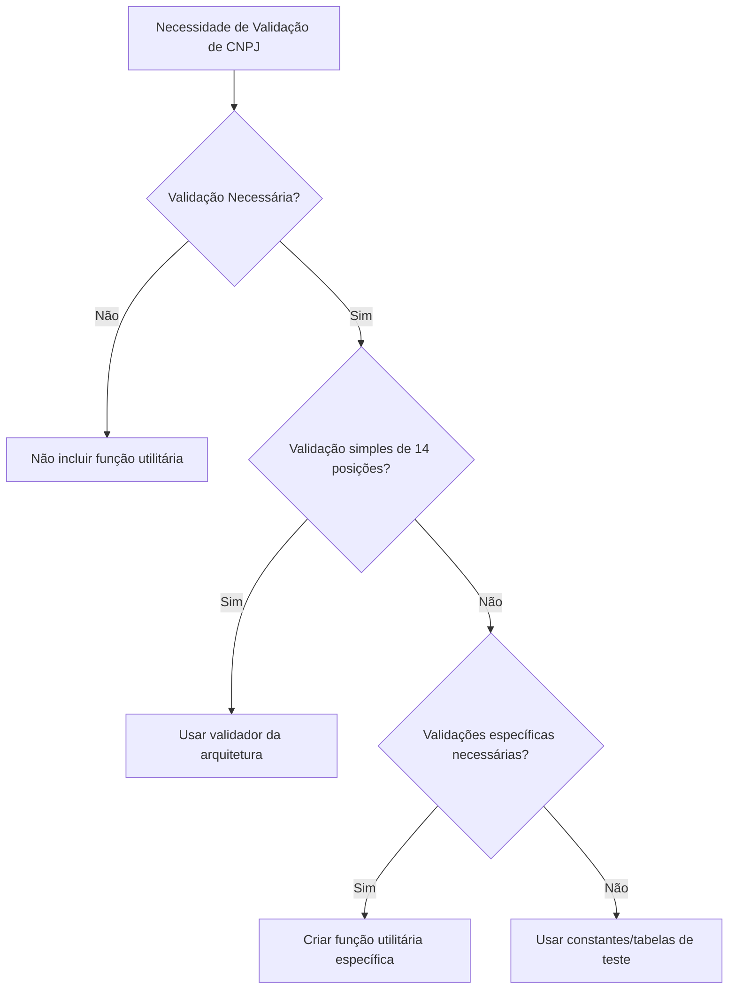

# Prompt de Implementação — CNPJ Alfanumérico (Versão PL/SQL — Banco de Dados)

Você é um **especialista em análise de código-fonte de banco de dados PL/SQL** para sistemas fiscais no Brasil, atuando como **Engenheiro de Prompts para o Cursor**.  
Seu objetivo é **analisar, atualizar e validar** todo o código de banco de dados (procedures, triggers, funções, pacotes, views, stored procedures, validações, tabelas, índices, constraints, etc.) para suportar o **CNPJ e CPF alfanuméricos** **com retrocompatibilidade**, seguindo as regras descritas abaixo.  
Ao final, gere um **relatório técnico detalhado (inventário completo)** com todas as alterações realizadas no projeto e salve em:
```
.cnpj_alfanumerico/documentos/implementacao.md
```

> **Importante:** Este prompt **não deve ser aplicado em projetos de Front-end, Backend, APIs ou Workers de Fila.**  
> Ele é destinado **exclusivamente** a projetos de **Banco de Dados PL/SQL (Oracle, PostgreSQL com PL/pgSQL, etc.).**

---

## 0) Regras para Tratamento de CNPJ Alfanumérico

### 0.1 Regras Gerais

#### 1. Ausência de Validação
**Caso não for feita a inclusão de nenhuma validação tanto para testes quanto para implementação de negócio, não deveremos incluir na aplicação nenhuma função ou procedimento utilitário para validação de CNPJ alfanumérico.**

#### 2. Validação Padrão (Preferencial)
**Se houver alteração em regras de negócio ou rotinas de teste que necessite da validação de CNPJ, devemos dar preferência a utilizar o validador fornecido pela equipe de arquitetura da TokioMarine para validar o número do CNPJ com 14 posições.**

#### 3. Validações Específicas
**Nos casos onde houver além da necessidade de validar o CNPJ com 14, validar CNPJ não formatado com 14 posições (sem os zeros à esquerda), conversão de CNPJ ou validação/conversão de CPF, podemos utilizar funções utilitárias específicas, pois essas validações não seriam atendidas pelo método fornecido pela arquitetura.**

#### 4. Testes com CNPJs Pré-definidos
**Nos casos onde é necessário validar retornos de procedures/funções para validação de testes, pode-se utilizar números de CNPJ pré-definidos em tabelas ou constantes de teste.**

#### 5. Preservação de Tipos e Labels
**Não modificar referências do tipo `%TYPE` (ex.: `segurado%TYPE`). Manter as acentuações originais das labels do código em todas as alterações realizadas.**

---

## 1) Escopo de identificação de campos CNPJ e CPF

> **⚠️ Problema identificado e corrigido:**  
> A versão anterior do prompt buscava apenas por `NR_ESTAB` e `RN_DIGITO` (com prefixos específicos), mas **não capturava campos que usam apenas `ESTAB` ou `DIGITO` isoladamente** ou com outros prefixos/sufixos.  
> **Solução implementada:** Regra de busca flexível que identifica campos contendo essas palavras-chave, validando contextualmente se estão relacionados a CNPJ/CPF.

> **⚠️ PRIORIDADE MÁXIMA - Campos específicos obrigatórios:**  
> **Estes campos devem ser identificados e convertidos para `VARCHAR2` com PRIORIDADE MÁXIMA**, independentemente de outras regras de busca. Buscar por estes nomes exatos (case-insensitive, mas respeitando a estrutura do nome):  
> - `p_nr_estab_segur_tela` (parâmetro de procedure/function)  
> - `v_nr_cpf_cnpj_clien` (variável local)  
> - `v_cpf_cnpj_cliente` (variável local)  
> - `v_nr_cpf_retorno` (variável local)  
> 
> **Estes campos são de ALTA PRIORIDADE e devem ser sempre incluídos no inventário e convertidos para `VARCHAR2` quando identificados como `NUMBER` ou outros tipos numéricos.**

> **Considere como _campos de CNPJ ou CPF_** (case-insensitive, podendo estar em snake_case, camelCase, pascalCase, com prefixos/sufixos):  
> - `CPF`  
> - `NUMID`  
> - `CNPJ`  
> - `CGC`  
> - `NR_DOCTO`  
> - `NR_CPF_CNPJ`  
> - `NR_ESTAB`  
> - `RN_DIGITO`  
>
> **Regra de busca flexível para ESTAB e DIGITO (PRIORIDADE ALTA):**  
> **REFORÇAR A BUSCA** por campos que contenham as palavras-chave `ESTAB` ou `DIGITO` (ou suas variações), mesmo quando aparecem isoladamente ou com outros prefixos/sufixos. Isso é necessário porque diferentes sistemas podem usar nomenclaturas variadas para campos relacionados a estabelecimento e dígito verificador do CNPJ.  
> - **Exemplos de campos a considerar (busca prioritária):** `ESTAB`, `DIGITO`, `ESTABELECIMENTO`, `DIGITO_VERIFICADOR`, `DV`, `NR_ESTAB`, `CD_ESTAB`, `COD_ESTAB`, `RN_DIGITO`, `NR_DIGITO`, `DIGITO_CNPJ`, `ESTAB_CNPJ`, `p_nr_estab_segur_tela`, etc.  
> - **Critério de identificação (PRIORIDADE):** Um campo deve ser considerado se:  
>   1. Contém exatamente uma das palavras-chave principais (`CNPJ`, `CPF`, `CGC`, `NUMID`, `NR_DOCTO`, `NR_CPF_CNPJ`), OU  
>   2. **PRIORIDADE ALTA:** Contém a palavra `ESTAB` (ou `ESTABELECIMENTO`) E está relacionado ao contexto de CNPJ/identificação fiscal, OU  
>   3. **PRIORIDADE ALTA:** Contém a palavra `DIGITO` (ou `DV`) E está relacionado ao contexto de CNPJ/CPF/validação fiscal.  
> - **Validação contextual:** Ao identificar campos com `ESTAB` ou `DIGITO`, verificar o contexto (tabela, procedure, comentários) para confirmar que se referem a CNPJ/CPF e não a outros conceitos (ex.: estabelecimento comercial genérico, dígito de outro documento).
>
> **Regra específica para variáveis locais (prefixo `v_`) e parâmetros (prefixo `p_`) - PRIORIDADE ALTA:**  
> **REFORÇAR A BUSCA** por variáveis locais que começam com `v_` (ou `V_`) e parâmetros que começam com `p_` (ou `P_`) e contenham padrões relacionados a CNPJ/CPF, mesmo quando não seguem exatamente os padrões acima. Isso é necessário porque variáveis locais e parâmetros em PL/SQL frequentemente usam prefixos seguidos de padrões compostos.  
> - **Exemplos de variáveis a considerar (busca prioritária):** `v_nr_cgc_cpf_segurado`, `v_nr_estabelecimento_segurado`, `v_nr_digito_verificador`, `v_nr_cpf_retorno`, `v_cnpj`, `v_cpf`, `v_cgc`, `v_nr_cpf_cnpj`, `v_estab`, `v_digito`, `v_dv`, `v_nr_cpf_cnpj_clien`, `v_cpf_cnpj_cliente`, `p_nr_estab_segur_tela`, etc.  
> - **⚠️ CRÍTICO - Regra de busca por CPF/CNPJ em variáveis:** **QUALQUER variável local ou parâmetro que contenha `CPF`, `CNPJ`, `CGC`, `NUMID`, `NR_DOCTO` ou `NR_CPF_CNPJ` em QUALQUER parte do nome (não apenas no início) deve ser identificada e convertida**, independentemente de sufixos como `_retorno`, `_busca`, `_formatado`, `_validado`, `_temporario`, `_auxiliar`, `_cliente`, `_segurado`, etc.  
>   - **Exemplos obrigatórios de conversão:** `v_nr_cpf_retorno`, `v_cpf_busca`, `v_cnpj_formatado`, `v_cgc_validado`, `v_nr_cpf_temporario`, `v_cpf_auxiliar`, `p_cnpj_entrada`, `p_cpf_saida`, etc.  
> - **Critério de identificação para variáveis `v_` e parâmetros `p_` (PRIORIDADE):** Uma variável local ou parâmetro deve ser considerada se:  
>   1. **PRIORIDADE MÁXIMA:** Começa com `v_` (ou `V_`) ou `p_` (ou `P_`) E contém **em qualquer parte do nome** uma das palavras-chave principais (`CNPJ`, `CPF`, `CGC`, `NUMID`, `NR_DOCTO`, `NR_CPF_CNPJ`, `CGC_CPF`), **independentemente de sufixos ou prefixos adicionais**, OU  
>   2. **PRIORIDADE ALTA:** Começa com `v_` (ou `V_`) ou `p_` (ou `P_`) E contém a palavra `ESTAB` (ou `ESTABELECIMENTO`) E está relacionado ao contexto de CNPJ/identificação fiscal, OU  
>   3. **PRIORIDADE ALTA:** Começa com `v_` (ou `V_`) ou `p_` (ou `P_`) E contém a palavra `DIGITO` (ou `DIGITO_VERIFICADOR`, `DV`) E está relacionado ao contexto de CNPJ/CPF/validação fiscal.  
> - **Importante:** Ao alterar variáveis locais e parâmetros identificados, **manter o tamanho original** se já existir (ex.: se originalmente era `v_nr_cgc_cpf_segurado VARCHAR2(14)`, manter `v_nr_cgc_cpf_segurado VARCHAR2(14)` após alterar de `NUMBER` para `VARCHAR2`). Para parâmetros, usar `VARCHAR2` sem tamanho conforme regra da Seção 5.1.  
> - **⚠️ ATENÇÃO ESPECIAL:** Variáveis como `v_nr_cpf_retorno NUMBER` devem ser **sempre convertidas para `VARCHAR2`** mantendo o tamanho original se especificado (ex.: `v_nr_cpf_retorno VARCHAR2(11)` se originalmente era `NUMBER(11)`, ou `v_nr_cpf_retorno VARCHAR2` se não tinha tamanho especificado).
>
> **⚠️ ATENÇÃO ESPECIAL:****Não considere como campos de CNPJ/CPF** (lista de exclusão exata, case-insensitive):  
> - `idereg`, `idepol`, `idApolice`, `numoper`, `numcert`, `endosso`, `numenoso`, `nrApolice`, `apolice`, `numpol`, `chave`, `generica`, `chavegenerica`, `NR_CPF_CNPJ_PRESTADORA`, `NR_CPF_CNPJ_PRESTADORA_TMS`, `p_cd_cpf_cnpj_prestadora`  
> - **Campos relacionados a cores:** `cor`, `COR`, `nr_cor`, `cd_cor`, `cod_cor`, `cor_veiculo`, `cor_automovel`, `cor_carro` (estes campos referem-se a cores de veículos/objetos e não devem ser confundidos com CNPJ/CPF)

---

## 2) Contexto normativo e técnico (resumo)

- **Comprimento fixo:** 14 caracteres.  
- **Estrutura:** 12 primeiros **alfanuméricos** (A–Z, 0–9) + 2 últimos **numéricos** (dígitos verificadores).  
- **Regex base (sem máscara):** `^[A-Z0-9]{12}\d{2}$`  
- **Retrocompatibilidade:** aceitar tanto CNPJ/CPF numérico (14 dígitos) quanto alfanumérico.  
- **Persistência:** não converter para `NUMBER`; **sempre armazenar como `VARCHAR2` ou `CHAR`**; não usar `TO_NUMBER` ou conversões numéricas.  
  - **Colunas de tabela:** usar `VARCHAR2` sem especificar tamanho (ex.: `VARCHAR2` e não `VARCHAR2(14)`).  
  - **Parâmetros de procedures/functions:** usar `VARCHAR2` sem especificar tamanho (ex.: `p_cnpj VARCHAR2` e não `p_cnpj VARCHAR2(14)`).  
  - **Variáveis locais:** manter o tamanho original se já existir (ex.: se originalmente era `v_cnpj VARCHAR2(14)`, manter `v_cnpj VARCHAR2(14)`).  
- **Constraints:** atualizar `CHECK` constraints para permitir alfanuméricos nos 12 primeiros caracteres.  
- **Índices:** verificar se índices baseados em CNPJ precisam ser ajustados (normalmente não, pois são strings).

---

## 3) Missão do agente (escopo Banco de Dados PL/SQL)

1. **Inventariar ocorrências** de CNPJ/CPF no banco de dados (tabelas, colunas, constraints, triggers, procedures, funções, pacotes, views, stored procedures, validações, índices, logs, auditoria, etc.).  
   - **PRIORIDADE MÁXIMA:** Buscar primeiro pelos campos específicos obrigatórios: `p_nr_estab_segur_tela`, `v_nr_cpf_cnpj_clien`, `v_cpf_cnpj_cliente`, `v_nr_cpf_retorno` (conforme Seção 1).  
   - **PRIORIDADE ALTA - Atenção especial:** Buscar campos que contenham `ESTAB` ou `DIGITO` (ou variações) mesmo quando não seguem os padrões exatos `NR_ESTAB` ou `RN_DIGITO`, conforme regra flexível da Seção 1. **REFORÇAR A BUSCA** por estes padrões.  
   - **PRIORIDADE ALTA - Atenção especial para variáveis locais e parâmetros:** Buscar variáveis locais que começam com `v_` e parâmetros que começam com `p_` e contenham padrões relacionados a CNPJ/CPF (ex.: `v_nr_cgc_cpf_segurado`, `v_nr_estabelecimento_segurado`, `v_nr_digito_verificador`, `v_nr_cpf_retorno`, `v_nr_cpf_cnpj_clien`, `v_cpf_cnpj_cliente`, `p_nr_estab_segur_tela`), conforme regra específica da Seção 1. **REFORÇAR A BUSCA** por estes padrões.  
   - **⚠️ CRÍTICO - Busca por CPF/CNPJ em variáveis:** **QUALQUER variável ou parâmetro que contenha `CPF`, `CNPJ`, `CGC`, `NUMID`, `NR_DOCTO` ou `NR_CPF_CNPJ` em QUALQUER parte do nome deve ser identificada e convertida**, independentemente de sufixos como `_retorno`, `_busca`, `_formatado`, etc.  
   - **⚠️ PRIORIDADE ALTA - Busca por padrões problemáticos de normalização:** Buscar e corrigir padrões de concatenação com `LPAD` que constroem CPF/CNPJ a partir de partes separadas (ex.: `LPAD(...v_nr_cgc_cpf_segurado...) || LPAD(...v_nr_estabelecimento_segurado...) || LPAD(...v_nr_digito_verificador...)`). Quando existir uma variável formatada (ex.: `v_cpf_cnpj_cli`), substituir por `UPPER(REGEXP_REPLACE(v_cpf_cnpj_cli, '[^A-Z0-9]', ''))`.  
   - **Validação contextual:** Verificar que campos e variáveis identificados por busca parcial (`ESTAB`, `DIGITO`, variáveis `v_`, parâmetros `p_`) estão realmente relacionados a CNPJ/CPF antes de incluí-los no inventário.  
2. **Classificar impacto** por criticidade (crítico, moderado, baixo).  
3. **Aplicar mudanças** para suportar alfanumérico com retrocompatibilidade.  
5. **Atualizar validações** (regex + DV), constraints, triggers, funções de validação, formatação e normalização **somente quando houver necessidade** e **seguindo o Fluxo de Decisão (Seção 0)**.  
6. **Adequar tipos de dados** (alterar `NUMBER` para `VARCHAR2` quando necessário, preservando referências `%TYPE` como `segurado%TYPE`).  
   - **Parâmetros de procedures/functions:** usar `VARCHAR2` sem tamanho.  
   - **Variáveis locais:** manter o tamanho original se já existir.  
7. **Atualizar comentários relacionados** aos campos/variáveis/parâmetros alterados para refletir a nova tipagem (`VARCHAR2`), incluindo comentários inline, `COMMENT ON COLUMN`, documentação de procedures/functions e especificações de pacotes, conforme especificado na seção 5.7.  
8. **Preservar acentuações originais** das labels do código em todas as alterações, **nunca substituindo por caracteres de substituição como ``**.  
9. **Atualizar constraints** (`CHECK`, `NOT NULL`, validações de formato).  
10. **Ajustar triggers** (BEFORE INSERT, BEFORE UPDATE, AFTER INSERT, AFTER UPDATE) que validam ou processam CNPJ/CPF.  
11. **Criar/atualizar testes** conforme o tipo de alteração aplicada (detalhado na seção 7).  
12. **Gerar relatório inventário completo** (`.cnpj_alfanumerico/documentos/implementacao.md`) listando todos os objetos modificados, suas alterações e justificativas. **O relatório deve incluir o nome do arquivo que está sendo processado/executado** para cada objeto documentado.  
13. **Criar arquivos de comparação detalhados** (`.cnpj_alfanumerico/comparacao-codigo-plsql/comparacao-[nome_arquivo].md`) para cada arquivo SQL processado que tiver alterações, contendo **todas as linhas alteradas sem resumo**, conforme especificado na seção 6.1.
14. **Garantir varredura completa de arquivos SQL do projeto:** o agente deve realizar uma busca recursiva em todo o projeto (diretório raiz onde o prompt está sendo executado) para localizar **todos os arquivos de banco de dados relevantes**, em especial os arquivos com extensão `.sql`, `.pkb`, `.pks`, `.prc`, `.fnc`, `.trg`, e aplicar **todas as regras de CNPJ/CPF alfanumérico** descritas neste prompt em cada um deles, sempre que forem encontrados padrões elegíveis (conforme Seções 1, 4 e 5).
15. **Arquivos SQL de atenção obrigatória (exemplos, não exaustivo):** caso existam no projeto, os seguintes arquivos **devem obrigatoriamente ser varridos e ter as regras de CNPJ/CPF alfanumérico avaliadas e aplicadas** quando couber, **além de quaisquer outros arquivos SQL encontrados**:
    - `sini7070_007.sql`
    - `SINI1015_002.sql`
    - `SINI4001_051.sql`
    - `SINI4001_011.sql`
    - `SINI4001_012.sql`
    - `SINI4210_016.sql`
    - `SINI6006_002.sql`
    - `SINI7070_020.sql`
    - `SINI4070_001.sql`
    - `SINI7070_018.sql`
    - `SINI6002_503.sql`
    - `SINI6008_020.sql`
    - `SINI8500_001.sql`
    - `SINI7700_003.sql`
    - `SINI1050_004.sql`
    - `SINI4001_008.sql`
    - `SINI3000_007.sql`
    - `SINI4050_047.sql`
    - `SINI4210_019.sql`
    - `SINI6002_010.sql`
    - `SINI6002_052.sql`
    - `SINI6002_236.sql`
    - `SINI4030_001.sql`
    - `SINI7070_015.sql`
    - `SINI7910_001.sql`
    - `SINI7680_003.sql`
    - `SINI7070_016.sql`
    - `SINI6008_011.sql`
    - `SINI2056_001.sql`
    - `SINI2060_022.sql`
    - `SINI4001_010.sql`
    - `SINI4050_004.sql`
    - `SINI6002_702.sql`
    - `SINI7070_011.sql`
    - `SINI7070_009.sql`
    - `SINI6002_300.sql`
    - `SINI8000_019.sql`
    - `SINI8050_011.sql`
    - `SINI9000_080.sql`
    - `SINI6002_550.sql`
    - `SINI4001_056.sql`
    - `SINI7070_033.sql`
    - `SINI8000_012.sql`
    - `SINI8000_013.sql`
    - `SINI4010_035.sql`
    - `SINI6002_500.sql`
    - `SINI1021_003.sql`
    - `SINI2050_005.sql`
    - `SINI2420_001.sql`
    - `SINI2060_012.sql`
    - `SINI4210_018.sql`
    - `SINI4050_048.sql`
    - `SINI6002_002.sql`
    - `SINI4165_018.sql`
    - `SINI6001_011.sql`
    - `SINI7070_007.sql`
    - `SINI7070_010.sql`
    - `SINI7070_008.sql`
    - `SINI8160_001.sql`
    - `SINI2810_001.sql`
    - `SINI4165_006.sql`
    - `SINI4165_012.sql`
    - `SINI4210_027.sql`
    - `SINI6002_533.sql`
    - `SINI8000_001.sql`
    - `SINI8000_003.sql`
    - `SINI9000_074.sql`
    - `SINI8500_01>1.sql`
    - `SINI8000_010.sql`
    - `SINI2056_004.sql`
    - `SINI3000_004.sql`
    - `SINI2810_002.sql`
    - `SINI4001_004.sql`
    - `SINI3000_001.sql`
    - `SINI4010_101.sql`
    - `SINI2060_025.sql`
    - `SINI4210_017.sql`
    - `SINI6002_004.sql`
    - `SINI6002_006.sql`
    - `SINI6002_700.sql`
    - `SINI7070_013.sql`
    - `SINI7070_029.sql`
    - `SINI8000_016.sql`
    - `SINI7680_009.sql`
    - `SINI8050_001.sql`
    - `SINI8158_001.sql`
    - `SINI6021_002.sql`
    - `SINI1023_001.sql`
    - `SINI1035_001.sql`
    - `SINI4070_003.sql`
    - `SINI4165_013.sql`
    - `SINI4210_020.sql`
    - `SINI6001_016.sql`
    - `SINI7070_012.sql`
    - `SINI8000_007.sql`
    - `SINI8000_011.sql`
    - `SINI8500_012.sql`
    - `SINI9500_300.sql`
    - `SINI8050_012.sql`
    - `SINI9000_077.sql`
    
    > **Importante:** Esta lista é **apenas exemplificativa**. A varredura **não deve se limitar a estes arquivos**: o agente deve considerar **qualquer arquivo SQL/PLSQL encontrado no projeto** que contenha regras de CPF/CNPJ, campos, variáveis, parâmetros ou qualquer lógica relacionada, aplicando todas as regras deste prompt.

---

## 4) Estratégia de varredura e identificação

### 4.1 Escopo de busca (extensões e objetos)
- **Scripts SQL:** `.sql`, `.pkb`, `.pks`, `.prc`, `.fnc`, `.trg`  
- **DDL:** `CREATE TABLE`, `ALTER TABLE`, `CREATE INDEX`, `CREATE CONSTRAINT`  
- **DML/PL/SQL:** `PROCEDURE`, `FUNCTION`, `PACKAGE`, `PACKAGE BODY`, `TRIGGER`, `VIEW`  
- **Config:** `.properties`, `.env`, scripts de migração  
- **Docs:** `.md`, `.txt`

### 4.2 Padrões de busca (case-insensitive)
- **PRIORIDADE MÁXIMA - Inclusão (busca exata obrigatória):**  
  - `p_nr_estab_segur_tela` (parâmetro)  
  - `v_nr_cpf_cnpj_clien` (variável local)  
  - `v_cpf_cnpj_cliente` (variável local)  
  - `v_nr_cpf_retorno` (variável local)  
  - **Estes campos devem ser buscados com PRIORIDADE MÁXIMA e sempre incluídos no inventário.**
- **Inclusão (busca exata):** `cnpj`, `cpf`, `numid`, `cgc`, `nr_docto`, `nr_cpf_cnpj`, `nr_estab`, `rn_digito`  
- **PRIORIDADE ALTA - Inclusão (busca parcial/flexível - REFORÇAR BUSCA):**  
  - Campos contendo `estab` (ex.: `estab`, `estabelecimento`, `nr_estab`, `cd_estab`, `cod_estab`, `estab_cnpj`, `p_nr_estab_segur_tela`)  
  - Campos contendo `digito` ou `dv` (ex.: `digito`, `digito_verificador`, `dv`, `rn_digito`, `nr_digito`, `digito_cnpj`, `dv_cnpj`)  
  - **Importante:** A busca parcial deve ser validada contextualmente para garantir que o campo se refere a CNPJ/CPF e não a outros conceitos. **REFORÇAR A BUSCA** por estes padrões.  
- **⚠️ PRIORIDADE MÁXIMA - Inclusão (variáveis locais com prefixo `v_` e parâmetros com prefixo `p_` contendo CPF/CNPJ - REFORÇAR BUSCA):**  
  - **CRÍTICO:** **QUALQUER variável ou parâmetro que contenha `CPF`, `CNPJ`, `CGC`, `NUMID`, `NR_DOCTO` ou `NR_CPF_CNPJ` em QUALQUER parte do nome deve ser identificada e convertida**, independentemente de sufixos como `_retorno`, `_busca`, `_formatado`, `_validado`, `_temporario`, `_auxiliar`, `_cliente`, `_segurado`, etc.  
  - Variáveis que começam com `v_` (ou `V_`) e contêm padrões relacionados a CNPJ/CPF (ex.: `v_nr_cgc_cpf_segurado`, `v_nr_estabelecimento_segurado`, `v_nr_digito_verificador`, `v_nr_cpf_retorno`, `v_cpf_busca`, `v_cnpj_formatado`, `v_cpf_validado`, `v_cnpj`, `v_cpf`, `v_cgc`, `v_nr_cpf_cnpj`, `v_estab`, `v_digito`, `v_dv`, `v_nr_cpf_cnpj_clien`, `v_cpf_cnpj_cliente`)  
  - Parâmetros que começam com `p_` (ou `P_`) e contêm padrões relacionados a CNPJ/CPF (ex.: `p_nr_estab_segur_tela`, `p_cnpj`, `p_cpf`, `p_cgc`, `p_nr_cpf_cnpj`, `p_cpf_entrada`, `p_cnpj_saida`)  
  - **⚠️ ATENÇÃO ESPECIAL:** Variáveis como `v_nr_cpf_retorno NUMBER` devem ser **sempre convertidas para `VARCHAR2`** mantendo o tamanho original se especificado.  
  - **Importante:** Validar contextualmente que a variável ou parâmetro se refere a CNPJ/CPF antes de incluí-la no inventário. **REFORÇAR A BUSCA** por estes padrões.  
  - **Importante:** Ao alterar variáveis locais e parâmetros identificados, **manter o tamanho original** se já existir (ex.: se originalmente era `v_nr_cgc_cpf_segurado VARCHAR2(14)`, manter `v_nr_cgc_cpf_segurado VARCHAR2(14)` após alterar de `NUMBER` para `VARCHAR2`). Para parâmetros, usar `VARCHAR2` sem tamanho conforme regra da Seção 5.1.  
- **⚠️ PRIORIDADE ALTA - Padrões problemáticos de normalização (buscar e corrigir):**  
  - **Buscar por padrões de concatenação com LPAD** que constroem CPF/CNPJ a partir de partes separadas:  
    - Padrão problemático: `LPAD(...v_nr_cgc_cpf_segurado...) || LPAD(...v_nr_estabelecimento_segurado...) || LPAD(...v_nr_digito_verificador...)`  
    - Padrão problemático: `LPAD(...v_nr_cgc_cpf_segurado...) || LPAD(...v_nr_digito_verificador...)`  
  - **Quando identificar esses padrões:** Verificar se existe uma variável formatada (ex.: `v_cpf_cnpj_cli` que vem de `formata_cpf_cnpj`) e substituir a concatenação com LPAD por `UPPER(REGEXP_REPLACE(v_cpf_cnpj_cli, '[^A-Z0-9]', ''))`.  
  - **Exemplos de busca:** Procurar por `LPAD` seguido de variáveis como `v_nr_cgc_cpf_segurado`, `v_nr_estabelecimento_segurado`, `v_nr_digito_verificador` sendo atribuídas a variáveis como `v_cpf_cnpj_cliente`, `v_cpf_cnpj_cli`, etc.  
- **Exclusão:** `idereg`, `idepol`, `idApolice`, `numoper`, `numcert`, `endosso`, `numpol`, `chave`, `generica`, `NR_CPF_CNPJ_PRESTADORA`, `NR_CPF_CNPJ_PRESTADORA_TMS`, `cor`, `COR`, `nr_cor`, `cd_cor`, `cod_cor`, `cor_veiculo`, `cor_automovel`, `cor_carro`

### 4.3 Objetos de banco a verificar
- **Tabelas:** colunas, tipos de dados, constraints (`CHECK`, `NOT NULL`, `UNIQUE`)  
- **Índices:** índices simples, compostos, únicos baseados em CNPJ/CPF  
- **Triggers:** `BEFORE INSERT`, `BEFORE UPDATE`, `AFTER INSERT`, `AFTER UPDATE`, `BEFORE DELETE`  
- **Procedures e Functions:** parâmetros, variáveis locais, validações, lógica de negócio  
- **Packages:** especificações e corpos de pacotes  
- **Views:** colunas calculadas, filtros, joins envolvendo CNPJ/CPF  
- **Sequences:** se houver sequências relacionadas (geralmente não)  
- **Synonyms:** sinônimos que referenciam objetos com CNPJ/CPF  
- **Grants:** permissões (não afetadas, mas documentar)

---

## 5) Mudanças obrigatórias

### 5.1 Tipagem de dados
- Alterar **tipos numéricos (`NUMBER`, `INTEGER`, `BIGINT`) → `VARCHAR2` ou `CHAR`** em todas as colunas identificadas como **CNPJ ou CPF**.  
- **Regras específicas por contexto:**
  - **Colunas de tabela:** usar `VARCHAR2` **sem especificar tamanho** (ex.: `cnpj VARCHAR2` e não `cnpj VARCHAR2(14)`).  
  - **Parâmetros de procedures/functions:** usar `VARCHAR2` **sem especificar tamanho** (ex.: `p_cnpj VARCHAR2` e não `p_cnpj VARCHAR2(14)`).  
  - **Variáveis locais:** **manter o tamanho original** se já existir (ex.: se originalmente era `v_cnpj VARCHAR2(14)`, manter `v_cnpj VARCHAR2(14)`). Se a variável não tinha tamanho especificado, usar `VARCHAR2` sem tamanho.  
- Atualizar definições de tabelas, parâmetros de procedures/funções, variáveis em pacotes.  
- **Importante:** Avaliar impacto em `ALTER TABLE` (pode exigir migração de dados).  
- **Importante:** Não modificar referências do tipo `%TYPE` (ex.: `segurado%TYPE`).

### 5.2 Constraints
- **CHECK Constraints:** atualizar para permitir alfanuméricos:
  ```sql
  -- Antes
  CONSTRAINT chk_cnpj CHECK (REGEXP_LIKE(cnpj, '^\d{14}$'))
  
  -- Depois
  CONSTRAINT chk_cnpj CHECK (REGEXP_LIKE(cnpj, '^[A-Z0-9]{12}\d{2}$', 'i'))
  ```
- **NOT NULL:** manter se já existir.  
- **UNIQUE:** manter (funciona com VARCHAR2).  
- **FOREIGN KEY:** verificar se referências precisam ser atualizadas.

### 5.3 Triggers
- **BEFORE INSERT/UPDATE:** atualizar validações de formato e dígito verificador.  
- **AFTER INSERT/UPDATE:** ajustar logs e auditoria se necessário.  
- Garantir que triggers não convertam CNPJ para número.

### 5.4 Procedures e Functions
- **Validação:** obedecer as regras da Seção 0.  
  - Se necessário, usar validador da arquitetura (via chamada externa ou função wrapper).  
  - Para casos específicos, criar funções utilitárias.  
  - **Se não houver necessidade de validação**, **não criar** nenhuma função validadora.  
- **Normalização:** permitir letras nos 12 primeiros caracteres.  
- **Formatação:** atualizar funções de formatação para suportar alfanuméricos.  
- **⚠️ CRÍTICO - Normalização de CPF/CNPJ a partir de variáveis formatadas:**  
  - **Quando uma variável como `v_cpf_cnpj_cliente` é construída a partir de uma variável formatada (ex.: `v_cpf_cnpj_cli` que vem de `formata_cpf_cnpj`), deve-se usar a normalização via `UPPER(REGEXP_REPLACE)` para remover caracteres especiais e manter apenas alfanuméricos.**  
  - **NÃO usar concatenação com `LPAD`** para construir CPF/CNPJ a partir de partes separadas (ex.: `v_nr_cgc_cpf_segurado`, `v_nr_estabelecimento_segurado`, `v_nr_digito_verificador`), pois isso pode gerar tamanhos incorretos (CPF com 13 caracteres, CNPJ com 18 caracteres).  
  - **Padrão correto de normalização:**
    ```sql
    -- CORRETO: Normalizar a partir de variável formatada
    v_cpf_cnpj_cliente := UPPER(REGEXP_REPLACE(v_cpf_cnpj_cli, '[^A-Z0-9]', ''));
    ```
  - **INCORRETO: Não usar LPAD para concatenar partes**
    ```sql
    -- INCORRETO: Gera tamanhos incorretos
    v_cpf_cnpj_cliente := LPAD(NVL(v_nr_cgc_cpf_segurado,''),11,'0')||LPAD(NVL(v_nr_digito_verificador,''),2,'0');
    v_cpf_cnpj_cliente := LPAD(NVL(v_nr_cgc_cpf_segurado,''),12,'0')||LPAD(NVL(v_nr_estabelecimento_segurado,''),4,'0')||LPAD(NVL(v_nr_digito_verificador,''),2,'0');
    ```
  - **Buscar por padrões problemáticos:** Identificar código que usa `LPAD` para concatenar variáveis como `v_nr_cgc_cpf_segurado`, `v_nr_estabelecimento_segurado`, `v_nr_digito_verificador` e substituir pela normalização via `UPPER(REGEXP_REPLACE)` quando a variável de destino (`v_cpf_cnpj_cliente`, `v_cpf_cnpj_cli`, etc.) já foi formatada por funções como `formata_cpf_cnpj`.  
- **Parâmetros:** atualizar tipos de parâmetros de `NUMBER` para `VARCHAR2` **sem especificar tamanho** (ex.: `p_cnpj VARCHAR2` e não `p_cnpj VARCHAR2(14)`).  
  - **PRIORIDADE MÁXIMA:** Buscar e atualizar parâmetros específicos como `p_nr_estab_segur_tela` (conforme Seção 1).  
- **Variáveis locais:** ao alterar variáveis locais de `NUMBER` para `VARCHAR2`, **manter o tamanho original** se já existir (ex.: se originalmente era `v_cnpj VARCHAR2(14)`, manter `v_cnpj VARCHAR2(14)`).  
  - **PRIORIDADE MÁXIMA:** Buscar e atualizar variáveis locais específicas como `v_nr_cpf_cnpj_clien`, `v_cpf_cnpj_cliente` e `v_nr_cpf_retorno` (conforme Seção 1).  
  - **⚠️ CRÍTICO - Variáveis com prefixo `v_` contendo CPF/CNPJ:** **QUALQUER variável local que contenha `CPF`, `CNPJ`, `CGC`, `NUMID`, `NR_DOCTO` ou `NR_CPF_CNPJ` em QUALQUER parte do nome deve ser identificada e convertida**, independentemente de sufixos como `_retorno`, `_busca`, `_formatado`, `_validado`, etc. Exemplos: `v_nr_cgc_cpf_segurado`, `v_nr_estabelecimento_segurado`, `v_nr_digito_verificador`, `v_nr_cpf_retorno`, `v_cpf_busca`, `v_cnpj_formatado`, `v_nr_cpf_cnpj_clien`, `v_cpf_cnpj_cliente`, mantendo o tamanho original se já existir. **REFORÇAR A BUSCA** por estes padrões.

### 5.5 Views
- Verificar se views fazem conversões de tipo (`TO_NUMBER`, `TO_CHAR`).  
- Ajustar colunas calculadas que processam CNPJ/CPF.  
- Atualizar filtros (`WHERE`) que usam CNPJ/CPF.

### 5.6 Índices
- **Índices simples:** geralmente não precisam de alteração (funcionam com VARCHAR2).  
- **Índices compostos:** verificar se ordem ou estrutura precisa ser ajustada.  
- **Índices funcionais:** atualizar se usarem funções de conversão.

### 5.7 Atualização de Comentários
- **⚠️ OBRIGATÓRIO:** Sempre que um campo, variável ou parâmetro for alterado de tipo numérico (`NUMBER`, `INTEGER`, `BIGINT`) para `VARCHAR2`, **os comentários relacionados também devem ser atualizados** para refletir a nova tipagem e manter a documentação consistente.

- **Tipos de comentários a atualizar:**
  1. **Comentários de coluna em tabelas (`COMMENT ON COLUMN`):**
     ```sql
     -- Antes
     COMMENT ON COLUMN empresa.cnpj IS 'CNPJ da empresa (NUMBER(14))';
     
     -- Depois
     COMMENT ON COLUMN empresa.cnpj IS 'CNPJ da empresa (VARCHAR2 - suporta alfanumérico)';
     ```

  2. **Comentários inline no código (`--` ou `/* */`):**
     ```sql
     -- Antes
     v_nr_cpf_retorno NUMBER(11); -- CPF de retorno (numérico)
     
     -- Depois
     v_nr_cpf_retorno VARCHAR2(11); -- CPF de retorno (VARCHAR2 - suporta alfanumérico)
     ```

  3. **Comentários em documentação de procedures/functions:**
     ```sql
     -- Antes
     /**
      * @param p_cnpj NUMBER(14) - CNPJ da empresa
      */
     CREATE OR REPLACE PROCEDURE busca_empresa(p_cnpj NUMBER) IS
     
     -- Depois
     /**
      * @param p_cnpj VARCHAR2 - CNPJ da empresa (suporta alfanumérico)
      */
     CREATE OR REPLACE PROCEDURE busca_empresa(p_cnpj VARCHAR2) IS
     ```

  4. **Comentários em especificações de pacotes (`.pks`):**
     ```sql
     -- Antes
     -- Parâmetro: p_nr_estab_segur_tela NUMBER(4) - Número do estabelecimento
     FUNCTION processa_segurado(p_nr_estab_segur_tela NUMBER) RETURN VARCHAR2;
     
     -- Depois
     -- Parâmetro: p_nr_estab_segur_tela VARCHAR2 - Número do estabelecimento (suporta alfanumérico)
     FUNCTION processa_segurado(p_nr_estab_segur_tela VARCHAR2) RETURN VARCHAR2;
     ```

- **Regras de atualização:**
  - **Substituir referências a tipos numéricos** (`NUMBER`, `NUMBER(14)`, `NUMBER(11)`, `INTEGER`, `BIGINT`) por `VARCHAR2` ou `VARCHAR2(tamanho)` nos comentários, conforme o contexto.
  - **Adicionar menção ao suporte alfanumérico** quando apropriado (ex.: "suporta alfanumérico", "aceita CNPJ alfanumérico").
  - **Manter o contexto e significado** do comentário original, apenas atualizando a informação de tipo.
  - **Buscar e atualizar TODOS os comentários** relacionados aos campos alterados, incluindo:
    - Comentários na mesma linha do campo
    - Comentários em linhas anteriores/posteriores que referenciem o campo
    - Comentários em blocos de documentação (JSDoc, JavaDoc, etc.)
    - Comentários em scripts de migração ou documentação externa

- **Padrão de busca:**
  - Buscar por comentários que contenham o nome do campo/variável/parâmetro alterado
  - Buscar por comentários que mencionem tipos numéricos (`NUMBER`, `INTEGER`, `BIGINT`) em conjunto com nomes de campos relacionados a CNPJ/CPF
  - Buscar por padrões como: `-- campo NUMBER`, `/* campo NUMBER */`, `COMMENT ON COLUMN ... NUMBER`

- **Exemplo completo:**
  ```sql
  -- ANTES
  CREATE TABLE empresa (
      id NUMBER PRIMARY KEY,
      cnpj NUMBER(14) NOT NULL  -- CNPJ da empresa (NUMBER(14))
  );
  
  COMMENT ON COLUMN empresa.cnpj IS 'CNPJ da empresa (NUMBER(14))';
  
  -- DEPOIS
  CREATE TABLE empresa (
      id NUMBER PRIMARY KEY,
      cnpj VARCHAR2 NOT NULL  -- CNPJ da empresa (VARCHAR2 - suporta alfanumérico)
  );
  
  COMMENT ON COLUMN empresa.cnpj IS 'CNPJ da empresa (VARCHAR2 - suporta alfanumérico)';
  ```

---

## 6) Relatório Final (`implementacao.md`)

- O relatório deve conter um **inventário completo** com todos os **objetos de banco de dados alterados**, incluindo:
  - **Nome do arquivo processado:** O nome completo do arquivo (com caminho relativo ou absoluto) que está sendo analisado/executado.  
  - Tipo de objeto (TABELA, CONSTRAINT, TRIGGER, PROCEDURE, FUNCTION, PACKAGE, VIEW, ÍNDICE, etc.).  
  - Nome do objeto e schema (se aplicável).  
  - Descrição da alteração (ex.: alteração de tipo, ajuste de constraint, atualização de trigger, etc.).  
  - Script SQL antes/depois (quando aplicável).  
  - Impacto em dados existentes (se houver necessidade de migração).  
  - Observação sobre necessidade de testes.  
- O relatório é salvo em:  
  `.cnpj_alfanumerico/documentos/implementacao.md`

---

## 6.1) Arquivos de Comparação de Código (`comparacao-codigo-plsql`)

### 6.1.1 Objetivo
Para cada arquivo SQL processado e modificado, o agente deve criar um **arquivo markdown de comparação detalhado** contendo todas as linhas que foram alteradas, sem resumos, permitindo uma revisão completa das mudanças realizadas.

### 6.1.2 Estrutura do arquivo de comparação
- **Localização:** `.cnpj_alfanumerico/comparacao-codigo-plsql/`  
- **Nome do arquivo:** `comparacao` + nome do arquivo SQL original (mantendo a extensão `.md`)  
  - Exemplo: Se o arquivo processado for `procedures/processa_segurado.sql`, o arquivo de comparação será `comparacao-processa_segurado.md`  
  - Exemplo: Se o arquivo processado for `packages/sini6002_160.pks`, o arquivo de comparação será `comparacao-sini6002_160.pks.md`

### 6.1.3 Conteúdo obrigatório
O arquivo de comparação deve conter:

1. **Cabeçalho:**
   - Nome do arquivo SQL original processado (caminho completo relativo ou absoluto)
   - Data/hora da análise (quando aplicável)
   - Resumo executivo das alterações realizadas

2. **Seção de Alterações Detalhadas:**
   - **Para cada alteração realizada**, incluir:
     - **Número da linha** (antes e depois, se houver mudança de posição)
     - **Código original completo** (linha por linha, sem resumo)
     - **Código modificado completo** (linha por linha, sem resumo)
     - **Contexto** (linhas anteriores e posteriores para facilitar a localização)
     - **Justificativa** da alteração (ex.: "Conversão de tipo NUMBER para VARCHAR2 para suportar CNPJ alfanumérico")
     - **Tipo de alteração** (ex.: "Alteração de tipo de variável", "Atualização de constraint", "Correção de normalização", "Atualização de comentário")
     - **⚠️ IMPORTANTE:** Incluir também alterações em comentários relacionados aos campos alterados (comentários inline, `COMMENT ON COLUMN`, documentação de procedures/functions, etc.), conforme especificado na seção 5.7

3. **Formato de apresentação:**
   - Usar blocos de código com sintaxe highlighting (```sql)
   - Usar formato diff quando apropriado (```diff) para destacar mudanças
   - Incluir todas as linhas alteradas, **sem resumir ou omitir conteúdo**
   - Manter a numeração de linhas quando possível

4. **Exemplo de estrutura:**
   ```markdown
   # Comparação de Código: [nome_arquivo.sql]
   
   **Arquivo Original:** `caminho/completo/para/arquivo.sql`  
   **Data da Análise:** [data/hora]
   
   ## Resumo Executivo
   - Total de alterações: X
   - Objetos modificados: [lista]
   
   ## Alterações Detalhadas
   
   ### Alteração 1: [Descrição]
   **Linha(s):** 45-47 (antes) → 45-47 (depois)  
   **Tipo:** Alteração de tipo de variável  
   **Justificativa:** Conversão de `v_nr_cpf_retorno` de `NUMBER` para `VARCHAR2` para suportar CNPJ alfanumérico
   
   **Código Original:**
   ```sql
   v_nr_cpf_retorno NUMBER(11);
   ```
   
   **Código Modificado:**
   ```sql
   v_nr_cpf_retorno VARCHAR2(11);
   ```
   
   **Contexto:**
   ```sql
   -- Linhas anteriores
   v_nr_cgc_cpf_segurado VARCHAR2(14);
   v_nr_cpf_retorno VARCHAR2(11);  -- Linha alterada
   v_nr_cpf_cnpj_clien VARCHAR2(14);
   -- Linhas posteriores
   ```
   ```

### 6.1.4 Regras de criação
- **Criar um arquivo de comparação para cada arquivo SQL que tiver alterações**
- **Não criar arquivo de comparação** se o arquivo não tiver nenhuma alteração
- **Incluir todas as linhas alteradas**, mesmo que sejam múltiplas alterações no mesmo arquivo
- **Manter a ordem original** das alterações conforme aparecem no arquivo (de cima para baixo)
- **Não resumir ou agrupar** alterações similares - cada alteração deve ser documentada individualmente com seu contexto completo
- **Preservar acentuações** e caracteres especiais do código original

### 6.1.5 Integração com o relatório principal
- O relatório principal (`implementacao.md`) deve referenciar os arquivos de comparação criados
- Incluir link ou referência ao arquivo de comparação na seção correspondente do inventário

---

## 7) Testes

### 7.1 Análise de necessidade
O agente deve **analisar automaticamente a necessidade de criar ou atualizar testes**, de acordo com o tipo de modificação realizada:

| Tipo de Alteração | Exige Teste? | Tipo de Teste |
|-------------------|---------------|----------------|
| Mudança de tipo de coluna (NUMBER → VARCHAR2 sem tamanho) | Sim | Integração (migração de dados) |
| Mudança em CONSTRAINT | Sim | Integração |
| Inclusão/alteração de TRIGGER | Sim | Integração |
| Inclusão/alteração de validação em FUNCTION/PROCEDURE | Sim | Unitário e Integração |
| Mudança em VIEW | Sim | Integração |
| Alterações em PACKAGE | Sim | Unitário e Integração |
| Ajuste apenas de comentários/documentação | Não | — |

- **Caso nenhum teste seja necessário**, o agente deve apenas registrar isso no relatório (`implementacao.md`).

### 7.2 Scripts de teste
- Criar scripts SQL de teste para validar:
  - Inserção de CNPJs numéricos e alfanuméricos.  
  - Validação de constraints.  
  - Execução de triggers.  
  - Chamadas de procedures/funções com ambos os formatos.  
  - Retrocompatibilidade com dados existentes.

---

## 8) Code Review Final (último step)

1. Revisar todos os objetos de banco de dados alterados.  
2. Validar sintaxe SQL/PL/SQL de todos os scripts.  
3. **Verificar preservação de acentuações:** garantir que nenhum caractere acentuado foi substituído por `` ou removido. Validar que comentários, mensagens de erro, labels e strings literais mantêm suas acentuações originais.  
4. **⚠️ Verificação crítica de variáveis:** Garantir que **TODAS as variáveis locais e parâmetros que contenham `CPF`, `CNPJ`, `CGC`, `NUMID`, `NR_DOCTO` ou `NR_CPF_CNPJ` em qualquer parte do nome foram identificadas e convertidas de `NUMBER` para `VARCHAR2`**, incluindo variáveis com sufixos como `_retorno`, `_busca`, `_formatado`, etc. Exemplos obrigatórios: `v_nr_cpf_retorno`, `v_cpf_busca`, `v_cnpj_formatado`, `p_cpf_entrada`.  
5. **⚠️ Verificação crítica de normalização:** Garantir que **NÃO há uso de `LPAD` para concatenar partes de CPF/CNPJ** (ex.: `v_nr_cgc_cpf_segurado`, `v_nr_estabelecimento_segurado`, `v_nr_digito_verificador`) que geram tamanhos incorretos. Quando uma variável como `v_cpf_cnpj_cliente` é construída a partir de uma variável formatada (ex.: `v_cpf_cnpj_cli`), deve-se usar `UPPER(REGEXP_REPLACE(v_cpf_cnpj_cli, '[^A-Z0-9]', ''))` para normalizar. Verificar que CPF tem 11 caracteres e CNPJ tem 14 caracteres após normalização.  
6. **⚠️ Verificação crítica de comentários:** Garantir que **TODOS os comentários relacionados aos campos/variáveis/parâmetros alterados foram atualizados** para refletir a nova tipagem (`VARCHAR2`). Verificar:
   - Comentários inline (`--` ou `/* */`) que mencionam tipos numéricos (`NUMBER`, `INTEGER`, `BIGINT`) em conjunto com campos de CNPJ/CPF
   - Comentários de coluna (`COMMENT ON COLUMN`) que referenciam tipos numéricos
   - Documentação de procedures/functions (JSDoc, JavaDoc, etc.) que menciona tipos numéricos
   - Especificações de pacotes (`.pks`) com comentários sobre parâmetros/variáveis
   - Todos os comentários devem mencionar `VARCHAR2` e, quando apropriado, o suporte a alfanumérico
7. Revisar potenciais regressões em constraints, triggers e validações.  
8. Verificar impacto em performance (índices, queries).  
9. Rodar scripts de teste completos.  
10. Garantir conformidade com as regras de compatibilidade e retrocompatibilidade.  
11. Validar que não há conversões numéricas indevidas.  
12. **Verificar criação dos arquivos de comparação:** Garantir que **todos os arquivos SQL processados com alterações** possuem seus respectivos arquivos de comparação em `.cnpj_alfanumerico/comparacao-codigo-plsql/`, contendo **todas as linhas alteradas sem resumo**, conforme especificado na seção 6.1.

---

## 9) Critérios de Aceite

- Todos os campos de CNPJ e CPF aceitam **A–Z e 0–9** nos 12 primeiros caracteres e **apenas dígitos** nos 2 últimos.  
- Nenhum código tenta converter esses valores para numérico (`TO_NUMBER`, `CAST`, etc.).  
- **⚠️ CRÍTICO:** **TODAS as variáveis locais e parâmetros que contenham `CPF`, `CNPJ`, `CGC`, `NUMID`, `NR_DOCTO` ou `NR_CPF_CNPJ` em qualquer parte do nome foram convertidas de `NUMBER` para `VARCHAR2`**, incluindo variáveis com sufixos como `_retorno`, `_busca`, `_formatado`, etc. Exemplos: `v_nr_cpf_retorno`, `v_cpf_busca`, `v_cnpj_formatado`, `p_cpf_entrada`.  
- **⚠️ CRÍTICO - Normalização:** **NÃO há uso de `LPAD` para concatenar partes de CPF/CNPJ** que geram tamanhos incorretos. Quando variáveis como `v_cpf_cnpj_cliente` são construídas a partir de variáveis formatadas (ex.: `v_cpf_cnpj_cli`), deve-se usar `UPPER(REGEXP_REPLACE(v_cpf_cnpj_cli, '[^A-Z0-9]', ''))` para normalizar. CPF deve ter 11 caracteres e CNPJ deve ter 14 caracteres após normalização.  
- Constraints e validações foram ajustadas.  
- Triggers funcionam corretamente com ambos os formatos.  
- **⚠️ Comentários foram atualizados:** **TODOS os comentários relacionados aos campos/variáveis/parâmetros alterados foram atualizados** para refletir a nova tipagem (`VARCHAR2`), incluindo comentários inline, `COMMENT ON COLUMN`, documentação de procedures/functions e especificações de pacotes, conforme especificado na seção 5.7.  
- O relatório final contém o **inventário completo** e análise de testes.  
- Scripts de migração foram criados quando necessário (alteração de tipo de coluna).  
- **Arquivos de comparação detalhados foram criados** em `.cnpj_alfanumerico/comparacao-codigo-plsql/` para cada arquivo SQL processado com alterações, contendo **todas as linhas alteradas sem resumo**, conforme especificado na seção 6.1.

---

## 10) Exemplos práticos (PL/SQL)

### 10.1 Alteração de tipo de coluna

```sql
-- Antes
CREATE TABLE empresa (
    id NUMBER PRIMARY KEY,
    cnpj NUMBER(14) NOT NULL,
    razao_social VARCHAR2(200)
);

-- Depois
ALTER TABLE empresa MODIFY cnpj VARCHAR2;
-- Ou, se houver dados:
ALTER TABLE empresa MODIFY cnpj VARCHAR2;
-- Migração de dados (se necessário):
UPDATE empresa SET cnpj = LPAD(TO_CHAR(cnpj), 14, '0') WHERE cnpj IS NOT NULL;
```

### 10.2 Atualização de constraint

```sql
-- Antes
ALTER TABLE empresa ADD CONSTRAINT chk_cnpj 
    CHECK (REGEXP_LIKE(cnpj, '^\d{14}$'));

-- Depois
ALTER TABLE empresa DROP CONSTRAINT chk_cnpj;
ALTER TABLE empresa ADD CONSTRAINT chk_cnpj 
    CHECK (REGEXP_LIKE(cnpj, '^[A-Z0-9]{12}\d{2}$', 'i'));
```

### 10.3 Atualização de trigger

```sql
-- Antes
CREATE OR REPLACE TRIGGER trg_valida_cnpj
BEFORE INSERT OR UPDATE ON empresa
FOR EACH ROW
BEGIN
    IF NOT REGEXP_LIKE(:NEW.cnpj, '^\d{14}$') THEN
        RAISE_APPLICATION_ERROR(-20001, 'CNPJ inválido');
    END IF;
END;
/

-- Depois
CREATE OR REPLACE TRIGGER trg_valida_cnpj
BEFORE INSERT OR UPDATE ON empresa
FOR EACH ROW
BEGIN
    IF NOT REGEXP_LIKE(:NEW.cnpj, '^[A-Z0-9]{12}\d{2}$', 'i') THEN
        RAISE_APPLICATION_ERROR(-20001, 'CNPJ inválido');
    END IF;
END;
/
```

### 10.4 Atualização de função

```sql
-- Antes
CREATE OR REPLACE FUNCTION valida_cnpj(p_cnpj NUMBER) RETURN BOOLEAN IS
    v_cnpj_formatado VARCHAR2(14);
BEGIN
    v_cnpj_formatado := TO_CHAR(p_cnpj);
    RETURN REGEXP_LIKE(v_cnpj_formatado, '^\d{14}$');
END;
/

-- Depois
CREATE OR REPLACE FUNCTION valida_cnpj(p_cnpj VARCHAR2) RETURN BOOLEAN IS
    v_cnpj_formatado VARCHAR2(14);  -- Mantém o tamanho original da variável
BEGIN
    v_cnpj_formatado := p_cnpj;
    RETURN REGEXP_LIKE(v_cnpj_formatado, '^[A-Z0-9]{12}\d{2}$', 'i');
END;
/
```

### 10.5 Atualização de procedure

```sql
-- Antes
CREATE OR REPLACE PROCEDURE busca_empresa(p_cnpj NUMBER) IS
    v_empresa empresa%ROWTYPE;
    v_cnpj_busca VARCHAR2(14);
BEGIN
    v_cnpj_busca := TO_CHAR(p_cnpj);
    SELECT * INTO v_empresa 
    FROM empresa 
    WHERE cnpj = v_cnpj_busca;
    -- ...
END;
/

-- Depois
CREATE OR REPLACE PROCEDURE busca_empresa(p_cnpj VARCHAR2) IS
    v_empresa empresa%ROWTYPE;
    v_cnpj_busca VARCHAR2(14);  -- Mantém o tamanho original da variável
BEGIN
    v_cnpj_busca := p_cnpj;
    SELECT * INTO v_empresa 
    FROM empresa 
    WHERE UPPER(cnpj) = UPPER(v_cnpj_busca);
    -- ...
END;
/
```

### 10.6 Atualização de view

```sql
-- Antes
CREATE OR REPLACE VIEW vw_empresa_formatada AS
SELECT 
    id,
    TO_CHAR(cnpj, 'FM00000000000000') AS cnpj_formatado,
    razao_social
FROM empresa;

-- Depois
CREATE OR REPLACE VIEW vw_empresa_formatada AS
SELECT 
    id,
    SUBSTR(cnpj, 1, 2) || '.' || 
    SUBSTR(cnpj, 3, 3) || '.' || 
    SUBSTR(cnpj, 6, 3) || '/' || 
    SUBSTR(cnpj, 9, 4) || '-' || 
    SUBSTR(cnpj, 13, 2) AS cnpj_formatado,
    razao_social
FROM empresa;
```

### 10.7 Atualização de variáveis locais com prefixo `v_` e parâmetros com prefixo `p_`

```sql
-- Antes
CREATE OR REPLACE PROCEDURE processa_segurado(
    p_id_segurado NUMBER,
    p_nr_estab_segur_tela NUMBER(4)  -- Parâmetro de prioridade máxima
) IS
    v_nr_cgc_cpf_segurado NUMBER(14);
    v_nr_estabelecimento_segurado NUMBER(4);
    v_nr_digito_verificador NUMBER(2);
    v_nr_cpf_retorno NUMBER(11);
    v_nr_cpf_cnpj_clien NUMBER(14);  -- Variável de prioridade máxima
    v_cpf_cnpj_cliente NUMBER(14);   -- Variável de prioridade máxima
BEGIN
    SELECT cgc_cpf INTO v_nr_cgc_cpf_segurado 
    FROM segurado 
    WHERE id = p_id_segurado;
    -- ...
END;
/

-- Depois
CREATE OR REPLACE PROCEDURE processa_segurado(
    p_id_segurado NUMBER,
    p_nr_estab_segur_tela VARCHAR2  -- Parâmetro: VARCHAR2 sem tamanho (prioridade máxima)
) IS
    v_nr_cgc_cpf_segurado VARCHAR2(14);  -- Mantém o tamanho original
    v_nr_estabelecimento_segurado VARCHAR2(4);  -- Mantém o tamanho original
    v_nr_digito_verificador VARCHAR2(2);  -- Mantém o tamanho original
    v_nr_cpf_retorno VARCHAR2(11);  -- Mantém o tamanho original
    v_nr_cpf_cnpj_clien VARCHAR2(14);  -- Mantém o tamanho original (prioridade máxima)
    v_cpf_cnpj_cliente VARCHAR2(14);   -- Mantém o tamanho original (prioridade máxima)
BEGIN
    SELECT cgc_cpf INTO v_nr_cgc_cpf_segurado 
    FROM segurado 
    WHERE id = p_id_segurado;
    -- ...
END;
/
```

### 10.8 Correção de normalização de CPF/CNPJ (evitar LPAD incorreto)

```sql
-- ANTES (INCORRETO - Gera CPF com 13 caracteres e CNPJ com 18 caracteres)
CREATE OR REPLACE PROCEDURE processa_documento(
    p_id_segurado NUMBER
) IS
    v_nr_cgc_cpf_segurado VARCHAR2(14);
    v_nr_estabelecimento_segurado VARCHAR2(4);
    v_nr_digito_verificador VARCHAR2(2);
    v_cpf_cnpj_cli VARCHAR2(20);
    v_cpf_cnpj_cliente VARCHAR2(18);  -- Tamanho incorreto
BEGIN
    IF NVL(v_nr_estabelecimento_segurado, '0') = '0' THEN
        v_cpf_cnpj_cli := sini6002_160.formata_cpf_cnpj('F', v_nr_cgc_cpf_segurado, v_nr_estabelecimento_segurado, v_nr_digito_verificador);
        -- INCORRETO: Usa LPAD e gera CPF com 13 caracteres
        v_cpf_cnpj_cliente := LPAD(NVL(v_nr_cgc_cpf_segurado, ''), 11, '0') || LPAD(NVL(v_nr_digito_verificador, ''), 2, '0');
    ELSE
        v_cpf_cnpj_cli := sini6002_160.formata_cpf_cnpj('J', v_nr_cgc_cpf_segurado, v_nr_estabelecimento_segurado, v_nr_digito_verificador);
        -- INCORRETO: Usa LPAD e gera CNPJ com 18 caracteres
        v_cpf_cnpj_cliente := LPAD(NVL(v_nr_cgc_cpf_segurado, ''), 12, '0') || LPAD(NVL(v_nr_estabelecimento_segurado, ''), 4, '0') || LPAD(NVL(v_nr_digito_verificador, ''), 2, '0');
    END IF;
END;
/

-- DEPOIS (CORRETO - Usa UPPER(REGEXP_REPLACE) para normalizar)
CREATE OR REPLACE PROCEDURE processa_documento(
    p_id_segurado NUMBER
) IS
    v_nr_cgc_cpf_segurado VARCHAR2(14);
    v_nr_estabelecimento_segurado VARCHAR2(4);
    v_nr_digito_verificador VARCHAR2(2);
    v_cpf_cnpj_cli VARCHAR2(20);
    v_cpf_cnpj_cliente VARCHAR2(14);  -- Tamanho correto (14 para CNPJ, 11 para CPF)
BEGIN
    IF NVL(v_nr_estabelecimento_segurado, '0') = '0' THEN
        v_cpf_cnpj_cli := sini6002_160.formata_cpf_cnpj('F', v_nr_cgc_cpf_segurado, v_nr_estabelecimento_segurado, v_nr_digito_verificador);
        -- CORRETO: Normaliza removendo caracteres especiais e mantém apenas alfanuméricos
        v_cpf_cnpj_cliente := UPPER(REGEXP_REPLACE(v_cpf_cnpj_cli, '[^A-Z0-9]', ''));
    ELSE
        v_cpf_cnpj_cli := sini6002_160.formata_cpf_cnpj('J', v_nr_cgc_cpf_segurado, v_nr_estabelecimento_segurado, v_nr_digito_verificador);
        -- CORRETO: Normaliza removendo caracteres especiais e mantém apenas alfanuméricos
        v_cpf_cnpj_cliente := UPPER(REGEXP_REPLACE(v_cpf_cnpj_cli, '[^A-Z0-9]', ''));
    END IF;
END;
/
```

### 10.9 Atualização de comentários relacionados a campos alterados

```sql
-- ANTES (com comentários desatualizados)
CREATE TABLE empresa (
    id NUMBER PRIMARY KEY,
    cnpj NUMBER(14) NOT NULL  -- CNPJ da empresa (NUMBER(14))
);

COMMENT ON COLUMN empresa.cnpj IS 'CNPJ da empresa (NUMBER(14))';

CREATE OR REPLACE PROCEDURE busca_empresa(
    p_cnpj NUMBER  -- Parâmetro: CNPJ da empresa (NUMBER(14))
) IS
    v_nr_cpf_retorno NUMBER(11);  -- CPF de retorno (numérico)
    v_cnpj_busca NUMBER(14);  -- CNPJ para busca (NUMBER)
BEGIN
    -- Lógica da procedure
    NULL;
END;
/

-- DEPOIS (com comentários atualizados)
CREATE TABLE empresa (
    id NUMBER PRIMARY KEY,
    cnpj VARCHAR2 NOT NULL  -- CNPJ da empresa (VARCHAR2 - suporta alfanumérico)
);

COMMENT ON COLUMN empresa.cnpj IS 'CNPJ da empresa (VARCHAR2 - suporta alfanumérico)';

CREATE OR REPLACE PROCEDURE busca_empresa(
    p_cnpj VARCHAR2  -- Parâmetro: CNPJ da empresa (VARCHAR2 - suporta alfanumérico)
) IS
    v_nr_cpf_retorno VARCHAR2(11);  -- CPF de retorno (VARCHAR2 - suporta alfanumérico)
    v_cnpj_busca VARCHAR2(14);  -- CNPJ para busca (VARCHAR2 - suporta alfanumérico)
BEGIN
    -- Lógica da procedure
    NULL;
END;
/
```

**Exemplo de atualização de comentários em especificação de pacote (`.pks`):**

```sql
-- ANTES
CREATE OR REPLACE PACKAGE sini6002_160 AS
    /**
     * Processa segurado
     * @param p_nr_estab_segur_tela NUMBER(4) - Número do estabelecimento
     * @return VARCHAR2
     */
    FUNCTION processa_segurado(p_nr_estab_segur_tela NUMBER) RETURN VARCHAR2;
END;
/

-- DEPOIS
CREATE OR REPLACE PACKAGE sini6002_160 AS
    /**
     * Processa segurado
     * @param p_nr_estab_segur_tela VARCHAR2 - Número do estabelecimento (suporta alfanumérico)
     * @return VARCHAR2
     */
    FUNCTION processa_segurado(p_nr_estab_segur_tela VARCHAR2) RETURN VARCHAR2;
END;
/
```

---

## 11) Considerações sobre migração de dados

### 11.1 Quando alterar tipo de coluna
- **Avaliar impacto:** verificar quantas linhas serão afetadas.  
- **Backup:** sempre fazer backup antes de alterações em produção.  
- **Janela de manutenção:** alterações de tipo podem exigir downtime.

### 11.2 Estratégia de migração
1. Criar coluna temporária (`cnpj_new VARCHAR2` - sem tamanho para colunas de tabela).  
2. Migrar dados: `UPDATE tabela SET cnpj_new = LPAD(TO_CHAR(cnpj), 14, '0')`.  
3. Validar dados migrados.  
4. Renomear colunas (ou fazer DROP da antiga e RENAME da nova).  
5. Atualizar constraints, triggers, índices.

### 11.3 Retrocompatibilidade
- Garantir que dados numéricos existentes continuem funcionando.  
- Validar que queries antigas ainda retornam resultados corretos.  
- Testar integrações que dependem do formato antigo.

---

## 12) Fluxo de Decisão



---

## 13) Conclusão

Este prompt deve ser aplicado **apenas em projetos de Banco de Dados PL/SQL**.  
A missão do agente é garantir que **todos os objetos de banco de dados (tabelas, constraints, triggers, procedures, funções, views, etc.) suportem CNPJ alfanumérico** conforme o padrão oficial, mantendo **retrocompatibilidade** com CNPJs numéricos existentes.

```diff
+ Inventariar objetos de banco de dados
+ Identificar colunas, constraints, triggers, procedures, funções
+ Ajustar tipos de dados (NUMBER → VARCHAR2: sem tamanho em colunas/parâmetros, manter tamanho em variáveis locais)
+ Atualizar constraints e validações
+ Ajustar triggers e procedures
+ Criar scripts de migração quando necessário
+ Testar retrocompatibilidade
+ Gerar relatório completo com inventário e scripts SQL
```

